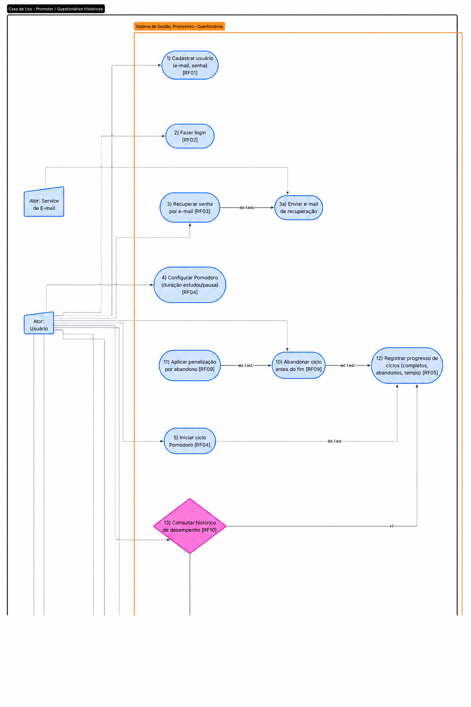
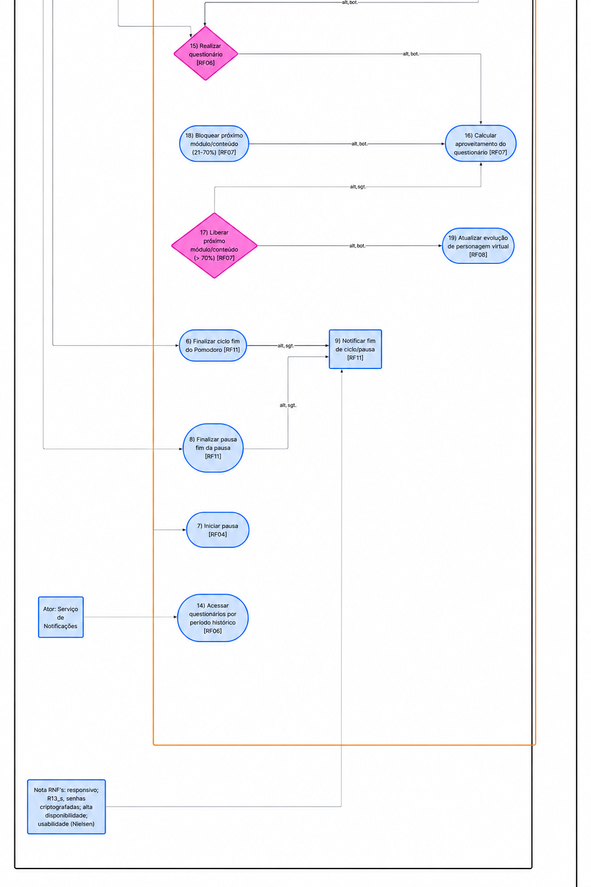
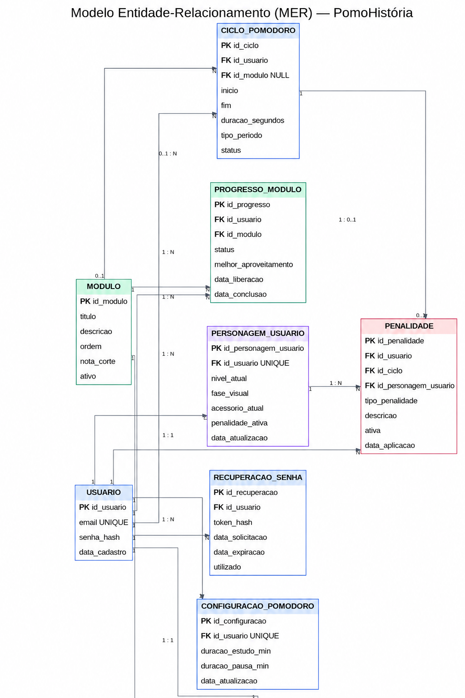
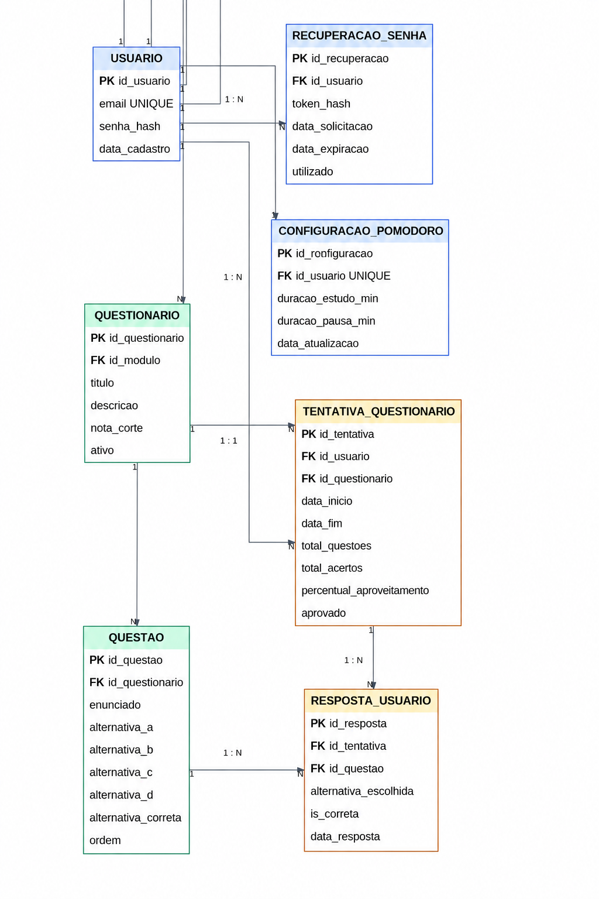

# CENTRO ESTADUAL DE EDUCAÇÃO TECNOLÓGICA PAULA SOUZA

**Faculdade de Tecnologia Baixada Santista**

**Rubens Lara**

**Curso Superior de Tecnologia em**

**Sistemas para Internet**

Diego de Oliveira Ferreira

Kauê de Oliveira Martins

## PomoHistória

**Santos, SP**

**2026**

Diego de Oliveira Ferreira

Kauê de Oliveira Martins

## PomoHistória

> Trabalho de Conclusão de Curso apresentado à Faculdade de Tecnologia Rubens Lara, como exigência para a obtenção do Título de Tecnólogo em Sistemas para Internet.
>
> **Orientador: Prof.**

**Santos, SP**

**2026**

## RESUMO

No contexto da preparação para o vestibular, muitos estudantes encontram dificuldades para manter a regularidade dos estudos, administrar o tempo de forma eficiente e sustentar a atenção por longos períodos, sobretudo diante das distrações frequentes do meio digital. Entre as estratégias utilizadas para enfrentar esse problema, destaca-se a Técnica Pomodoro, que organiza o estudo em intervalos de concentração alternados com pausas, favorecendo maior foco e melhor aproveitamento das tarefas. Considerando esse cenário, este projeto propõe o desenvolvimento do PomoHistória, uma aplicação web voltada ao estudo de História para vestibulandos. A proposta consiste em reunir, em um mesmo ambiente, organização do tempo, acompanhamento do desempenho e estímulos visuais de progresso, de modo a tornar a experiência de aprendizagem mais envolvente. Para isso, o sistema contará com temporizador inspirado na técnica Pomodoro, questionários sobre conteúdos históricos, cadastro e armazenamento do progresso do usuário, além de um personagem virtual que evolui conforme o estudante avança em seus estudos. O projeto também prevê regras de progressão baseadas no desempenho obtido nas atividades, exigindo aproveitamento mínimo para continuidade, bem como mecanismos que desencorajam a interrupção dos ciclos de estudo. Com isso, espera-se oferecer uma ferramenta de apoio capaz de contribuir para a disciplina, a constância e o engajamento do vestibulando, associando produtividade e motivação em uma proposta digital aplicada ao ensino de História.

**Palavras-chaves:** Método Pomodoro. História. Estudo

## ABSTRACT

In the context of preparing for university entrance exams, many students face difficulties in maintaining regular study habits, managing their time efficiently, and sustaining attention for long periods, especially in the face of frequent distractions in the digital environment. Among the strategies used to address this issue, the Pomodoro Technique stands out, as it organizes study sessions into intervals of concentration alternated with breaks, promoting greater focus and better use of study tasks. Considering this scenario, this project proposes the development of PomoHistória, a web application aimed at supporting History studies for students preparing for university entrance exams. The proposal consists of bringing together, in a single environment, time organization, performance monitoring, and visual progress stimuli, in order to make the learning experience more engaging. To achieve this, the system will include a timer inspired by the Pomodoro Technique, quizzes on historical content, user registration and progress storage, as well as a virtual character that evolves as the student advances in their studies. The project also includes progression rules based on the performance achieved in the activities, requiring a minimum level of achievement for continuation, as well as mechanisms that discourage the interruption of study cycles. Thus, it is expected to provide a support tool capable of contributing to the student’s discipline, consistency, and engagement, associating productivity and motivation in a digital proposal applied to the teaching of History.

**Keywords:** Pomodoro Technique. History. Study

## LISTA DE ABREVIATURAS E SIGLAS

RNF – Requisito Não Funcional 13

UML – Unified Modeling Language (Linguagem de Modelagem Unificada) 13

RF – Requisito Funcional 13, 15, 16, 17, 18, 19, 20, 21, 22, 23, 24, 25

3FN – Terceira Forma Normal 29

MER – Modelo Entidade-Relacionamento 29

PK – Primary Key (Chave Primária) 29, 30

FK – Foreign Key (Chave Estrangeira) 30

DDL – Data Definition Language (Linguagem de Definição de Dados) 34

API – Application Programming Interface (Interface de Programação de Aplicações) 41

JWT – JSON Web Token 41

## LISTA DE ILUSTRAÇÕES

Ilustração 01 – Diagrama de Casos de Uso 45, 46

Ilustração 02 – Modelo Entidade-Relacionamento (MER) 47, 48

## LISTA DE TABELAS

Tabela 01 – Impactos do Método Pomodoro 12

## SUMÁRIO

- **1. INTRODUÇÃO 9**

  - 1.1 OBJETIVO 10
  - 1.1.1 OBJETIVO GERAL 10
  - 1.1.2 OBJETIVOS ESPECÍFICOS 10
  - 1.2 ESTADO DA ARTE 11
  - Fundamentação Teórica da Técnica Pomodoro 11
  - Aplicações e Eficácia no Ensino 11
  - Impactos do Método Pomodoro 12
  - Gamificação e Engajamento 12
  - Análise de Mercado e Lacunas 12

- **2. DESENVOLVIMENTO 12**

  - 2.1 ANÁLISE DO SISTEMA 13
  - 2.1.1 ANÁLISE DE REQUISITOS 13
  - 2.1.2 DIAGRAMA DE CASO DE USO 15
  - 2.1.3 FLUXO DE EVENTOS 15
  - Caso de Uso 01 - Cadastrar Usuário 15
  - Pré-condições 15
  - Fluxo principal 15
  - Fluxos alternativos 16
  - Pós-condições 16
  - Caso de Uso 02 - Fazer Login 16
  - Pré-condições 16
  - Fluxo principal 16
  - Fluxos alternativos 16
  - Pós-condições 17
  - Caso de Uso 03 - Recuperar Senha por E-mail 17
  - Pré-condições 17
  - Fluxo principal 17
  - Fluxos alternativos 17
  - Pós-condições 17
  - Caso de Uso 04 - Configurar Pomodoro 17
  - Pré-condições 18
  - Fluxo principal 18
  - Fluxos alternativos 18
  - Pós-condições 18
  - Caso de Uso 05 - Iniciar Ciclo Pomodoro 18
  - Pré-condições 18
  - Fluxo principal 18
  - Fluxos alternativos 19
  - Pós-condições 19
  - Caso de Uso 06 - Abandonar Ciclo Antes do Fim 19
  - Pré-condições 19
  - Fluxo principal 19
  - Fluxos alternativos 19
  - Pós-condições 20
  - Caso de Uso 07 - Finalizar Ciclo e Notificar Usuário 20
  - Pré-condições 20
  - Fluxo principal 20
  - Fluxos alternativos 20
  - Pós-condições 20
  - Caso de Uso 08 - Iniciar e Finalizar Pausa 20
  - Pré-condições 21
  - Fluxo principal 21
  - Fluxos alternativos 21
  - Pós-condições 21
  - Caso de Uso 09 - Realizar Questionário 21
  - Pré-condições 21
  - Fluxo principal 21
  - Fluxos alternativos 22
  - Pós-condições 22
  - Caso de Uso 10 - Calcular Aproveitamento do Questionário 22
  - Pré-condições 22
  - Fluxo principal 22
  - Fluxos alternativos 23
  - Pós-condições 23
  - Caso de Uso 11 - Liberar ou Bloquear Próximo Módulo 23
  - Pré-condições 23
  - Fluxo principal 23
  - Fluxos alternativos 23
  - Pós-condições 23
  - Caso de Uso 12 - Atualizar Evolução do Personagem Virtual 24
  - Pré-condições 24
  - Fluxo principal 24
  - Fluxos alternativos 24
  - Pós-condições 24
  - Caso de Uso 13 - Consultar Histórico de Desempenho 24
  - Pré-condições 24
  - Fluxo principal 25
  - Fluxos alternativos 25
  - Pós-condições 25
  - Caso de Uso 14 - Registrar Progresso de Ciclos 25
  - Pré-condições 25
  - Fluxo principal 25
  - Fluxos alternativos 25
  - Pós-condições 26
  - 2.2 BANCO DE DADOS 26
  - 2.2.1 Modelo entidade-relacionamento 26
  - 2.2.2 Mapeamento para o esquema relacional 29
  - 2.2.3 Índices e otimizações 31
  - 2.2.4 Scripts de criação (DDL) 34
  - 2.3 CAMADA DE NEGÓCIO 41
  - 2.4 CAMADA DE APRESENTAÇÃO 41

- **3. RESULTADO 43**

- **REFERÊNCIAS BIBLIOGRÁFICAS 44**

- **APÊNDICE A: Ilustração 1 - Diagrama de Casos de Uso 45**

- **APÊNDICE B: Ilustração 2 - Modelo Entidade-Relacionamento (MER) 47**

## 1. INTRODUÇÃO

No cenário educacional contemporâneo, a preparação para exames vestibulares exige dos estudantes não apenas a absorção de grande volume de conteúdo, mas também disciplina e gerenciamento eficiente do tempo. A dificuldade em manter a concentração por longos períodos e organizar as sessões de estudo de maneira produtiva constitui um dos principais desafios enfrentados pelos vestibulandos, especialmente diante da crescente quantidade de distrações presentes no ambiente digital.

Nesse contexto, destaca-se a Técnica Pomodoro, desenvolvida por Francesco Cirillo no final da década de 1980 e amplamente difundida a partir dos anos 1990. Trata-se de um método de gerenciamento de tempo que propõe a divisão do trabalho em intervalos curtos e focados, tradicionalmente de 25 minutos, intercalados por pausas breves. Segundo Cirillo (2018), a técnica visa reduzir a ansiedade relacionada ao tempo e aumentar a concentração ao minimizar interrupções, mostrando-se particularmente adequada a atividades que exigem atenção sustentada, como o estudo para vestibulares.

O presente trabalho insere-se nesse cenário ao propor o desenvolvimento de um sistema web denominado PomoHistória, que integra a Técnica Pomodoro a conteúdos de História Geral e História do Brasil direcionados a vestibulandos. A delimitação do projeto concentra-se na criação de uma ferramenta que, além de estruturar o tempo de estudo por meio de ciclos pomodoro, incorpora um sistema de questionários progressivos, nos quais o usuário somente avança para o próximo tema ao atingir 70% de aproveitamento, e um personagem virtual cuja evolução visual acompanha o progresso do estudante pelos períodos históricos. Tal abordagem busca combinar produtividade, avaliação contínua e elementos lúdicos para enriquecer a experiência de aprendizagem.

Observa-se, no entanto, que embora a Técnica Pomodoro seja amplamente empregada, sua aplicação isolada não garante a efetividade do aprendizado, uma vez que o estudante permanece responsável pela seleção e assimilação autônoma dos conteúdos. Diante disso, o problema central que orienta este projeto pode ser formulado da seguinte maneira: como conciliar o gerenciamento do tempo de estudo, por meio da Técnica Pomodoro, com mecanismos estruturados de avaliação e engajamento que favoreçam a retenção de conteúdo histórico por vestibulandos?

### 1.1 OBJETIVO

Considerando os desafios enfrentados por vestibulandos na gestão do tempo e na manutenção do foco em conteúdos densos de História, este item apresenta as metas fundamentais do projeto PomoHistória. O objetivo geral e os objetivos específicos aqui delineados servem como guia para a resolução da problemática apresentada, estabelecendo os critérios técnicos e pedagógicos para o desenvolvimento da aplicação.

#### 1.1.1 OBJETIVO GERAL

O intuito do projeto é desenvolver e avaliar uma aplicação web que utilize o método Pomodoro de estudo, com o uso de um personagem virtual para acompanhar o progresso do usuário, ajudando-o a manter o foco e consistência nos estudos, junto de uma recompensa visual.

O site contará com um sistema de questionário voltado a conteúdos de história de vestibulares, ajudando nos estudos dos vestibulandos. O personagem virtual irá progredir conforme o vestibulando avança em seus estudos e isso se dá com a mudança visual do personagem.

#### 1.1.2 OBJETIVOS ESPECÍFICOS

1.  Projetar e implementar uma interface responsiva e intuitiva, garantindo acessibilidade e usabilidade em diferentes dispositivos.

2.  Implementar um sistema temporizador baseado na técnica Pomodoro, permitindo o gerenciamento dos ciclos de estudo.

3.  Desenvolver um personagem virtual, cuja evolução visual esteja diretamente vinculada ao progresso do usuário nos módulos de história, oferecendo *feedback* lúdico e motivacional.

4.  Estabelecer um sistema de penalidades, a fim de desestimular o abandono ou a não conclusão dos ciclos de estudo, promovendo a disciplina.

5.  Criar um sistema de avaliação de conhecimento, por meio de questionários, para mensurar as habilidades adquiridas pelo usuário durante os períodos de estudo.

6.  Implementar um sistema de autenticação e armazenamento de dados, permitindo que o usuário mantenha seu histórico de progresso de forma personalizada.

7.  Utilizar React para a estrutura do *front-end*, Java para o funcionamento do *back-end*, PostgreSQL para armazenamento dos dados e do progresso do usuário, mas também as matérias e suas questões.

8.  Utilizar Trello para monitoramento do progresso da equipe e Metodologias Ágeis para melhor organização e aproveitamento da mesma.

### 1.2 ESTADO DA ARTE

### Fundamentação Teórica da Técnica Pomodoro

A Técnica Pomodoro, criada por Francesco Cirillo no final da década de 1980, baseia-se na alternância entre blocos de trabalho focado e breves intervalos de descanso. A premissa central é que a segmentação temporal auxilia no gerenciamento da carga cognitiva, facilitando a codificação da informação no cérebro e prevenindo a exaustão mental. Cirillo estabeleceu que o "pomodoro" é uma unidade indivisível: se houver interrupção, o ciclo deve ser reiniciado, treinando a mente para ignorar distrações (CIRILLO, 2018).

### Aplicações e Eficácia no Ensino

Pesquisas recentes indicam que o método é altamente eficaz no ambiente educacional. Uma revisão de 32 estudos envolvendo 5.270 participantes demonstrou que 88% das aplicações obtiveram resultados positivos, com uma redução média de 20% na fadiga mental e melhora na motivação do aluno (SCOPING REVIEW, 2023). No ensino de disciplinas densas, como Biologia e História, a técnica atua como um andaime metacognitivo que ajuda o estudante a gerenciar sua autonomia e fixar termos complexos (MÜLLER NETO, 2023).

### Impactos do Método Pomodoro

Tabela 1 – Impactos do Método Pomodoro

| Atributo Avaliado          | Impacto Médio Identificado |
|------------------------------------------------------|------------------------------------------------------|
| Fadiga Mental              | Redução de ~20%            |
| Foco Autorrelatado         | Aumento de 15% a 25%       |
| Eficiência de Aprendizagem | Incremento de 12%          |

*Fonte: Adaptado de Scoping Review (2023).*

### Gamificação e Engajamento

A gamificação integra elementos de jogos em contextos sérios para disparar a liberação de dopamina, mantendo o foco sustentado. Ao associar o ciclo Pomodoro a recompensas visuais, como o crescimento de árvores (aplicativo Forest) ou a evolução de civilizações (Age of Pomodoro), o sistema capitaliza sobre a motivação extrínseca para sedimentar hábitos de estudo (SHIKUDO, 2026). O sistema PomoHistória alinha-se a essa tendência ao vincular a evolução de um personagem virtual ao progresso curricular, preenchendo uma lacuna de mercado onde a maioria das ferramentas é "vazia" de conteúdo didático específico.

### Análise de Mercado e Lacunas

O mapeamento de softwares atuais revela ferramentas robustas como *Focus To-Do* e *Reclaim.ai*, que focam em automação e produtividade geral (análise dos autores). No entanto, raras aplicações integram o cronômetro diretamente a um banco de conteúdos curriculares verticalizados para exames como o vestibular. O PomoHistória posiciona-se como uma resposta a essa lacuna, unindo a mecânica de tempo, a diversão da gamificação e a necessidade acadêmica de preparação em História.

## 2. DESENVOLVIMENTO

Este capítulo descreve as etapas de construção do sistema PomoHistória, desde a especificação dos requisitos até a implementação das camadas de *software*. O conteúdo está organizado da seguinte forma: a análise do sistema com levantamento de requisitos, diagrama de caso de uso e fluxo de eventos (subitem 2.1), a modelagem do banco de dados (subitem 2.2), a camada de negócio, onde são discutidas as principais lógicas e rotinas do *back-end* (subitem 2.3), e a camada de apresentação, que detalha a interface e os componentes do *front-end* (subitem 2.4).

### 2.1 ANÁLISE DO SISTEMA

A análise do sistema constitui a etapa inicial do processo de desenvolvimento, na qual são especificados o comportamento, a estrutura e os limites da aplicação. Para este projeto, adotou-se a *Unified Modeling Language* (UML) como linguagem de modelagem, por permitir a representação visual dos principais artefatos do sistema, como requisitos, casos de uso e fluxos de eventos. Segundo BEZERRA (2015), a UML facilita a comunicação entre os envolvidos no projeto e serve como base para as fases posteriores de implementação e teste.

#### 2.1.1 ANÁLISE DE REQUISITOS

Os requisitos funcionais e não funcionais levantados para o PomoHistória estão organizados conforme apresentado a seguir. A separação entre RF e RNF permite maior clareza sobre o que o sistema faz e como ele deve se comportar, seguindo as práticas da engenharia de software (PRESSMAN, 2016).

##### Requisitos Funcionais (RF)

\[RF01\] O sistema deve permitir o cadastro de usuários com e-mail e senha.

\[RF02\] O sistema deve permitir o login de usuários autenticados.

\[RF03\] O sistema deve fornecer recuperação de senha por e-mail.

\[RF04\] O sistema deve exibir um temporizador baseado na Técnica Pomodoro, com ciclos de estudo de 25 minutos e pausas de 5 minutos (configuráveis pelo usuário).

\[RF05\] O sistema deve registrar o progresso do usuário nos ciclos de estudo (ciclos completos, abandonos, tempo total estudado).

\[RF06\] O sistema deve disponibilizar questionários de História com questões objetivas sobre conteúdos de vestibular, organizados por períodos históricos.

\[RF07\] O sistema deve exigir aproveitamento mínimo de 70% de acertos em um questionário para liberar o próximo módulo/conteúdo.

\[RF08\] O sistema deve exibir um personagem virtual cuja evolução visual (fases/vestimentas/acessórios) avança conforme o progresso nos módulos concluídos.

\[RF09\] O sistema deve aplicar penalizações ao personagem ou à pontuação do usuário caso um ciclo Pomodoro seja abandonado antes do fim (ex.: atraso na evolução, perda de pontos).

\[RF10\] O sistema deve armazenar permanentemente o histórico de desempenho do usuário (acertos, módulos concluídos, ciclos realizados).

\[RF11\] O sistema deve notificar o usuário ao final de cada ciclo (fim do Pomodoro e fim da pausa)

##### Requisitos Não Funcionais (RNF)

\[RNF01\] O sistema deve ter interface responsiva, adaptando-se a dispositivos móveis, tablets e computadores.

\[RNF02\] O sistema deve apresentar tempo de carregamento inferior a 3 segundos para as principais telas.

\[RNF03\] As senhas dos usuários devem ser armazenadas de forma criptografada (ex.: bcrypt).

\[RNF04\] O sistema deve estar disponível para uso contínuo durante os horários de estudo, com tolerância a falhas.

\[RNF05\] A interface deve seguir os princípios de usabilidade de Nielsen (consistência, *feedback*, prevenção de erros).

#### 2.1.2 DIAGRAMA DE CASO DE USO

A partir dos requisitos funcionais, construiu-se o diagrama de casos de uso, que representa graficamente as interações entre os atores (usuário comum, usuário autenticado e administrador) e o sistema. Esse diagrama permite visualizar, de forma simplificada, quais funcionalidades cada ator pode executar. O diagrama de casos de uso do PomoHistória encontra-se no **Apêndice A** deste documento.

#### 2.1.3 FLUXO DE EVENTOS

##### Caso de Uso 01 - Cadastrar Usuário

**Ator principal:** Usuário

**Atores secundários:** Sistema PomoHistória

**Requisito(s) relacionado(s):** RF01

**Objetivo:** Permitir que o usuário crie uma conta no sistema utilizando e-mail e senha.

###### Pré-condições

O usuário deve acessar a aplicação web e não possuir sessão ativa no sistema.

###### Fluxo principal

> 1\. O usuário acessa a tela inicial do sistema.
>
> 2\. O sistema apresenta as opções de login e cadastro.
>
> 3\. O usuário seleciona a opção de cadastro.
>
> 4\. O sistema exibe o formulário solicitando e-mail e senha.
>
> 5\. O usuário preenche os dados solicitados.
>
> 6\. O sistema valida se o e-mail possui formato válido e se a senha atende aos critérios mínimos de segurança.
>
> 7\. O sistema verifica se o e-mail informado ainda não está cadastrado.
>
> 8\. O sistema registra o novo usuário, armazenando a senha de forma criptografada.
>
> 9\. O sistema cria os registros iniciais de progresso e personagem associados ao usuário.
>
> 10\. O sistema informa que o cadastro foi realizado com sucesso.
>
> 11\. O usuário é direcionado para a tela de login ou para o painel principal, conforme a regra definida pela aplicação.

###### Fluxos alternativos

- E-mail já cadastrado: caso o e-mail informado já esteja registrado, o sistema exibe uma mensagem informando que o usuário deve realizar login ou recuperar a senha.

- Dados inválidos: caso o e-mail ou a senha não atendam aos critérios definidos, o sistema informa o erro e solicita a correção dos dados.

- Falha no cadastro: caso ocorra erro de conexão ou indisponibilidade do sistema, uma mensagem de falha é exibida e o usuário poderá tentar novamente.

###### Pós-condições

O usuário passa a possuir uma conta cadastrada no sistema e poderá realizar login.

##### Caso de Uso 02 - Fazer Login

**Ator principal:** Usuário

**Atores secundários:** Sistema PomoHistória

**Requisito(s) relacionado(s):** RF02

**Objetivo:** Permitir que o usuário acesse sua conta e suas informações de progresso.

###### Pré-condições

O usuário deve possuir cadastro ativo no sistema.

###### Fluxo principal

> 1\. O usuário acessa a tela de login.
>
> 2\. O sistema solicita e-mail e senha.
>
> 3\. O usuário informa suas credenciais.
>
> 4\. O sistema valida os dados informados.
>
> 5\. O sistema autentica o usuário.
>
> 6\. O sistema carrega as informações associadas à conta, como progresso, ciclos realizados, módulos liberados e estágio atual do personagem.
>
> 7\. O sistema direciona o usuário para o dashboard principal.

###### Fluxos alternativos

- Credenciais incorretas: caso o e-mail ou a senha estejam incorretos, o sistema informa que os dados são inválidos.

- Usuário não cadastrado: caso o e-mail não seja encontrado, o sistema sugere a realização de cadastro.

- Esquecimento de senha: caso o usuário não se lembre da senha, poderá acionar o fluxo de recuperação de senha.

###### Pós-condições

O usuário acessa o sistema autenticado e pode utilizar as funcionalidades disponíveis.

##### Caso de Uso 03 - Recuperar Senha por E-mail

**Ator principal:** Usuário

**Atores secundários:** Serviço de E-mail

**Requisito(s) relacionado(s):** RF03

**Objetivo:** Permitir que o usuário recupere o acesso à conta por meio do envio de e-mail de recuperação.

###### Pré-condições

O usuário deve possuir uma conta cadastrada no sistema.

###### Fluxo principal

> 1\. O usuário acessa a tela de login.
>
> 2\. O usuário seleciona a opção de recuperação de senha.
>
> 3\. O sistema solicita o e-mail cadastrado.
>
> 4\. O usuário informa o e-mail.
>
> 5\. O sistema verifica se o e-mail existe na base de dados.
>
> 6\. O sistema gera uma solicitação de recuperação de senha.
>
> 7\. O sistema aciona o serviço de e-mail.
>
> 8\. O serviço de e-mail envia uma mensagem de recuperação ao usuário.
>
> 9\. O sistema informa que as instruções foram enviadas.

###### Fluxos alternativos

- E-mail não encontrado: caso o e-mail informado não esteja cadastrado, o sistema informa que não foi possível localizar uma conta vinculada.

- Falha no envio do e-mail: caso o serviço de e-mail esteja indisponível, o sistema informa que houve falha no envio e orienta o usuário a tentar novamente.

- E-mail inválido: caso o formato do e-mail esteja incorreto, o sistema solicita a correção do dado.

###### Pós-condições

O usuário recebe as instruções para redefinir sua senha.

##### Caso de Uso 04 - Configurar Pomodoro

**Ator principal:** Usuário

**Atores secundários:** Sistema PomoHistória

**Requisito(s) relacionado(s):** RF04

**Objetivo:** Permitir que o usuário configure a duração do ciclo de estudo e da pausa.

###### Pré-condições

O usuário deve estar autenticado no sistema.

###### Fluxo principal

> 1\. O usuário acessa o dashboard principal.
>
> 2\. O sistema apresenta o temporizador Pomodoro.
>
> 3\. O usuário seleciona a opção de configuração do Pomodoro.
>
> 4\. O sistema exibe os campos de duração do tempo de estudo e da pausa.
>
> 5\. O usuário define os valores desejados ou mantém os valores padrão.
>
> 6\. O sistema valida as configurações inseridas.
>
> 7\. O sistema salva a configuração escolhida.
>
> 8\. O sistema atualiza o temporizador conforme os valores definidos.

###### Fluxos alternativos

- Valores inválidos: caso o usuário informe valores incompatíveis, o sistema exibe uma mensagem de erro e solicita nova configuração.

- Cancelamento da configuração: caso o usuário cancele a ação, o sistema mantém os valores anteriores.

###### Pós-condições

O temporizador passa a utilizar os tempos definidos pelo usuário.

##### Caso de Uso 05 - Iniciar Ciclo Pomodoro

**Ator principal:** Usuário

**Atores secundários:** Sistema PomoHistória

**Requisito(s) relacionado(s):** RF04, RF05

**Objetivo:** Permitir que o usuário inicie um ciclo de estudo com base na Técnica Pomodoro.

###### Pré-condições

O usuário deve estar autenticado e possuir o temporizador configurado.

###### Fluxo principal

> 1\. O usuário acessa o dashboard principal.
>
> 2\. O sistema apresenta o temporizador e o botão para iniciar o ciclo.
>
> 3\. O usuário seleciona a opção de iniciar ciclo Pomodoro.
>
> 4\. O sistema registra o início do ciclo.
>
> 5\. O temporizador começa a contagem do período de estudo.
>
> 6\. O sistema mantém o ciclo em andamento até o término do tempo definido.
>
> 7\. Ao final do ciclo, o sistema registra a conclusão do período de estudo.
>
> 8\. O sistema atualiza o progresso do usuário, incluindo tempo estudado e quantidade de ciclos completos.
>
> 9\. O sistema aciona o serviço de notificações para informar o fim do ciclo.

###### Fluxos alternativos

- Abandono do ciclo antes do fim: caso o usuário abandone o ciclo antes da conclusão, o sistema registra o abandono e aciona o fluxo de penalização.

- Falha no registro: caso ocorra erro ao salvar o ciclo, o sistema informa a falha e tenta manter o estado atual até nova sincronização.

- Pausa iniciada após ciclo: após concluir o ciclo, o usuário pode iniciar o período de pausa.

###### Pós-condições

O ciclo é registrado no histórico do usuário como concluído ou abandonado.

##### Caso de Uso 06 - Abandonar Ciclo Antes do Fim

**Ator principal:** Usuário

**Atores secundários:** Sistema PomoHistória

**Requisito(s) relacionado(s):** RF05, RF09

**Objetivo:** Registrar a interrupção de um ciclo Pomodoro e aplicar penalização ao usuário.

###### Pré-condições

O usuário deve ter um ciclo Pomodoro em andamento.

###### Fluxo principal

> 1\. O usuário interrompe ou abandona o ciclo antes do tempo final.
>
> 2\. O sistema solicita confirmação da ação, a fim de prevenir erros acidentais.
>
> 3\. O usuário confirma o abandono.
>
> 4\. O sistema encerra o ciclo em andamento.
>
> 5\. O sistema registra o ciclo como abandonado.
>
> 6\. O sistema atualiza o histórico do usuário com o abandono.
>
> 7\. O sistema aplica a penalização correspondente, como atraso na evolução do personagem ou perda de pontuação.
>
> 8\. O sistema apresenta uma mensagem informando a penalização aplicada.

###### Fluxos alternativos

- Cancelamento do abandono: caso o usuário desista da ação, o sistema mantém o ciclo em andamento.

- Falha ao registrar penalização: caso ocorra erro no registro, o sistema mantém a informação pendente para atualização posterior.

###### Pós-condições

O abandono é registrado no histórico e a penalização é aplicada ao progresso do usuário.

##### Caso de Uso 07 - Finalizar Ciclo e Notificar Usuário

**Ator principal:** Sistema PomoHistória

**Atores secundários:** Serviço de Notificações

**Requisito(s) relacionado(s):** RF11

**Objetivo:** Notificar o usuário ao final de um ciclo Pomodoro ou de uma pausa.

###### Pré-condições

Deve existir um ciclo Pomodoro ou uma pausa em andamento.

###### Fluxo principal

> 1\. O temporizador chega ao fim do tempo definido.
>
> 2\. O sistema identifica se o encerramento corresponde ao fim de um ciclo de estudo ou ao fim de uma pausa.
>
> 3\. O sistema registra o encerramento do período.
>
> 4\. O sistema aciona o serviço de notificações.
>
> 5\. O serviço de notificações envia um alerta ao usuário.
>
> 6\. O sistema exibe uma mensagem informando que o ciclo ou a pausa foi concluído.
>
> 7\. O usuário decide se deseja iniciar uma pausa, iniciar novo ciclo ou acessar outra funcionalidade.

###### Fluxos alternativos

- Notificação indisponível: caso o navegador ou dispositivo bloqueie notificações, o sistema exibe o aviso diretamente na interface.

- Falha no serviço de notificações: caso o serviço esteja indisponível, o sistema mantém o alerta visual na tela.

###### Pós-condições

O usuário é informado sobre o encerramento do ciclo ou da pausa.

##### Caso de Uso 08 - Iniciar e Finalizar Pausa

**Ator principal:** Usuário

**Atores secundários:** Sistema PomoHistória e Serviço de Notificações

**Requisito(s) relacionado(s):** RF04, RF11

**Objetivo:** Permitir que o usuário realize uma pausa após o ciclo de estudo.

###### Pré-condições

O usuário deve ter concluído um ciclo Pomodoro ou possuir permissão para iniciar uma pausa.

###### Fluxo principal

> 1\. Após a conclusão do ciclo de estudo, o sistema oferece a opção de iniciar pausa.
>
> 2\. O usuário seleciona a opção de iniciar pausa.
>
> 3\. O sistema inicia o temporizador da pausa.
>
> 4\. O usuário aguarda o término do tempo definido.
>
> 5\. Ao final da pausa, o sistema registra o encerramento.
>
> 6\. O sistema aciona o serviço de notificações.
>
> 7\. O sistema informa ao usuário que a pausa foi concluída.
>
> 8\. O usuário pode iniciar um novo ciclo de estudo.

###### Fluxos alternativos

- Finalização manual da pausa: caso o usuário encerre a pausa antes do tempo, o sistema registra o encerramento antecipado.

- Retorno ao ciclo: após a pausa, o usuário pode iniciar novo ciclo Pomodoro.

###### Pós-condições

A pausa é finalizada e o usuário pode continuar seus estudos.

##### Caso de Uso 09 - Realizar Questionário

**Ator principal:** Usuário

**Atores secundários:** Sistema PomoHistória

**Requisito(s) relacionado(s):** RF06, RF07, RF10

**Objetivo:** Permitir que o usuário responda questionários de História organizados por períodos históricos.

###### Pré-condições

O usuário deve estar autenticado e acessar um módulo de História disponível.

###### Fluxo principal

> 1\. O usuário acessa a área de módulos ou questionários.
>
> 2\. O sistema apresenta os módulos disponíveis conforme o progresso do usuário.
>
> 3\. O usuário seleciona um questionário relacionado a um período histórico.
>
> 4\. O sistema carrega as questões objetivas do módulo selecionado.
>
> 5\. O usuário responde às questões apresentadas.
>
> 6\. O sistema registra as respostas selecionadas.
>
> 7\. Ao finalizar o questionário, o sistema calcula o percentual de aproveitamento.
>
> 8\. O sistema armazena o desempenho do usuário no histórico.
>
> 9\. O sistema verifica se o usuário atingiu o aproveitamento mínimo de 70%.
>
> 10\. O sistema informa o resultado ao usuário.

###### Fluxos alternativos

- Aproveitamento igual ou superior a 70%: o sistema libera o próximo módulo ou conteúdo e atualiza a evolução do personagem.

- Aproveitamento inferior a 70%: o sistema bloqueia o próximo módulo e informa que o usuário deve revisar o conteúdo ou refazer o questionário.

- Questionário incompleto: caso o usuário tente finalizar sem responder todas as questões obrigatórias, o sistema solicita o preenchimento das respostas pendentes.

- Falha no salvamento: caso ocorra erro ao registrar as respostas, o sistema informa a falha e solicita nova tentativa.

###### Pós-condições

O desempenho do questionário é registrado e o sistema atualiza o estado de liberação dos módulos.

##### Caso de Uso 10 - Calcular Aproveitamento do Questionário

**Ator principal:** Sistema PomoHistória

**Requisito(s) relacionado(s):** RF07

**Objetivo:** Calcular o percentual de acertos do usuário em um questionário.

###### Pré-condições

O usuário deve ter finalizado um questionário.

###### Fluxo principal

> 1\. O sistema recupera as respostas fornecidas pelo usuário.
>
> 2\. O sistema compara cada resposta com a alternativa correta registrada.
>
> 3\. O sistema contabiliza a quantidade de acertos e erros.
>
> 4\. O sistema calcula o percentual de aproveitamento.
>
> 5\. O sistema apresenta o resultado ao usuário.
>
> 6\. O sistema utiliza o resultado para definir se o próximo módulo será liberado ou bloqueado.

###### Fluxos alternativos

- Resultado suficiente: se o aproveitamento for igual ou superior a 70%, o usuário avança para o próximo conteúdo.

- Resultado insuficiente: se o aproveitamento for inferior a 70%, o próximo conteúdo permanece bloqueado.

###### Pós-condições

O resultado do questionário é salvo no histórico do usuário.

##### Caso de Uso 11 - Liberar ou Bloquear Próximo Módulo

**Ator principal:** Sistema PomoHistória

**Requisito(s) relacionado(s):** RF07

**Objetivo:** Controlar o avanço do usuário entre os módulos de História conforme seu desempenho.

###### Pré-condições

O usuário deve ter concluído um questionário.

###### Fluxo principal

> 1\. O sistema consulta o percentual de aproveitamento obtido pelo usuário.
>
> 2\. O sistema compara o resultado com a nota mínima exigida de 70%.
>
> 3\. Caso o desempenho seja suficiente, o sistema libera o próximo módulo ou conteúdo.
>
> 4\. O sistema registra a liberação no progresso do usuário.
>
> 5\. O sistema atualiza a interface, indicando que o novo módulo está disponível.

###### Fluxos alternativos

- Desempenho insuficiente: caso o aproveitamento seja inferior a 70%, o sistema mantém o próximo módulo bloqueado.

- Novo questionário: o usuário poderá refazer o questionário para tentar atingir a nota mínima.

- Erro de atualização: se houver falha ao atualizar o módulo, o sistema informa o problema e tenta manter os dados anteriores.

###### Pós-condições

O módulo seguinte fica liberado ou bloqueado conforme o desempenho do usuário.

##### Caso de Uso 12 - Atualizar Evolução do Personagem Virtual

**Ator principal:** Sistema PomoHistória

**Requisito(s) relacionado(s):** RF08, RF10

**Objetivo:** Atualizar visualmente o personagem virtual conforme o avanço do usuário nos módulos.

###### Pré-condições

O usuário deve possuir progresso registrado no sistema.

###### Fluxo principal

> 1\. O sistema identifica que o usuário concluiu um módulo ou atingiu progresso suficiente.
>
> 2\. O sistema consulta o estágio atual do personagem virtual.
>
> 3\. O sistema verifica a regra de evolução associada ao progresso do usuário.
>
> 4\. O sistema atualiza o nível, fase, vestimenta ou acessório do personagem.
>
> 5\. O sistema registra a atualização no histórico do usuário.
>
> 6\. O sistema exibe a nova aparência do personagem na interface.
>
> 7\. O sistema apresenta uma mensagem de avanço ou recompensa visual.

###### Fluxos alternativos

- Penalidade ativa: caso o usuário tenha penalização por abandono de ciclo, o sistema pode atrasar ou limitar a evolução do personagem.

- Progresso insuficiente: caso o usuário ainda não tenha concluído os requisitos necessários, o personagem permanece no estágio atual.

- Falha na atualização: caso ocorra erro no salvamento, o sistema mantém o estágio anterior até nova tentativa.

###### Pós-condições

O personagem virtual passa a refletir o progresso atualizado do usuário.

##### Caso de Uso 13 - Consultar Histórico de Desempenho

**Ator principal:** Usuário

**Atores secundários:** Sistema PomoHistória

**Requisito(s) relacionado(s):** RF05, RF10

**Objetivo:** Permitir que o usuário visualize seu desempenho acumulado no sistema.

###### Pré-condições

O usuário deve estar autenticado e possuir registros de uso ou desempenho.

###### Fluxo principal

> 1\. O usuário acessa a área de perfil ou histórico.
>
> 2\. O sistema recupera os dados de ciclos Pomodoro realizados, abandonos, tempo total estudado, respostas de questionários e módulos concluídos.
>
> 3\. O sistema organiza os dados em formato visual ou textual.
>
> 4\. O sistema exibe o histórico de desempenho ao usuário.
>
> 5\. O usuário consulta seu progresso, acertos, erros, módulos liberados e evolução do personagem.

###### Fluxos alternativos

- Usuário sem histórico: caso não existam registros, o sistema informa que ainda não há dados disponíveis.

- Falha ao carregar histórico: caso ocorra erro de consulta, o sistema exibe mensagem de indisponibilidade temporária.

###### Pós-condições

O usuário visualiza seu histórico e pode acompanhar sua evolução nos estudos.

##### Caso de Uso 14 - Registrar Progresso de Ciclos

**Ator principal:** Sistema PomoHistória

**Requisito(s) relacionado(s):** RF05, RF10

**Objetivo:** Armazenar as informações referentes aos ciclos Pomodoro realizados pelo usuário.

###### Pré-condições

O usuário deve ter iniciado, concluído ou abandonado um ciclo.

###### Fluxo principal

> 1\. O sistema identifica o evento ocorrido no ciclo Pomodoro.
>
> 2\. O sistema registra o tipo de evento: ciclo iniciado, ciclo concluído ou ciclo abandonado.
>
> 3\. O sistema armazena a data, horário, duração e status do ciclo.
>
> 4\. O sistema atualiza o tempo total estudado do usuário.
>
> 5\. O sistema atualiza a quantidade de ciclos completos e abandonados.
>
> 6\. O sistema disponibiliza essas informações para consulta no histórico.

###### Fluxos alternativos

- Ciclo abandonado: o sistema registra o abandono e aciona a penalização correspondente.

- Ciclo concluído: o sistema soma o tempo estudado e pode permitir continuidade para pausa ou novo ciclo.

- Erro de persistência: se houver falha ao salvar, o sistema informa o erro e tenta preservar os dados temporariamente.

###### Pós-condições

O progresso do usuário é atualizado no sistema.

### 2.2 BANCO DE DADOS

A camada de persistência é responsável por armazenar, de forma estruturada e permanente, todos os dados gerados pela utilização do sistema PomoHistória, incluindo informações de cadastro, progresso nos estudos, desempenho nos questionários e evolução do personagem virtual. Para tanto, foi projetado um modelo de dados relacional, implementado no sistema gerenciador de banco de dados PostgreSQL.

#### 2.2.1 Modelo entidade-relacionamento

O Modelo Entidade-Relacionamento (MER) do sistema PomoHistória foi elaborado com o objetivo de representar, em nível conceitual, as principais entidades envolvidas no funcionamento da aplicação e os relacionamentos existentes entre elas. O modelo considera as funcionalidades de cadastro e autenticação de usuários, recuperação de senha, configuração e execução dos ciclos Pomodoro, realização de questionários, controle de progresso nos módulos de História, registro do desempenho do usuário, aplicação de penalidades e evolução do personagem virtual.

##### Entidades do Modelo

- **Usuário**

  - Representa o estudante cadastrado no sistema. Essa entidade armazena as informações necessárias para autenticação e identificação da conta, como e-mail, senha criptografada e data de cadastro. O usuário é a entidade central do modelo, pois está relacionado aos ciclos Pomodoro, questionários, progresso nos módulos, personagem virtual, configurações e histórico de desempenho.

- **Recuperação de Senha**

  - Armazena as solicitações de redefinição de senha feitas pelo usuário. Cada solicitação pertence a um usuário e contém dados como token de recuperação, data de solicitação, data de expiração e indicação de uso. Essa entidade atende à funcionalidade de recuperação de senha por e-mail.

- **Configuração Pomodoro**

  - Guarda as preferências individuais do usuário em relação ao temporizador Pomodoro, como duração do ciclo de estudo e duração da pausa. Cada usuário possui uma configuração própria, permitindo que o sistema personalize a experiência de estudo.

- **Ciclo Pomodoro**

  - Registra cada ciclo de estudo ou pausa realizado pelo usuário. Essa entidade armazena informações como horário de início, horário de término, duração, tipo de período e status do ciclo, podendo indicar se ele foi concluído, abandonado ou se está em andamento. Também pode estar vinculada a um módulo de História quando o estudo estiver associado a determinado conteúdo.

- **Penalidade**

  - Representa as penalizações aplicadas quando o usuário abandona um ciclo Pomodoro antes do fim. A penalidade está vinculada ao usuário, ao ciclo que originou a ocorrência e ao personagem virtual afetado. Essa entidade permite registrar o tipo de penalidade, sua descrição, data de aplicação e se ainda está ativa.

- **Personagem Usuário**

  - Armazena o estado atual do personagem virtual de cada usuário. Essa entidade registra o nível atual, fase visual, acessórios, penalidade ativa e data da última atualização. Sua função é representar a evolução visual do estudante conforme ele avança nos módulos e obtém bom desempenho nos questionários.

- **Módulo**

  - Representa os períodos ou conteúdos de História disponibilizados pelo sistema, como Pré-História, Idade Antiga, Idade Média, Brasil Colônia, entre outros. Cada módulo possui título, descrição, ordem de progressão, nota de corte e status de atividade.

- **Progresso Módulo**

  - Registra a situação de cada usuário em relação aos módulos do sistema. Essa entidade indica se o módulo está bloqueado, liberado ou concluído, além de armazenar o melhor aproveitamento obtido, a data de liberação e a data de conclusão. Ela permite controlar o avanço progressivo do estudante.

- **Questionário**

  - Representa um conjunto de questões vinculado a um módulo de História. Cada questionário possui título, descrição, nota de corte e indicação de atividade. Essa entidade permite organizar as avaliações conforme os conteúdos históricos estudados.

- **Questão**

  - Armazena as perguntas objetivas pertencentes a um questionário. Cada questão contém enunciado, alternativas, alternativa correta e ordem de exibição. Essa entidade é utilizada para compor os questionários respondidos pelo usuário.

- **Tentativa Questionário**

  - Registra cada tentativa realizada pelo usuário em um questionário. Armazena a data de início, data de término, total de questões, total de acertos, percentual de aproveitamento e indicação de aprovação. Essa entidade é essencial para calcular se o usuário atingiu o aproveitamento mínimo de 70%.

- **Resposta Usuário**

  - Armazena cada resposta selecionada pelo usuário durante uma tentativa de questionário. Essa entidade relaciona a tentativa com a questão respondida, registrando a alternativa escolhida, se a resposta está correta e a data da resposta.

##### Cardinalidades Principais do MER

- Usuário (1) — (0..N) Recuperação de Senha

- Usuário (1) — (1) Configuração Pomodoro

- Usuário (1) — (0..N) Ciclo Pomodoro

- Usuário (1) — (1) Personagem Usuário

- Usuário (1) — (0..N) Penalidade

- Usuário (1) — (0..N) Progresso Módulo

- Usuário (1) — (0..N) Tentativa Questionário

- Módulo (1) — (0..N) Questionário

- Módulo (1) — (0..N) Progresso Módulo

- Módulo (0..N) — (0..1) Ciclo Pomodoro

- Questionário (1) — (1..N) Questão

- Questionário (1) — (0..N) Tentativa Questionário

- Tentativa Questionário (1) — (1..N) Resposta Usuário

- Questão (1) — (0..N) Resposta Usuário

- Ciclo Pomodoro (1) — (0..1) Penalidade

- Personagem Usuário (1) — (0..N) Penalidade

O diagrama completo do MER, incluindo atributos e chaves primárias/estrangeiras, encontra-se no **Apêndice B**.

#### 2.2.2 Mapeamento para o esquema relacional

A partir do Modelo Entidade-Relacionamento (MER), foi gerado o esquema relacional do sistema PomoHistória, organizado em tabelas que representam as entidades principais e seus respectivos relacionamentos. A estrutura proposta respeita os princípios da 3ª Forma Normal (3FN), buscando evitar redundâncias, facilitar a manutenção dos dados e garantir maior consistência nas operações de cadastro, autenticação, ciclos Pomodoro, questionários, progresso, penalidades e evolução do personagem virtual.

As principais tabelas do modelo lógico são:

- usuario (id_usuario PK, email UNIQUE, senha_hash, data_cadastro);

- recuperacao_senha (id_recuperacao PK, id_usuario FK, token_hash, data_solicitacao, data_expiracao, utilizado);

- configuracao_pomodoro (id_configuracao PK, id_usuario FK UNIQUE, duracao_estudo_min, duracao_pausa_min, data_atualizacao);

- modulo (id_modulo PK, titulo, descricao, ordem, nota_corte, ativo);

- ciclo_pomodoro (id_ciclo PK, id_usuario FK, id_modulo FK NULL, inicio, fim, duracao_segundos, tipo_periodo, status);

- personagem_usuario (id_personagem_usuario PK, id_usuario FK UNIQUE, nivel_atual, fase_visual, acessorio_atual, penalidade_ativa, data_atualizacao);

- penalidade (id_penalidade PK, id_usuario FK, id_ciclo FK, id_personagem_usuario FK, tipo_penalidade, descricao, ativa, data_aplicacao);

- progresso_modulo (id_progresso PK, id_usuario FK, id_modulo FK, status, melhor_aproveitamento, data_liberacao, data_conclusao);

- questionario (id_questionario PK, id_modulo FK, titulo, descricao, nota_corte, ativo);

- questao (id_questao PK, id_questionario FK, enunciado, alternativa_a, alternativa_b, alternativa_c, alternativa_d, alternativa_correta, ordem);

- tentativa_questionario (id_tentativa PK, id_usuario FK, id_questionario FK, data_inicio, data_fim, total_questoes, total_acertos, percentual_aproveitamento, aprovado);

- resposta_usuario (id_resposta PK, id_tentativa FK, id_questao FK, alternativa_escolhida, is_correta, data_resposta).

Nesse mapeamento, a tabela usuario centraliza os dados de autenticação e identificação do estudante. A tabela configuracao_pomodoro possui relação de um para um com o usuário, pois cada usuário deve possuir apenas uma configuração ativa para duração dos ciclos de estudo e pausas. A tabela personagem_usuario também possui relação de um para um com o usuário, armazenando o estado atual do personagem virtual.

As tabelas ciclo_pomodoro, progresso_modulo, tentativa_questionario e penalidade estão associadas ao usuário para permitir o acompanhamento detalhado de sua utilização do sistema. A tabela ciclo_pomodoro também pode se relacionar opcionalmente a um módulo, já que um ciclo de estudo pode ou não estar vinculado a um conteúdo específico.

A estrutura de questionários é composta pelas tabelas modulo, questionario, questao, tentativa_questionario e resposta_usuario. Cada módulo pode possuir vários questionários, cada questionário pode conter várias questões e cada tentativa registra o desempenho do usuário em uma avaliação. As respostas individuais ficam armazenadas em resposta_usuario, vinculadas à tentativa realizada e à questão respondida.

A tabela progresso_modulo registra a situação do usuário em cada módulo, indicando se o conteúdo está bloqueado, liberado ou concluído, além de armazenar o melhor aproveitamento obtido. Já a tabela penalidade registra as ocorrências decorrentes do abandono de ciclos Pomodoro, relacionando o usuário, o ciclo afetado e o personagem virtual impactado.

#### 2.2.3 Índices e otimizações

Para garantir melhor desempenho nas consultas mais frequentes do sistema, foram definidos índices sobre as chaves estrangeiras, campos de autenticação, campos de ordenação e atributos utilizados com frequência em filtros. Como o PomoHistória depende de consultas constantes ao progresso do usuário, aos ciclos Pomodoro, aos questionários e ao histórico de desempenho, a criação de índices contribui para reduzir o tempo de resposta da aplicação.

Exemplos dos índices feitos:

- CREATE UNIQUE INDEX uk_usuario_email

> ON usuario (email);

- CREATE INDEX idx_recuperacao_senha_usuario

> ON recuperacao_senha (id_usuario);

- CREATE INDEX idx_recuperacao_senha_token

> ON recuperacao_senha (token_hash);

- CREATE UNIQUE INDEX uk_configuracao_usuario

> ON configuracao_pomodoro (id_usuario);

- CREATE INDEX idx_ciclo_usuario_inicio

> ON ciclo_pomodoro (id_usuario, inicio);

- CREATE INDEX idx_ciclo_modulo

> ON ciclo_pomodoro (id_modulo);

- CREATE INDEX idx_ciclo_status

> ON ciclo_pomodoro (status);

- CREATE UNIQUE INDEX uk_personagem_usuario

> ON personagem_usuario (id_usuario);

- CREATE INDEX idx_penalidade_usuario

> ON penalidade (id_usuario);

- CREATE INDEX idx_penalidade_ciclo

> ON penalidade (id_ciclo);

- CREATE INDEX idx_penalidade_personagem

> ON penalidade (id_personagem_usuario);

- CREATE INDEX idx_penalidade_ativa

> ON penalidade (ativa);

- CREATE INDEX idx_modulo_ordem

> ON modulo (ordem);

- CREATE UNIQUE INDEX uk_progresso_usuario_modulo

> ON progresso_modulo (id_usuario, id_modulo);

- CREATE INDEX idx_progresso_usuario

> ON progresso_modulo (id_usuario);

- CREATE INDEX idx_progresso_modulo

> ON progresso_modulo (id_modulo);

- CREATE INDEX idx_progresso_status

> ON progresso_modulo (status);

- CREATE INDEX idx_questionario_modulo

> ON questionario (id_modulo);

- CREATE INDEX idx_questao_questionario

> ON questao (id_questionario);

- CREATE INDEX idx_tentativa_usuario

> ON tentativa_questionario (id_usuario);

- CREATE INDEX idx_tentativa_questionario

> ON tentativa_questionario (id_questionario);

- CREATE INDEX idx_tentativa_aprovado

> ON tentativa_questionario (aprovado);

- CREATE INDEX idx_resposta_tentativa

> ON resposta_usuario (id_tentativa);

- CREATE INDEX idx_resposta_questao

> ON resposta_usuario (id_questao).

O índice único em usuario.email garante que não existam dois usuários com o mesmo e-mail cadastrado. Os índices únicos em configuracao_pomodoro.id_usuario e personagem_usuario.id_usuario reforçam as relações de um para um dessas tabelas com o usuário.

Na tabela progresso_modulo, o índice único composto por id_usuario e id_modulo impede que um mesmo usuário possua registros duplicados para o mesmo módulo. Já os índices em tentativa_questionario, resposta_usuario, questionario e questao otimizam as consultas relacionadas à realização de questionários, cálculo de aproveitamento e exibição do histórico de respostas.

Também foram previstos índices em campos como status, aprovado, ativo, ordem e inicio, pois esses atributos podem ser utilizados com frequência para filtrar ciclos em andamento, módulos ativos, tentativas aprovadas e registros ordenados por data. Dessa forma, a estrutura de índices contribui para a eficiência do sistema, principalmente nas telas de dashboard, histórico, progresso de módulos e questionários.

#### 2.2.4 Scripts de criação (DDL)

A partir do Modelo Entidade-Relacionamento e do mapeamento para o esquema relacional, foram definidos os comandos DDL responsáveis pela criação da estrutura do banco de dados do sistema PomoHistória. Esses comandos contemplam a criação das tabelas, chaves primárias, chaves estrangeiras, restrições de integridade, regras de validação e índices necessários para garantir a organização, a consistência e o desempenho das consultas realizadas pela aplicação.

O banco de dados foi estruturado em PostgreSQL, considerando as principais funcionalidades do sistema, como cadastro e autenticação de usuários, recuperação de senha, configuração dos ciclos Pomodoro, registro de ciclos de estudo, controle de progresso nos módulos de História, realização de questionários, armazenamento de respostas, aplicação de penalidades e evolução do personagem virtual. Dessa forma, os scripts apresentados a seguir estabelecem a base necessária para a persistência dos dados utilizados pelas camadas de negócio e apresentação da aplicação.

##### Scripts de criação

```sql
CREATE TABLE usuario (
id_usuario SERIAL PRIMARY KEY,
email VARCHAR(255) NOT NULL UNIQUE,
senha_hash VARCHAR(255) NOT NULL,
data_cadastro TIMESTAMP NOT NULL DEFAULT CURRENT_TIMESTAMP
);

CREATE TABLE recuperacao_senha (
id_recuperacao SERIAL PRIMARY KEY,
id_usuario INTEGER NOT NULL,
token_hash VARCHAR(255) NOT NULL,
data_solicitacao TIMESTAMP NOT NULL DEFAULT CURRENT_TIMESTAMP,
data_expiracao TIMESTAMP NOT NULL,
utilizado BOOLEAN NOT NULL DEFAULT FALSE,
CONSTRAINT fk_recuperacao_usuario
FOREIGN KEY (id_usuario)
REFERENCES usuario (id_usuario)
ON DELETE CASCADE
);

CREATE TABLE configuracao_pomodoro (
id_configuracao SERIAL PRIMARY KEY,
id_usuario INTEGER NOT NULL UNIQUE,
duracao_estudo_min INTEGER NOT NULL DEFAULT 25,
duracao_pausa_min INTEGER NOT NULL DEFAULT 5,
data_atualizacao TIMESTAMP NOT NULL DEFAULT CURRENT_TIMESTAMP,
CONSTRAINT fk_configuracao_usuario
FOREIGN KEY (id_usuario)
REFERENCES usuario (id_usuario)
ON DELETE CASCADE,
CONSTRAINT chk_duracao_estudo
CHECK (duracao_estudo_min > 0),
CONSTRAINT chk_duracao_pausa
CHECK (duracao_pausa_min > 0)
);

CREATE TABLE modulo (
id_modulo SERIAL PRIMARY KEY,
titulo VARCHAR(150) NOT NULL,
descricao TEXT,
ordem INTEGER NOT NULL UNIQUE,
nota_corte NUMERIC(5,2) NOT NULL DEFAULT 70.00,
ativo BOOLEAN NOT NULL DEFAULT TRUE,
CONSTRAINT chk_modulo_nota_corte
CHECK (nota_corte >= 0 AND nota_corte <= 100)
);

CREATE TABLE ciclo_pomodoro (
id_ciclo SERIAL PRIMARY KEY,
id_usuario INTEGER NOT NULL,
id_modulo INTEGER NULL,
inicio TIMESTAMP NOT NULL DEFAULT CURRENT_TIMESTAMP,
fim TIMESTAMP NULL,
duracao_segundos INTEGER NOT NULL,
tipo_periodo VARCHAR(20) NOT NULL,
status VARCHAR(20) NOT NULL,
CONSTRAINT fk_ciclo_usuario
FOREIGN KEY (id_usuario)
REFERENCES usuario (id_usuario)
ON DELETE CASCADE,
CONSTRAINT fk_ciclo_modulo
FOREIGN KEY (id_modulo)
REFERENCES modulo (id_modulo)
ON DELETE SET NULL,
CONSTRAINT chk_ciclo_duracao
CHECK (duracao_segundos > 0),
CONSTRAINT chk_ciclo_tipo_periodo
CHECK (tipo_periodo IN ('ESTUDO', 'PAUSA')),
CONSTRAINT chk_ciclo_status
CHECK (status IN ('EM_ANDAMENTO', 'CONCLUIDO', 'ABANDONADO'))
);

CREATE TABLE personagem_usuario (
id_personagem_usuario SERIAL PRIMARY KEY,
id_usuario INTEGER NOT NULL UNIQUE,
nivel_atual INTEGER NOT NULL DEFAULT 1,
fase_visual VARCHAR(100) NOT NULL DEFAULT 'Inicial',
acessorio_atual VARCHAR(100),
penalidade_ativa BOOLEAN NOT NULL DEFAULT FALSE,
data_atualizacao TIMESTAMP NOT NULL DEFAULT CURRENT_TIMESTAMP,
CONSTRAINT fk_personagem_usuario
FOREIGN KEY (id_usuario)
REFERENCES usuario (id_usuario)
ON DELETE CASCADE,
CONSTRAINT chk_personagem_nivel
CHECK (nivel_atual >= 1)
);

CREATE TABLE penalidade (
id_penalidade SERIAL PRIMARY KEY,
id_usuario INTEGER NOT NULL,
id_ciclo INTEGER NOT NULL,
id_personagem_usuario INTEGER NOT NULL,
tipo_penalidade VARCHAR(100) NOT NULL,
descricao TEXT,
ativa BOOLEAN NOT NULL DEFAULT TRUE,
data_aplicacao TIMESTAMP NOT NULL DEFAULT CURRENT_TIMESTAMP,
CONSTRAINT fk_penalidade_usuario
FOREIGN KEY (id_usuario)
REFERENCES usuario (id_usuario)
ON DELETE CASCADE,
CONSTRAINT fk_penalidade_ciclo
FOREIGN KEY (id_ciclo)
REFERENCES ciclo_pomodoro (id_ciclo)
ON DELETE CASCADE,
CONSTRAINT fk_penalidade_personagem
FOREIGN KEY (id_personagem_usuario)
REFERENCES personagem_usuario (id_personagem_usuario)
ON DELETE CASCADE
);

CREATE TABLE progresso_modulo (
id_progresso SERIAL PRIMARY KEY,
id_usuario INTEGER NOT NULL,
id_modulo INTEGER NOT NULL,
status VARCHAR(20) NOT NULL DEFAULT 'BLOQUEADO',
melhor_aproveitamento NUMERIC(5,2) DEFAULT 0,
data_liberacao TIMESTAMP NULL,
data_conclusao TIMESTAMP NULL,
CONSTRAINT fk_progresso_usuario
FOREIGN KEY (id_usuario)
REFERENCES usuario (id_usuario)
ON DELETE CASCADE,
CONSTRAINT fk_progresso_modulo
FOREIGN KEY (id_modulo)
REFERENCES modulo (id_modulo)
ON DELETE CASCADE,
CONSTRAINT uk_progresso_usuario_modulo
UNIQUE (id_usuario, id_modulo),
CONSTRAINT chk_progresso_status
CHECK (status IN ('BLOQUEADO', 'LIBERADO', 'CONCLUIDO')),
CONSTRAINT chk_progresso_aproveitamento
CHECK (melhor_aproveitamento >= 0 AND melhor_aproveitamento <= 100)
);

CREATE TABLE questionario (
id_questionario SERIAL PRIMARY KEY,
id_modulo INTEGER NOT NULL,
titulo VARCHAR(150) NOT NULL,
descricao TEXT,
nota_corte NUMERIC(5,2) NOT NULL DEFAULT 70.00,
ativo BOOLEAN NOT NULL DEFAULT TRUE,
CONSTRAINT fk_questionario_modulo
FOREIGN KEY (id_modulo)
REFERENCES modulo (id_modulo)
ON DELETE CASCADE,
CONSTRAINT chk_questionario_nota_corte
CHECK (nota_corte >= 0 AND nota_corte <= 100)
);

CREATE TABLE questao (
id_questao SERIAL PRIMARY KEY,
id_questionario INTEGER NOT NULL,
enunciado TEXT NOT NULL,
alternativa_a TEXT NOT NULL,
alternativa_b TEXT NOT NULL,
alternativa_c TEXT NOT NULL,
alternativa_d TEXT NOT NULL,
alternativa_correta CHAR(1) NOT NULL,
ordem INTEGER NOT NULL,
CONSTRAINT fk_questao_questionario
FOREIGN KEY (id_questionario)
REFERENCES questionario (id_questionario)
ON DELETE CASCADE,
CONSTRAINT chk_alternativa_correta
CHECK (alternativa_correta IN ('A', 'B', 'C', 'D'))
);

CREATE TABLE tentativa_questionario (
id_tentativa SERIAL PRIMARY KEY,
id_usuario INTEGER NOT NULL,
id_questionario INTEGER NOT NULL,
data_inicio TIMESTAMP NOT NULL DEFAULT CURRENT_TIMESTAMP,
data_fim TIMESTAMP NULL,
total_questoes INTEGER NOT NULL DEFAULT 0,
total_acertos INTEGER NOT NULL DEFAULT 0,
percentual_aproveitamento NUMERIC(5,2) NOT NULL DEFAULT 0,
aprovado BOOLEAN NOT NULL DEFAULT FALSE,
CONSTRAINT fk_tentativa_usuario
FOREIGN KEY (id_usuario)
REFERENCES usuario (id_usuario)
ON DELETE CASCADE,
CONSTRAINT fk_tentativa_questionario
FOREIGN KEY (id_questionario)
REFERENCES questionario (id_questionario)
ON DELETE CASCADE,
CONSTRAINT chk_tentativa_total_questoes
CHECK (total_questoes >= 0),
CONSTRAINT chk_tentativa_total_acertos
CHECK (total_acertos >= 0),
CONSTRAINT chk_tentativa_aproveitamento
CHECK (percentual_aproveitamento >= 0 AND percentual_aproveitamento <= 100)
);

CREATE TABLE resposta_usuario (
id_resposta SERIAL PRIMARY KEY,
id_tentativa INTEGER NOT NULL,
id_questao INTEGER NOT NULL,
alternativa_escolhida CHAR(1) NOT NULL,
is_correta BOOLEAN NOT NULL DEFAULT FALSE,
data_resposta TIMESTAMP NOT NULL DEFAULT CURRENT_TIMESTAMP,
CONSTRAINT fk_resposta_tentativa
FOREIGN KEY (id_tentativa)
REFERENCES tentativa_questionario (id_tentativa)
ON DELETE CASCADE,
CONSTRAINT fk_resposta_questao
FOREIGN KEY (id_questao)
REFERENCES questao (id_questao)
ON DELETE CASCADE,
CONSTRAINT chk_alternativa_escolhida
CHECK (alternativa_escolhida IN ('A', 'B', 'C', 'D')),
CONSTRAINT uk_resposta_tentativa_questao
UNIQUE (id_tentativa, id_questao)
);

CREATE INDEX idx_recuperacao_senha_usuario
ON recuperacao_senha (id_usuario);

CREATE INDEX idx_recuperacao_senha_token
ON recuperacao_senha (token_hash);

CREATE INDEX idx_ciclo_usuario_inicio
ON ciclo_pomodoro (id_usuario, inicio);

CREATE INDEX idx_ciclo_modulo
ON ciclo_pomodoro (id_modulo);

CREATE INDEX idx_ciclo_status
ON ciclo_pomodoro (status);

CREATE INDEX idx_penalidade_usuario
ON penalidade (id_usuario);

CREATE INDEX idx_penalidade_ciclo
ON penalidade (id_ciclo);

CREATE INDEX idx_penalidade_personagem
ON penalidade (id_personagem_usuario);

CREATE INDEX idx_penalidade_ativa
ON penalidade (ativa);

CREATE INDEX idx_modulo_ordem
ON modulo (ordem);

CREATE INDEX idx_progresso_usuario
ON progresso_modulo (id_usuario);

CREATE INDEX idx_progresso_modulo
ON progresso_modulo (id_modulo);

CREATE INDEX idx_progresso_status
ON progresso_modulo (status);

CREATE INDEX idx_questionario_modulo
ON questionario (id_modulo);

CREATE INDEX idx_questao_questionario
ON questao (id_questionario);

CREATE INDEX idx_tentativa_usuario
ON tentativa_questionario (id_usuario);

CREATE INDEX idx_tentativa_questionario
ON tentativa_questionario (id_questionario);

CREATE INDEX idx_tentativa_aprovado
ON tentativa_questionario (aprovado);

CREATE INDEX idx_resposta_tentativa
ON resposta_usuario (id_tentativa);

CREATE INDEX idx_resposta_questao
ON resposta_usuario (id_questao);
```

### 2.3 CAMADA DE NEGÓCIO

A camada de negócio (ou *backend*) é responsável por implementar as regras de negócio e a lógica de funcionamento do sistema. No PomoHistória, essa camada será desenvolvida em Java, utilizando o *framework* Spring Boot para exposição de APIs. As principais rotinas implementadas incluem:

- Controle de temporização: lógica que gerencia os ciclos Pomodoro, registra o início, pausa, conclusão ou abandono de cada ciclo.

- Validação de progresso: verifica se o usuário atingiu 70% de acertos em um questionário antes de liberar o próximo módulo.

- Gerenciamento do personagem: atualiza o estágio visual do personagem com base nos módulos concluídos e aplica penalidades em caso de abandono de ciclos.

- Autenticação e autorização: controle de acesso utilizando Spring Security com *tokens* JWT.

Os trechos de código mais relevantes para o entendimento dessas regras serão comentados ao longo desta subseção, com destaque para a lógica de validação de aproveitamento mínimo e a rotina de penalização por abandono de ciclo.

### 2.4 CAMADA DE APRESENTAÇÃO

A camada de apresentação (ou *frontend*) compreende a interface com a qual o usuário interage. Para o PomoHistória, adotou-se o *framework* React, que permite a construção de componentes reutilizáveis e a atualização dinâmica da interface sem recarregamento completo da página. As principais telas a serem desenvolvidas são:

- Tela de login/cadastro: formulários para autenticação e registro de novos usuários.

- Dashboard principal: exibe o temporizador Pomodoro, o personagem virtual e o botão para iniciar os ciclos de estudo.

- Módulos de História: lista os períodos históricos disponíveis (ex.: Idade Antiga, Idade Média, Brasil Colônia) com indicação de quais já foram concluídos.

- Tela de questionário: apresenta questões objetivas com alternativas, valida as respostas e mostra o percentual de acertos ao final.

- Perfil e histórico: mostra o progresso acumulado do usuário, incluindo ciclos realizados, módulos liberados e evolução do personagem.

A interface será projetada para ser responsiva, garantindo usabilidade em dispositivos móveis, tablets e computadores. As capturas de tela das principais telas serão apresentadas ao longo desta seção, acompanhadas de comentários sobre as decisões de layout e componentes utilizados.

## 3. RESULTADO

Deve ser mostrado os resultados dos testes de desenvolvimento e os testes finais do sistema junto ao usuário.

Finalizando com **uma conclusão**, isto é, comprovando se os objetivos firmados no cap.1 foram atingidos e se não foram o que aconteceu para inviabilizar a proposta inicial.

## REFERÊNCIAS BIBLIOGRÁFICAS

CIRILLO, Francesco. A Técnica Pomodoro*.* Tradução de Camilla Werner. Rio de Janeiro: Sextante, 2018, Título original: The Pomodoro Technique.

MÜLLER NETO, Marcos Antônio. Aplicabilidade do Método Pomodoro no Ensino Médio nas aulas de Ciências Biológicas. Revista Científica Multidisciplinar Núcleo do Conhecimento, 2023. Disponível em:

https://revistaft.com.br/aplicabilidade-do-metodo-pomodoro-no-ensino-medio-nas-aulas-de-ciencias-biologicas/. Acesso em: 08 abr. 2026.

SCOPING Review on the Pomodoro Technique (PT) in education. PMC - PubMed Central, 2023. Disponível em: https://pmc.ncbi.nlm.nih.gov/articles/PMC12532815/. Acesso em: 08 abr. 2026.

SHIKUDO. Age of Pomodoro: Focus timer. 2026. Disponível em:

https://play.google.com/store/apps/details?id=com.shikudo.focus.civilization.google. Acesso em: 08 abr. 2026.

BEZERRA, Eduardo. Princípios de análise e projeto de sistemas com UML. 3. ed. Rio de Janeiro: Elsevier, 2015. 400 p.

PRESSMAN, Roger S. Engenharia de software: uma abordagem profissional. 8. ed. Porto Alegre: AMGH, 2016. 960 p.

NIELSEN, Jakob. Usability 101: Introduction to Usability. 2012. Disponível em: https://www.nngroup.com/articles/usability-101-introduction-to-usability/. Acesso em: 08 abr. 2026.

## APÊNDICE A: Ilustração 1 - Diagrama de Casos de Uso





## APÊNDICE B: Ilustração 2 - Modelo Entidade-Relacionamento (MER)




