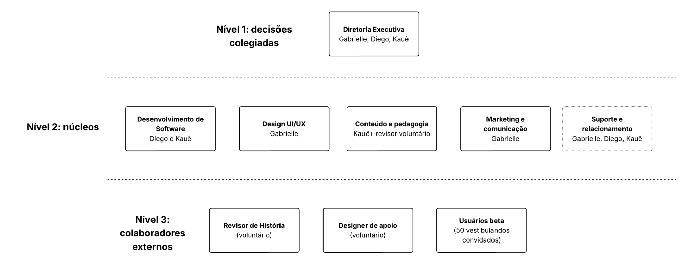

# Plano de Marketing - PomoHistória

**Fatec Rubens Lara**

**PLANO DE MARKETING**

> **MARCA**
>
> PomoHistória
>
> Produto: PomoHistória
>
> **Nomes:** Diego de Oliveira Ferreira
>
> Gabrielle Almeida Lima
>
> Kauê de Oliveira Martins
>
> **Professora:** Dra. Sofia Ruiz
>
> **Disciplina:** Marketing e Negócios
>
> Santos, junho/2026

**Sumário**

[***1. SUMÁRIO EXECUTIVO 6***](#sumário-executivo)

> [***1.1. Desenvolvimento do Produto 6***](#desenvolvimento-do-produto)
>
> [***1.2. Criação e Consolidação da Marca 7***](#criação-e-consolidação-da-marca)
>
> [**1.2.1. Objetivo do Plano De Marketing 8**](#objetivo-do-plano-de-marketing)
>
> [**1.2.2. Estratégias de Produto 8**](#estratégias-de-produto)
>
> [**1.2.3. Estratégias de Preço 8**](#estratégias-de-preço)
>
> [**1.2.4. Estratégias de Promoção 9**](#estratégias-de-promoção)
>
> [**1.2.5. Estratégias de Praças 10**](#estratégias-de-praças)
>
> [**1.2.6. Estratégias de Pessoas 10**](#estratégias-de-pessoas)
>
> [**1.2.7. Estratégias de Processos 10**](#estratégias-de-processos)
>
> [**1.2.8. Estratégias de Evidências Físicas 11**](#estratégias-de-evidências-físicas)
>
> [**1.2.9. Visão de Futuro 11**](#visão-de-futuro)
>
> [***1.3. Proponente 11***](#proponente)

[***2. EMPREENDEDOR 12***](#empreendedor)

> [***2.1. Perfil do Empreendedor 12***](#perfil-do-empreendedor)

[***3. EMPREENDIMENTO 13***](#empreendimento)

> [***3.1. PomoHistória 13***](#pomohistória)
>
> [***3.2. Características do Negócio 13***](#características-do-negócio)
>
> [***3.3. Situação Atual 14***](#situação-atual)
>
> [***3.4. Plano de Aprimoramento 14***](#plano-de-aprimoramento)
>
> [**3.4.1. Objetivos: 15**](#objetivos)
>
> [**3.4.2. Estratégias: 15**](#estratégias)
>
> [**3.4.3. Plano de Ação: 15**](#plano-de-ação)
>
> [**3.4.4. Controle e Avaliação: 21**](#controle-e-avaliação)
>
> [***3.5. Análise de Ambiente 21***](#análise-de-ambiente)
>
> [**3.5.1. Fatores Econômicos 21**](#fatores-econômicos)
>
> [**3.5.2. Fatores Socioculturais 22**](#fatores-socioculturais)
>
> [**3.5.3. Fatores Políticos/Legais 22**](#fatores-políticoslegais)
>
> [**3.5.4. Fatores Tecnológicos 23**](#fatores-tecnológicos)
>
> [**3.5.5. Concorrência 23**](#concorrência)
>
> [**3.5.6. Fatores Internos 23**](#fatores-internos)
>
> [***3.6. Definição do Público-Alvo 24***](#definição-do-público-alvo)
>
> [**3.6.1. Pessoas Físicas 24**](#pessoas-físicas)
>
> [**3.6.2. Pessoas Jurídicas 25**](#pessoas-jurídicas)
>
> [***3.7. Posicionamento no mercado 26***](#posicionamento-no-mercado)
>
> [**3.7.1. Imagem Empresarial que desejamos 26**](#imagem-empresarial-que-desejamos)
>
> [**3.7.2. Posicionamento Estratégico da Marca no Mercado 27**](#_yjw3du6m7pvu)
>
> [***3.8. Definição da Marca 28***](#_1bbdjrmhuc54)
>
> [**3.8.1. Logotipo da empresa 28**](#_6t8sce5vos6v)
>
> [**3.8.2. Slogan 29**](#_qo9zg64uejzm)
>
> [**3.8.3. Posicionamento Online 29**](#_xquwls95m1up)
>
> [***3.9. Definições de Objetivos e Metas (Período De Maio/2026 a Abril/2027) 29***](#_ei0da7yk2ary)
>
> [**3.9.1. Objetivos 29**](#_65z8u5v4l0xd)
>
> [***3.10. Definição das estratégias de marketing 31***](#_ungvw6nr7o8)
>
> [**3.10.1. Investimentos e suas possíveis fontes 31**](#_98tcafh5uygp)
>
> [**3.10.2. Fatores para a montagem da estratégia de marketing 33**](#_z9klkeaceyta)
>
> [***3.11. PRODUTO 34***](#_i5jxjbxqa5vh)
>
> [**3.11.1. Ciclo de Vida Do Produto - Fase Atual 34**](#_cl36t2g53cil)
>
> [**3.11.2. Ações a partir da fase atual 34**](#_snxdsaejr9vm)
>
> [**3.11.3. Estratégias de Crescimento 35**](#_fmh7a4b5guym)
>
> [**3.11.4. Oportunidades de Crescimento Visualizadas 35**](#_1bo1zx6hmg2u)
>
> [***3.12. PREÇO 36***](#_hzw79c1jcran)
>
> [**3.12.1. Estratégias a serem Adotadas pela Empresa. 36**](#_2qtxmbbhlbj5)
>
> [**3.12.2. Diversificação de Preços na Diversidade dos Produtos 36**](#_2nujrzkwfrjw)
>
> [**3.12.3. Preço Baseado Nos Valores Percebidos Aos Produtos Especiais 36**](#_hubpvyz97kaf)
>
> [**3.12.4. Estratégia De Preços Acessíveis Aos Produtos Tradicionais 36**](#_ctx97ztk4xrr)
>
> [**3.12.5. Ajuste de Preços por Segmento 36**](#_xj2fvtjpxbh5)
>
> [**3.12.6. Estrutura de Preços Dinâmico 36**](#_k0xtei84iims)
>
> [**3.12.7. Preços com Relação aos Custos 37**](#_l91qo9ckx84c)
>
> [**3.12.8. Estratégia de Pacotes Combinados de Vendas. 37**](#_kks4p3yjybra)
>
> [**3.12.9. Fidelização do Cliente. 37**](#_yrdwn2sebfsw)
>
> [**3.12.10. Preço para Adentrar no Mercado 37**](#_idtje2tum8ra)
>
> [**3.12.11. Transparência nos Preços 37**](#_9wb6vi9sxpr7)
>
> [***3.13. PRAÇA 37***](#_put7k88m70ah)
>
> [**3.13.1. Estratégias de Praça 37**](#_dn2mwp8bfiok)
>
> [**3.13.2. Diversificação dos Pontos de Venda 37**](#_awppf9gieu6q)
>
> [**3.13.3. Parcerias com Serviços de Entrega 37**](#_nfs13xw8wqvp)
>
> [**3.13.4. Degustações e Experiências Sensoriais 37**](#_7qceee9j6lvd)
>
> [**3.13.5. Amostras Grátis em Eventos 38**](#_4ethvujtkrkg)
>
> [**3.13.6. Canais de Venda Direta 38**](#_7oggihjxg00u)
>
> [**3.13.7. Plataforma de Multi Canais 38**](#_idutmpqgrr3)
>
> [**3.13.8. Distribuição Seletiva 38**](#_r1e29yypktfa)
>
> [**3.13.9. Expansão Mercadológica 38**](#_2ufwcymrsd6d)
>
> [**3.13.10. Distribuição Inteligente 38**](#_xup910whq66m)
>
> [**3.13.11. Experiência de Compra Personalizada 38**](#_jlep4i4xkoqo)
>
> [***3.14. PROMOÇÃO 38***](#_14exnduwnujb)
>
> [**3.14.1. Estratégias de Promoções a serem Praticadas 38**](#_4s2fdfay1zwh)
>
> [**3.14.2. Campanhas Publicitárias 38**](#_u3p091gracf2)
>
> [**3.14.3. Participação em Eventos 38**](#_wyswpcmrq57n)
>
> [**3.14.4. Parcerias com Influenciadores Digitais 39**](#_icgywabunyhx)
>
> [**3.14.5. Promoções Especiais De Lançamento 39**](#_lgcr0aivhg3k)
>
> [**3.14.6. Publicidade Online e Offline 39**](#_7ezsk6tqylpc)
>
> [**3.14.7. Vendas Diretas e Telemarketing 39**](#_f3hg17k9znot)
>
> [**3.14.8. Marketing Direto 39**](#_uu5y91apqz6q)
>
> [**3.14.9. Segmentação de Comunicação 39**](#_ouy63e8dy44m)
>
> [**3.14.10. Integração de Marketing Digital e Tradicional 39**](#_a6ozrjwb6liu)
>
> [**3.14.11. Campanhas de Aquisição 39**](#_l9gipnagcu87)
>
> [**3.14.12. Campanhas de Monetização 39**](#_yuxzp2uw56e6)
>
> [**3.14.13. Campanhas de Fidelização 39**](#_tmtw15ood0ww)
>
> [***3.15. PESSOAS 40***](#_o9sv2smw6byj)
>
> [**3.15.1. Estratégias Voltadas aos Funcionários  
> As estratégias voltadas à equipe buscam garantir um ambiente colaborativo, produtivo e alinhado aos objetivos da empresa. 40**](#_y7zft1vblq1l)
>
> [**3.15.2. Recrutamento 40**](#_lloeavv9jt3)
>
> [**3.15.3. Treinamento 40**](#_zft58sj3750b)
>
> [**3.15.4. Código De Conduta 40**](#_g2lwk4okno66)
>
> [**3.15.5. Comunicação Interna 40**](#_uwgu5pyu3xkl)
>
> [**3.15.6. Avaliação e Remuneração 40**](#_8asmu3xj96p6)
>
> [**3.15.7. Desenvolvimento de Conhecimento 41**](#_1uc3498a1vtq)
>
> [***3.16. PROCESSOS 41***](#_o070h3pzqu18)
>
> [**3.16.1. Estratégias para os Processos da Empresa 41**](#_9z2hpss7z2gf)
>
> [**3.16.2. Adoção de Normas de Qualidade e Segurança. 41**](#_tlxhs4pfhn4b)
>
> [**3.16.3. Atenção aos Detalhes e Qualidade. 41**](#_wsx08iyx2bkk)
>
> [**3.16.4. Seleção Cuidadosa de Fornecedores e Parceiros. 41**](#_1efh7ndmg1qb)
>
> [**3.16.5. Sistema de Entrega Eficiente e Confiável. 41**](#_ylc03c5am51n)
>
> [**3.16.6. Experiência do Cliente no Uso do Produto. 42**](#_29lrwgqsqkue)
>
> [**3.16.7. Garantia de Qualidade e Satisfação. 42**](#_2bef5qk83ivg)
>
> [**● Política de reembolso integral nos primeiros 7 dias de assinatura; 42**](#)
>
> [**● Suporte humano com tempo de resposta menos de 2 horas para premium, menos de 24 horas para gratuíto; 42**](#)
>
> [**● Pesquisa de satisfação pós-resolução. 42**](#)
>
> [**3.16.8. Práticas Ambientais Responsáveis. 42**](#_kso62lv86u5g)
>
> [**● Compensação de carbono dos servidores via parceria com programa de reflorestamento; 42**](#)
>
> [**● Uso de energia renovável na infraestrutura; 42**](#)
>
> [**● Política de trabalho remoto (redução de deslocamento). 42**](#)
>
> [***3.17. Evidências Físicas 42***](#_5reqgnvxxbvu)
>
> [**3.17.1. Estratégias voltadas ao ambiente 42**](#_o758zepc4bt7)

[***4. ESTRUTURA ADMINISTRATIVA DA EMPRESA. 43***](#estrutura-administrativa-da-empresa.)

> [**4.1. Constituição Jurídica 43**](#constituição-jurídica)
>
> [**4.1.1. Natureza do Projeto 43**](#natureza-do-projeto)
>
> [**4.1.2. Regime Tributário 43**](#regime-tributário)
>
> [**4.1.3. Responsabilidade Social e Ambiental 43**](#responsabilidade-social-e-ambiental)
>
> [***4.2. Estrutura Organizacional da Empresa 44***](#estrutura-organizacional-da-empresa)
>
> [**4.2.1. Equipe Gerencial 44**](#equipe-gerencial)
>
> [***4.3. Organograma da Empresa Detalhado: 45***](#organograma-da-empresa-detalhado)
>
> [**4.3.1. Diretoria Executiva: 45**](#diretoria-executiva)
>
> [**4.3.2. Núcleo de Desenvolvimento de Software 45**](#núcleo-de-desenvolvimento-de-software)
>
> [**4.3.3. Núcleo de Design e Experiência do Usuário (UX/UI) 45**](#núcleo-de-design-e-experiência-do-usuário-uxui)
>
> [**4.3.4. Núcleo de Conteúdo e Pedagogia 45**](#núcleo-de-conteúdo-e-pedagogia)
>
> [**4.3.5. Núcleo de Marketing e Comunicação 45**](#núcleo-de-marketing-e-comunicação)
>
> [**4.3.6. Núcleo de Suporte e Relacionamento com Usuários 46**](#núcleo-de-suporte-e-relacionamento-com-usuários)
>
> [**4.3.7. Imagem do Organograma Detalhado da Empresa. 46**](#imagem-do-organograma-detalhado-da-empresa.)

[***5. ESTRUTURA FÍSICA DA EMPRESA 46***](#estrutura-física-da-empresa)

> [***5.1. Layout: 46***](#layout)
>
> [***5.2. Capacidade Instalada 47***](#capacidade-instalada)

[***6. IMPLEMENTAÇÃO DO PLANO DE MARKETING 47***](#implementação-do-plano-de-marketing)

> [***6.1. Avaliação e Controle 47***](#avaliação-e-controle)
>
> [***6.2. Processos de Controle e Avaliação (Trimestral) 48***](#processos-de-controle-e-avaliação-trimestral)
>
> [**6.2.1. Planejamento 48**](#planejamento)
>
> [**6.2.2. Monitoramento 48**](#monitoramento)
>
> [**6.2.3. Avaliação 48**](#avaliação)
>
> [**6.2.4. Ação Corretiva 48**](#ação-corretiva)
>
> [**6.2.5. Comunicação Interna 48**](#comunicação-interna-1)
>
> [***6.3. Relatórios e Ferramentas. 48***](#relatórios-e-ferramentas.)
>
> [**6.3.1. Painel de Marketing. 48**](#painel-de-marketing.-o-painel-de-marketing-reunirá-dados-sobre-acessos-ao-site-número-de-usuários-cadastrados-origem-dos-visitantes-desempenho-das-campanhas-crescimento-das-redes-sociais-e-conversões-para-o-plano-premium.-esse-painel-facilitará-a-visualização-dos-resultados-e-ajudará-a-identificar-quais-canais-estão-trazendo-mais-retorno-para-a-marca.)
>
> [**6.3.2. Relatórios de Desempenho. 48**](#relatórios-de-desempenho.-os-relatórios-de-desempenho-serão-elaborados-mensalmente-e-analisados-de-forma-mais-completa-a-cada-trimestre.-eles-apresentarão-um-resumo-das-ações-realizadas-os-resultados-alcançados-as-dificuldades-encontradas-e-as-propostas-de-melhoria-para-o-próximo-período.-esses-relatórios-serão-importantes-para-manter-o-controle-do-crescimento-do-pomohistória.)
>
> [**6.3.3. Feedback dos Clientes. 48**](#feedback-dos-clientes.-o-feedback-dos-usuários-será-utilizado-como-uma-fonte-importante-de-melhoria.-por-meio-de-formulários-mensagens-no-suporte-comentários-nas-redes-sociais-e-pesquisas-de-satisfação-a-equipe-poderá-compreender-melhor-as-necessidades-dos-estudantes.-essas-informações-ajudarão-no-aperfeiçoamento-da-interface-dos-conteúdos-de-história-da-gamificação-e-do-atendimento-ao-usuário.)
>
> [**6.3.4. Reuniões de Revisão. 48**](#reuniões-de-revisão.-as-reuniões-de-revisão-serão-realizadas-para-discutir-os-relatórios-avaliar-os-resultados-e-definir-os-próximos-passos.-nelas-a-equipe-poderá-decidir-quais-campanhas-devem-continuar-quais-precisam-ser-alteradas-e-quais-novas-ações-podem-ser-colocadas-em-prática.-com-esse-acompanhamento-constante-a-implementação-do-plano-de-marketing-do-pomohistória-será-mais-organizada-e-alinhada-aos-objetivos-da-empresa.)

[***7. ANEXOS 49***](#anexos)

> [***7.1. Foto do Produto escolhido inicialmente 49***](#foto-do-produto-escolhido-inicialmente)
>
> [***7.2. Foto do Produto Depois com sua Marca. 49***](#foto-do-produto-depois-com-sua-marca.)

# SUMÁRIO EXECUTIVO

A premissa central do PomoHistória é resolver uma dor objetiva dos estudantes que se preparam para vestibulares: a dificuldade de manter constância nos estudos diante do volume extenso de conteúdos de História Geral e História do Brasil. A proposta da plataforma é reunir, em um único ambiente digital, a técnica Pomodoro, módulos organizados de conteúdo, quizzes de revisão, trava pedagógica e gamificação visual, criando uma experiência de estudo mais estruturada, menos dispersiva e mais mensurável para o usuário.

A análise de mercado indica que ferramentas de produtividade como Focus To-Do, Forest, Trello, Anki e temporizadores Pomodoro tradicionais ajudam no controle do tempo, mas não entregam, de forma integrada, conteúdo pedagógico específico de História. Por outro lado, plataformas educacionais amplas costumam oferecer aulas e materiais, mas nem sempre estimulam a disciplina diária do estudante por meio de mecânicas de foco e recompensas. O PomoHistória ocupa essa lacuna ao unir produtividade, aprendizagem e gamificação em uma aplicação web responsiva, acessível pelo navegador e pensada inicialmente para vestibulandos da Baixada Santista e do estado de São Paulo.

O diferencial estratégico está na combinação entre gestão de tempo, banco de questões, evolução visual do personagem e controle mínimo de aprendizagem por aproveitamento. O usuário não apenas estuda por blocos de tempo, mas também responde a questões, visualiza seu progresso e recebe estímulos para manter a rotina.

## Desenvolvimento do Produto

O desenvolvimento do PomoHistória será orientado pela criação de um MVP funcional, capaz de validar a proposta principal antes de investimentos maiores em mídia paga, equipe externa ou expansão nacional. A primeira versão da aplicação deverá contemplar as funcionalidades essenciais: temporizador Pomodoro, cadastro de usuários, primeiros módulos de História Geral, quizzes básicos, sistema inicial de evolução do personagem e trava pedagógica de 70% de aproveitamento para progressão temática.

Diferente de cronômetros genéricos, o PomoHistória não tratará o tempo de estudo como uma atividade isolada. Cada ciclo de foco será conectado a uma trilha de aprendizagem, permitindo que o estudante conclua uma sessão de Pomodoro e, em seguida, responda às questões relacionadas ao tema estudado. Essa integração transforma o tempo dedicado em ação pedagógica mensurável, pois o progresso do usuário poderá ser acompanhado por acertos, frequência de uso, evolução do personagem e relatórios de desempenho.

O mecanismo de trava pedagógica, que exige aproveitamento mínimo de 70% nos questionários para a liberação de novos módulos, funciona como garantia de entrega de valor educacional. Ele evita que o estudante avance superficialmente pelos conteúdos e reforça a ideia de aprendizagem progressiva. Caso o usuário não atinja o percentual necessário, a plataforma deverá sugerir revisão do conteúdo, novo ciclo Pomodoro e tentativa posterior, ressignificando o erro como parte do processo de aprendizagem.

A gamificação será representada por um personagem virtual que acompanha o aluno ao longo da jornada. Esse personagem evolui conforme o usuário conclui ciclos, acerta questões e avança por períodos históricos. Em contrapartida, a falta de constância pode gerar regressão visual, reforçando o hábito de estudo sem recorrer a punições excessivas. Na comunicação de marketing, esse elemento será tratado como um ativo central da marca, pois torna o progresso visível e compartilhável.

As campanhas de comunicação devem respeitar a etapa de desenvolvimento. Antes do lançamento oficial, a prioridade será a criação de landing page de espera, captação de e-mails, divulgação de bastidores do protótipo e formação de uma lista de early adopters. Após os testes beta, os aprendizados obtidos com os usuários serão utilizados para ajustar mensagens, funcionalidades e argumentos de venda.

**Tabela 1 - Atributos do produto e impacto estratégico de marketing**

| **Atributo de Produto**  | **Funcionalidade Técnica**                                                                                                               | **Impacto Estratégico de Marketing**                                                                                      |
|--------------------------|------------------------------------------------------------------------------------------------------------------------------------------|---------------------------------------------------------------------------------------------------------------------------|
| Temporizador Pomodoro    | Ciclos programáveis de foco e descanso, inicialmente configurados no padrão 25 minutos de estudo e 5 minutos de pausa.                   | Associação direta com produtividade, disciplina e rotina de estudos, facilitando campanhas educativas sobre foco.         |
| Módulos de História      | Conteúdos organizados por temas de História Geral e História do Brasil, com prioridade inicial para tópicos recorrentes em vestibulares. | Diferenciação frente a aplicativos genéricos, pois o tempo de estudo é conectado a conteúdo pedagógico específico.        |
| Questionários de Revisão | Banco de questões com quizzes básicos no MVP e expansão gradual para questões avançadas, comentadas e segmentadas por vestibular.        | Geração de valor percebido, pois o aluno consegue verificar desempenho e identificar lacunas de aprendizagem.             |
| Trava Pedagógica         | Exigência de 70% de aproveitamento para progressão nos módulos, com recomendação de revisão quando o índice não for atingido.            | Reforça a promessa de aprendizagem real, evitando que o usuário avance apenas por concluir etapas sem dominar o conteúdo. |
| Gamificação Visual       | Personagem evolutivo relacionado aos períodos históricos estudados, com progressão por desempenho e constância.                          | Aumento de retenção e engajamento emocional, tornando o progresso visível, motivador e compartilhável.                    |

## Criação e Consolidação da Marca

A marca PomoHistória foi concebida para representar foco, constância e evolução acadêmica. O nome sintetiza a união entre a técnica Pomodoro e a disciplina de História, criando uma identidade verbal clara, memorável e diretamente relacionada à proposta de valor. A marca não deve ser apresentada apenas como um aplicativo de cronômetro, mas como uma ferramenta de estudo orientada por tempo, conteúdo e progresso.

A consolidação da marca dependerá da capacidade de provar, na prática, que o PomoHistória ajuda o estudante a organizar sua rotina e revisar História com maior frequência. Por isso, a comunicação inicial precisa se apoiar em validação, testes com usuários beta e resultados de uso, como número de ciclos concluídos, evolução em quizzes e depoimentos sobre melhora na constância. Essa abordagem é mais coerente do que utilizar, desde o início, promessas de aprovação em vestibulares sem base de dados suficiente.

O propósito da marca é transformar a preparação para vestibulares em uma jornada de conquistas diárias. Ao associar o crescimento do personagem virtual à absorção de períodos históricos, o PomoHistória ressignifica a rotina de estudo e torna a evolução mais concreta. O erro deixa de ser comunicado como fracasso e passa a ser interpretado como sinal de revisão, tentativa e aprendizado contínuo.

Os elementos que compõem o DNA da marca são a precisão tecnológica, a organização pedagógica, a psicologia comportamental aplicada à produtividade e uma linguagem jovem, porém responsável. Visualmente, a marca deve equilibrar seriedade educacional e estética gamificada, utilizando elementos que remetam ao Pomodoro, à História e ao universo de jogos digitais sem perder credibilidade acadêmica.

Na fase inicial, a consolidação ocorrerá principalmente no ambiente digital, com presença em landing page, Instagram, TikTok, YouTube, Discord e conteúdos de blog voltados a SEO. Em paralelo, a marca buscará legitimidade regional por meio de parcerias com cursinhos e escolas da Baixada Santista, utilizando a proximidade com a FATEC Rubens Lara como ponto de origem e credibilidade institucional.

### Objetivo do Plano De Marketing

O objetivo central deste plano de marketing é posicionar o PomoHistória como uma solução digital de estudo para vestibulandos que desejam melhorar sua constância, foco e desempenho em História por meio da técnica Pomodoro, de quizzes e de gamificação. O plano deve orientar o lançamento do MVP, a validação do produto com usuários reais e a construção gradual de base de usuários, evitando metas incompatíveis com a fase inicial do empreendimento.

Para o primeiro ciclo, compreendido entre maio de 2026 e abril de 2027, a estratégia será dividida em três momentos: pré-lançamento, lançamento e validação pós-lançamento. No pré-lançamento, a prioridade será captar interessados e testar a aceitação da proposta. No lançamento, o foco será apresentar o MVP ao público e gerar os primeiros cadastros. No pós-lançamento, o objetivo será acompanhar retenção, conversão para Premium, satisfação do usuário e adequação das funcionalidades.

As metas para o primeiro ano são: validar o MVP com pelo menos 50 usuários beta, alcançar aproximadamente 1000 usuários cadastrados, atingir 500 usuários ativos mensais, converter entre 5% e 10% da base ativa mais engajada para o plano Premium e estabelecer parcerias iniciais com 3 cursinhos ou instituições educacionais. Essas metas são mais coerentes com uma operação enxuta e com orçamento inicial limitado, mantendo a possibilidade de crescimento sem comprometer a credibilidade do plano.

A estratégia geral envolve um funil de marketing orientado por conteúdo, comunidade e experimentação. A autoridade acadêmica dos proponentes Diego de Oliveira Ferreira, Kauê de Oliveira Martins e Gabrielle Almeida Lima será utilizada como elemento de confiança, mas a prova principal da marca deverá vir do uso da plataforma, dos dados de engajamento e dos relatos de usuários beta.

### Estratégias de Produto

A estratégia de produto do PomoHistória será estruturada a partir de uma lógica de MVP evolutivo. A primeira versão deve entregar o núcleo da proposta: foco com Pomodoro, estudo de História, quizzes e evolução visual. Funcionalidades mais robustas, como relatórios avançados, trilhas personalizadas, integração com escolas e expansão para outras disciplinas, deverão ser implementadas somente após a validação do uso recorrente e da aceitação da proposta pelo público.

O conteúdo pedagógico será organizado em módulos progressivos, com temas de História Geral disponíveis inicialmente em formato introdutório e História do Brasil expandida no plano Premium. Essa divisão reforça a lógica freemium: o estudante consegue experimentar a ferramenta gratuitamente, mas encontra valor adicional na assinatura ao buscar aprofundamento, feedback detalhado e acompanhamento de desempenho.

Cada questão inserida na plataforma deverá refletir o nível de complexidade esperado em vestibulares e exames como ENEM, FUVEST e demais processos seletivos relevantes para o público-alvo. Na fase inicial, recomenda-se que o conteúdo seja revisado por professor de História voluntário ou parceiro, evitando erros conceituais e fortalecendo a credibilidade da ferramenta.

A experiência de onboarding será um componente estratégico do produto. O usuário deve sair do cadastro para o primeiro ciclo Pomodoro em menos de três minutos, entendendo rapidamente como estudar, responder questões e acompanhar a evolução do personagem. Quanto menor a fricção inicial, maior a chance de ativação e retenção.

Além disso, a interface responsiva será essencial para a distribuição. Como o público jovem alterna entre celular, computador escolar, notebook pessoal e dispositivos compartilhados, a aplicação precisa ser simples, leve e acessível. A meta operacional é manter tempo de carregamento reduzido, navegação intuitiva e compatibilidade com diferentes tamanhos de tela.

### Estratégias de Preço

A estratégia de precificação do PomoHistória será baseada em acessibilidade, recorrência e percepção clara de valor. Como o público principal é composto por jovens vestibulandos, muitos deles dependentes financeiramente dos pais ou responsáveis, o preço precisa reduzir barreiras de entrada sem inviabilizar a manutenção da plataforma.

O modelo adotado será Freemium. O plano gratuito funcionará como motor de aquisição, permitindo que o estudante teste a proposta, crie rotina e perceba valor antes de assinar. O plano Premium será direcionado aos usuários que desejam aprofundamento, acompanhamento mais completo e recursos adicionais para preparação intensiva.

- Nível Gratuito: acesso ao temporizador Pomodoro, módulos introdutórios de História Geral, quizzes básicos, evolução inicial do personagem e participação em campanhas ou desafios gratuitos.

- Nível Premium: acesso à biblioteca completa de História do Brasil, módulos avançados de História Geral, questionários com feedback detalhado, relatórios de desempenho, personalização do personagem e recursos adicionais de acompanhamento.

A precificação foi padronizada para eliminar divergências entre as partes do plano. O valor semestral adotado será R$69,90, mantendo coerência com a proposta de acessibilidade e com o ciclo de preparação de vestibulandos. O plano anual de R$149,00 será oferecido como alternativa de maior fidelização, com economia em relação à mensalidade avulsa.

**Tabela 2 - Modelo de preços**

| **Modelo de Preço**           | **Público-Alvo**                                                                                    | **Justificativa Estratégica**                                                                                                           |
|-------------------------------|-----------------------------------------------------------------------------------------------------|-----------------------------------------------------------------------------------------------------------------------------------------|
| Freemium (Grátis)             | Estudantes em fase de descoberta, vestibulandos que ainda não conhecem a marca e usuários beta.     | Reduz a barreira de entrada, permite experimentação do produto e amplia a base para ações de remarketing, comunidade e indicação.       |
| Assinatura Mensal (R$ 19,90) | Vestibulandos que desejam testar o Premium sem compromisso de longo prazo.                          | Gera receita recorrente inicial, facilita a conversão após o uso gratuito e permite cancelamento simples, reduzindo objeções de compra. |
| Plano Semestral (R$ 69,90)   | Alunos de ensino médio, cursinhos e estudantes com preparação concentrada em um semestre letivo.    | Alinha o pagamento ao ciclo acadêmico, oferece desconto em relação ao plano mensal e favorece maior retenção.                           |
| Assinatura Anual (R$ 149,00) | Estudantes em preparação contínua, treineiros e usuários que desejam acompanhamento de longo prazo. | Aumenta a previsibilidade de receita, reduz churn e estimula fidelização com melhor custo-benefício.                                    |
| Cupons de Desconto            | Usuários vindos de influenciadores, cursinhos parceiros, webinars e campanhas sazonais.             | Estimula conversão rápida, permite mensurar canais por UTM e apoia testes de CAC sem comprometer a política de preços.                  |

Para fortalecer a confiança do consumidor, a política comercial deverá incluir transparência nos valores, ausência de taxas ocultas, possibilidade de cancelamento simplificado e reembolso nos primeiros 7 dias de assinatura. Essa comunicação reduz inseguranças comuns em serviços digitais por assinatura e melhora a percepção ética da marca.

### Estratégias de Promoção

| **Estratégia**                               | **Descrição**                                                                                                                                                                                | **Canais**                                                         | **Periodicidade**                                                                           | **Métrica de Sucesso**                                                                                                                      |
|----------------------------------------------|----------------------------------------------------------------------------------------------------------------------------------------------------------------------------------------------|--------------------------------------------------------------------|---------------------------------------------------------------------------------------------|---------------------------------------------------------------------------------------------------------------------------------------------|
| Marketing de Conteúdo Educacional            | Produção de conteúdos sobre Técnica Pomodoro, História para vestibular, organização de estudos e uso do PomoHistória. O foco será educar o público e gerar autoridade antes da venda direta. | Blog, YouTube, TikTok, Instagram                                   | 2 artigos por semana no blog, 1 vídeo semanal no YouTube e 3 Reels/TikToks por semana.      | Tráfego orgânico inicial entre 500 e 800 visitas/mês após o lançamento; tempo médio de leitura acima de 2 minutos.                          |
| Campanhas em Redes Sociais (Orgânico)        | Publicações curtas mostrando evolução do personagem, bastidores do MVP, curiosidades históricas, desafios de 25 minutos e dicas de estudo.                                                   | TikTok e Instagram (Feed, Stories e Reels)                         | 1 publicação por dia durante lançamento e 3 a 5 publicações semanais na fase de manutenção. | Alcance de 2 mil a 5 mil impressões/mês após o lançamento; taxa de engajamento superior a 6%.                                               |
| Tráfego Pago Piloto                          | Anúncios segmentados para validar criativos, palavras-chave e públicos. O investimento será limitado e ocorrerá somente após página de captura e MVP minimamente funcional.                  | Google Ads, TikTok Ads e Instagram Ads                             | Teste concentrado em 2 meses, com orçamento total inicial de R$ 400,00.                    | CTR (*Click Through Rate*) acima de 2%; custo por lead qualificado inferior a R$ 15,00; identificação dos criativos com melhor desempenho. |
| Parcerias com Influenciadores (Micro e Nano) | Envio de acesso Premium vitalício para perfis de estudo, vestibular e História, priorizando criadores com comunidade engajada e linguagem próxima do público.                                | Instagram, TikTok e YouTube                                        | Ações pontuais durante pré-lançamento e lançamento, com 5 a 10 microinfluenciadores.        | Ao menos 5 publicações ou stories gerados; tráfego rastreado por UTM ( *Urchin Tracking Module*); primeiras conversões atribuídas ao canal. |
| Programa de Indicação                        | Usuário que convidar 3 amigos ganha 1 mês de Premium. O objetivo é estimular crescimento orgânico sem depender de mídia paga constante.                                                      | E-mail, WhatsApp, redes sociais e painel do usuário                | Lançamento a partir do 3º mês após o MVP público.                                           | Número de indicações por usuário ativo; taxa de cadastro por link; crescimento orgânico da base.                                            |
| E-mail Marketing e Automação                 | Fluxos de boas-vindas, tutorial de uso, lembretes de estudo e ofertas de upgrade para usuários com maior engajamento.                                                                        | Mailchimp, Brevo ou ferramenta gratuita integrada à landing page   | Automático, com gatilhos de cadastro, inatividade e conclusão de ciclos.                    | Taxa de abertura acima de 35%; CTR acima de 4%; conversão por e-mail entre 1% e 2%.                                                         |
| Eventos e Webinars                           | Realização de encontros online sobre como estudar História com Pomodoro, além de demonstrações do produto para usuários beta e cursinhos parceiros.                                          | YouTube Live, Google Meet e eventos de cursinhos                   | Semana do Foco Histórico no lançamento e 1 webinar mensal após validação.                   | 50 participantes por webinar; conversão mínima de 20% dos inscritos em cadastros na plataforma.                                             |
| Promoções Sazonais e Descontos               | Ofertas alinhadas aos períodos de maior busca por estudo, como pré-ENEM, inscrições de vestibulares, início de semestre e Black Friday.                                                      | Landing page, e-mail, redes sociais e influenciadores parceiros    | Campanhas em maio, setembro, novembro e início do ano letivo.                               | Aumento de cadastros e assinaturas no período; acompanhamento de ticket médio e conversão por cupom.                                        |
| Comunidade e Gamificação Social              | Criação gradual de comunidade para troca de dicas, desafios de estudo e acompanhamento coletivo, sem tornar rankings obrigatórios ou punitivos.                                              | Discord, WhatsApp e Telegram                                       | Início com grupo beta; expansão após lançamento público.                                    | 150 membros ativos em 6 meses; maior retenção entre usuários participantes da comunidade.                                                   |
| Programa de Afiliados B2B                    | Parcerias com cursinhos e escolas para indicação da ferramenta, com possibilidade futura de comissão ou plano institucional.                                                                 | E-mail comercial, reuniões presenciais e landing page de parceiros | Prospecção a partir do lançamento e consolidação no 2º semestre de operação.                | 3 cursinhos ou instituições parceiras no primeiro ano; geração de cadastros por canal institucional.                                        |
| Prova Social e Cases de Uso                  | Coleta de depoimentos de usuários beta sobre rotina de estudo, constância, clareza da interface e evolução em simulados, sem prometer aprovação antes de dados reais.                        | Site, Instagram, YouTube e páginas de venda                        | Coleta contínua com consolidação trimestral.                                                | NPS (*Net Promoter Score*) inicial acima de 50; depoimentos publicados; aumento de conversão em páginas com prova social.                   |
| Campanha de Bolsas (Sustentabilidade Social) | Concessão inicial de bolsas Premium para estudantes de baixa renda de escolas públicas, aproveitando o baixo custo marginal do produto digital.                                              | Site, redes sociais, e-mail para escolas parceiras e ONGs          | Primeiro edital piloto no início do ano letivo ou antes do ENEM.                            | 50 bolsas no primeiro ano; expansão gradual conforme crescimento da receita e capacidade operacional.                                       |

### Estratégias de Praças

A praça principal do PomoHistória é o ambiente digital. A plataforma será disponibilizada como aplicação web responsiva, acessível por navegador, o que reduz barreiras de instalação e permite uso em diferentes dispositivos. A distribuição, portanto, não depende de pontos físicos de venda ou serviços de entrega, mas de canais digitais de aquisição, acesso estável à plataforma e parcerias educacionais.

Na fase inicial, a presença digital será estruturada por meio de landing page, blog, redes sociais, e-mail marketing e comunidade. Esses canais serão responsáveis por atrair usuários, explicar a proposta, demonstrar o MVP, converter cadastros e manter relacionamento. O site deve apresentar demonstração do produto, planos, perguntas frequentes, política de privacidade, depoimentos e conteúdos educativos.

A distribuição seletiva ocorrerá por parcerias com cursinhos, escolas e projetos educacionais da Baixada Santista, especialmente em Santos, São Vicente, Guarujá e Praia Grande. Nesses ambientes, o PomoHistória poderá ser apresentado como ferramenta complementar para o estudo de História, com demonstrações gratuitas, testes beta e cupons de acesso Premium.

A expansão geográfica será dividida em fases. Em 2026 e 2027, a prioridade será validar o produto na Baixada Santista e nos canais digitais do estado de São Paulo. Em 2027, a atuação poderá ser ampliada para São Paulo capital e interior, priorizando cursinhos e escolas com foco em ENEM e vestibulares de alta concorrência. A expansão nacional deverá ser tratada como objetivo posterior, a partir de 2028 ou 2029, quando houver maior base de usuários, dados de retenção e estrutura operacional.

### Estratégias de Pessoas

A estratégia de pessoas precisa refletir a realidade operacional da empresa. Na fase inicial, o PomoHistória será conduzido pelos três proponentes: Diego de Oliveira Ferreira, Kauê de Oliveira Martins e Gabrielle Almeida Lima. A equipe combinará competências de desenvolvimento, front-end, back-end, banco de dados, design, conteúdo, marketing digital e atendimento ao usuário.

Diego atuará com maior foco em arquitetura, back-end, banco de dados, infraestrutura e integração de pagamentos. Kauê terá atuação voltada ao front-end, lógica de gamificação, implementação dos quizzes, testes de usabilidade e integração da experiência do usuário. Gabrielle ficará responsável por design de interface, identidade visual, criação de conteúdo, redes sociais, parcerias e relacionamento com usuários.

A formação de uma equipe multidisciplinar com professores de História, pesquisadores, designer UI/UX dedicado e suporte especializado é uma meta de crescimento, não uma estrutura já disponível no início. Para o MVP, o apoio externo deverá ocorrer de forma pontual, com professor voluntário para revisão dos conteúdos e eventual colaboração de designer parceiro em ajustes visuais.

O atendimento ao usuário será tratado como parte da experiência de marca. Entretanto, para manter coerência com a equipe reduzida, o SLA (Service Level Agreement) inicial deverá ser realista: resposta em até 24 horas úteis para usuários Premium, até 48 horas úteis para usuários gratuitos e até 12 horas úteis para parceiros B2B em fase de teste. Como objetivo futuro, suporte em menos de 2 horas, após contratação ou estruturação de atendimento dedicado.

A cultura interna deverá valorizar aprendizado contínuo, agilidade, transparência e foco no usuário. Reuniões semanais, uso de Kanban, retrospectivas quinzenais e análise de feedback serão práticas essenciais para manter alinhamento entre produto, marketing e conteúdo pedagógico.

### Estratégias de Processos

Os processos internos do PomoHistória devem garantir consistência entre desenvolvimento, conteúdo, atendimento e marketing. Desde a modelagem inicial, com wireframes, análise de requisitos, diagrama de casos de uso e fluxos de eventos, cada etapa precisa ser documentada para reduzir retrabalho e facilitar a evolução do MVP.

O desenvolvimento será conduzido com metodologia ágil, em ciclos curtos de planejamento, execução, teste e revisão. As funcionalidades prioritárias serão validadas com usuários beta antes de serem comunicadas como recursos definitivos. Esse processo reduz o risco de investir em funcionalidades pouco úteis e aumenta a aderência do produto às necessidades reais dos vestibulandos.

No conteúdo pedagógico, o processo deve incluir seleção de temas, elaboração de questões, revisão por fonte confiável ou professor parceiro, cadastro no sistema, testes de funcionamento e monitoramento de desempenho. Caso muitos usuários errem determinada questão, a equipe deverá avaliar se o problema está no conteúdo, na formulação ou na ausência de material explicativo suficiente.

O suporte pós-venda seguirá fluxo simples e rastreável: recebimento da dúvida por WhatsApp Business, e-mail ou formulário; classificação do problema; resposta ao usuário; registro do feedback; e encaminhamento para melhoria de produto, quando necessário. Reclamações recorrentes devem alimentar o backlog de desenvolvimento e as pautas de conteúdo educativo.

Também serão adotados processos básicos de segurança e conformidade, incluindo política de privacidade, consentimento para uso de dados, proteção de informações de login e atenção à Lei Geral de Proteção de Dados (LGPD). Como o produto trabalha com dados de estudo e possíveis usuários menores de idade, a comunicação deve ser clara, responsável e transparente.

### Estratégias de Evidências Físicas

Em um serviço digital, as evidências físicas são substituídas por elementos tangíveis da experiência: interface, identidade visual, relatórios, telas de progresso, personagem evolutivo, notificações, e-mails e materiais de apresentação. Esses elementos funcionam como prova visual da qualidade e ajudam o usuário a perceber o valor do serviço mesmo antes de concluir a preparação para um vestibular.

A interface deverá apresentar organização clara, cores coerentes com a identidade da marca e elementos visuais que associem produtividade, História e gamificação. O personagem virtual será uma das principais evidências do progresso, pois transforma ciclos concluídos e acertos em evolução visual. Relatórios e dashboards também terão papel importante para tornar o desempenho mensurável.

A landing page será outra evidência essencial. Ela deve apresentar proposta de valor, demonstrações do produto, prints da interface, explicação dos planos, depoimentos de usuários beta, política de bolsas e perguntas frequentes. Para parceiros B2B, materiais digitais como apresentação institucional, one page comercial e demonstração guiada substituirão materiais físicos tradicionais.

Mesmo sem loja física, a marca poderá criar experiências memoráveis por meio de alertas sonoros suaves de início e fim de ciclo, notificações personalizadas, certificados simbólicos de conclusão de trilhas, conquistas visuais e relatórios compartilháveis. Esses recursos reforçam o ritual de estudo e ajudam a transformar o uso da plataforma em hábito.

### Visão de Futuro

A visão de futuro do PomoHistória contempla a transição gradual de uma ferramenta de nicho para um ecossistema de produtividade educacional. No curto prazo, o foco será concluir o MVP, validar a aceitação com usuários beta, lançar a plataforma e construir uma base inicial de estudantes ativos. Essa etapa é essencial para gerar dados reais antes de qualquer expansão mais agressiva.

No médio prazo, após validação da retenção e da conversão para Premium, a empresa poderá ampliar a biblioteca de História, desenvolver trilhas personalizadas, oferecer relatórios mais robustos e iniciar planos institucionais para cursinhos e escolas. Também poderá expandir a atuação para São Paulo capital e interior, aproveitando dados de origem dos usuários e desempenho dos canais digitais.

No longo prazo, o roadmap prevê a expansão para outras disciplinas das Ciências Humanas, como Geografia, Sociologia e Filosofia, mantendo a mesma lógica de Pomodoro, quizzes, progressão e gamificação. A incorporação de Inteligência Artificial deverá ocorrer apenas após a maturidade do produto, com objetivo de personalizar revisões, sugerir trilhas de estudo e identificar padrões de fadiga ou dificuldade.

A responsabilidade social continuará fazendo parte da marca, mas de forma financeiramente sustentável. O programa de bolsas Premium começará com número limitado de estudantes, considerando o baixo custo marginal do produto digital, e será ampliado conforme crescimento da receita e da estrutura operacional. Essa abordagem preserva a proposta de democratização do acesso sem criar metas incompatíveis com a fase inicial do negócio.

A consolidação nacional será tratada como uma meta futura, não imediata. Antes de alcançar milhões de vestibulandos no Brasil, o PomoHistória deverá provar sua utilidade em escala menor, conquistar usuários recorrentes, formar parcerias regionais e desenvolver processos confiáveis de atualização de conteúdo e atendimento.

## Proponente

Os proponentes deste projeto são Diego de Oliveira Ferreira, Kauê de Oliveira Martins e Gabrielle Almeida Lima, estudantes concluintes do curso de Tecnologia em Sistemas para Internet da Faculdade de Tecnologia Baixada Santista - Rubens Lara, localizada em Santos, SP. A formação tecnológica do grupo oferece base para o desenvolvimento da aplicação web, estruturação do banco de dados, criação da interface, implementação de recursos de gamificação e planejamento de evolução do produto.

A equipe proponente possui competências complementares para a fase inicial do empreendimento. Diego contribui com experiência em desenvolvimento back-end, banco de dados e estrutura técnica. Kauê contribui com desenvolvimento front-end, lógica de sistemas, gamificação e testes de usabilidade. Gabrielle contribui com design, criação de conteúdo, comunicação digital e relacionamento com potenciais parceiros e usuários.

A PomoHistória, enquanto proposta de negócio, dedica-se à criação de software educacional de alta acessibilidade, combinando técnica de produtividade, conteúdo histórico e experiência gamificada. A missão da empresa é auxiliar estudantes a transformarem o tempo de estudo em progresso visível, mensurável e conectado às exigências dos vestibulares.

# EMPREENDEDOR

## Perfil do Empreendedor

**Nome:** Gabrielle Almeida Lima

**CPF:** 413.036.658-08

**Endereço:** Rua Gaspar Lourenço, Náutica, São Vicente

**Telefone:** (13) 99708-1719

**E-mail:** gabi.almeida2806@gmail.com

**Formação acadêmica:** Formada no ensino médio técnico com ênfase em linguagens, técnica em Desenvolvimento de Sistemas e atualmente cursando Sistemas para Internet.

**Experiência na área:** Projetos acadêmicos práticos variados, aplicando conceitos de banco de dados, design de interfaces e lógica de programação em diferentes linguagens, como C#, Java, JavaScript, Dart, C++, PHP, além de linguagens de marcação.

**Nome:** Diego de Oliveira Ferreira

**CPF:** 242.018.948-51

**Endereço:** Rua Paulo Fabris, Vila Ligya, Guarujá

**Telefone:** (13) 98804-7031

**E-mail:** diego07_ferreira@hotmail.com

**Formação acadêmica:** Graduação em Sistemas para Internet na FATEC Rubens Lara

**Experiência na área:** Experiência acadêmica no desenvolvimento de aplicações web utilizando HTML, CSS, JavaScript e SQL.

**Nome:** Kauê de Oliveira Martins

**CPF:** 492.637.988-00

**Endereço:** Rua Treze de Maio, Centro, São Vicente

**Telefone:** (13) 99680-0974

**E-mail:** kaueomartins2.0@gmail.com

**Formação acadêmica:** Graduação em Sistemas para Internet na FATEC Rubens Lara

**Experiência na área:**

- Projeto Acadêmico de Site FullStack, com foco em Springboot Java;

- Projetos acadêmicos em Desenvolvimento de Software e Metodologias Ágeis;

- Projeto de criação de API utilizando C# e Entity Framework;

- Projeto de estudo de checagem de bandeiras de cartões de crédito utilizando GitHub Copilot e Engenharia de Prompts;

- Projetos acadêmicos variados utilizando conhecimentos de Bancos de Dados SQL e JavaScript.

# EMPREENDIMENTO

## PomoHistória

O PomoHistória é uma aplicação web educacional criada para auxiliar estudantes na organização da rotina de estudos de História por meio da Técnica Pomodoro, de quizzes de revisão e de recursos de gamificação. A proposta do empreendimento é transformar o tempo dedicado aos estudos em progresso visível, mensurável e conectado às exigências dos vestibulares, evitando que o aluno precise alternar entre cronômetros genéricos, apostilas, vídeos soltos e plataformas sem integração entre produtividade e conteúdo.

## Características do Negócio

**Produtos:** Aplicação web responsiva com temporizador Pomodoro integrado a módulos de História Geral e História do Brasil, quizzes com trava pedagógica de 70% de aproveitamento, sistema de gamificação por personagem evolutivo e relatórios de desempenho. Sob a perspectiva de marketing digital, o produto funciona como uma EdTech as a Service, distribuída em modelo SaaS, permitindo acompanhamento da jornada do usuário por meio de eventos como cadastro, primeiro ciclo concluído, resposta a quizzes, retorno à plataforma, indicação de amigos e conversão para plano Premium.

**Público-alvo:** Jovens de 16 a 19 anos, treineiros, vestibulandos e estudantes do ensino médio que precisam melhorar a constância nos estudos de História. No ambiente digital, esse público apresenta forte presença em TikTok, Instagram, YouTube, grupos de WhatsApp, comunidades de Discord e canais voltados à preparação para ENEM e vestibulares. A comunicação da marca deve falar a linguagem desse estudante, equilibrando leveza, objetividade e credibilidade acadêmica.

**Diferenciais:** O principal diferencial do PomoHistória é unir, em um único ambiente, três elementos que geralmente aparecem separados: gerenciamento de tempo, conteúdo específico de História e gamificação pedagógica. A combinação entre temporizador, módulos temáticos, quizzes, evolução do personagem e trava de 70% transforma a promessa de marketing em uma experiência concreta: o aluno percebe que cada ciclo de estudo gera avanço, revisão e feedback.

**Qualidade Premium:** A qualidade do produto será percebida pela clareza da interface, pela organização dos conteúdos, pela velocidade de carregamento, pela estabilidade da aplicação e pela utilidade dos relatórios. Na fase inicial, a credibilidade não deve depender de selos exagerados ou promessas de aprovação, mas de validação com usuários beta, revisão de conteúdo por professor parceiro e demonstrações reais de uso da plataforma.

**Inovação Contínua:** A inovação será tratada como processo gradual. O MVP contará com recursos essenciais; depois, com base no comportamento dos usuários, serão adicionados relatórios mais completos, novas trilhas de História, personalização do personagem e, futuramente, módulos de outras disciplinas das Ciências Humanas. Cada atualização deverá ser comunicada por release notes, e-mails de reengajamento e posts educativos nas redes sociais.

**Sustentabilidade:** A sustentabilidade do PomoHistória será trabalhada em dois pilares. O primeiro é social, por meio de um programa inicial de bolsas Premium para estudantes de baixa renda de escolas públicas, começando com 50 bolsas no primeiro ano e ampliando conforme a capacidade operacional e financeira. O segundo é econômico, com modelo freemium, planos acessíveis, cancelamento simples e busca por receita recorrente sem depender de publicidade invasiva ou promessas incompatíveis com a fase inicial.

**Engajamento Comunitário:** O engajamento comunitário será desenvolvido de forma progressiva. Inicialmente, a comunidade servirá para captar feedback de usuários beta, divulgar desafios de estudo e incentivar constância. Em fases posteriores, poderão ser criados rankings opcionais, grupos de revisão, desafios semanais e eventos como o “Desafio PomoHistória - 7 dias de foco”.

## Situação Atual

**Mercado:** Há demanda crescente por soluções digitais que ajudem estudantes a organizar a rotina, revisar conteúdos e manter foco. No entanto, o nicho específico de uma ferramenta que une Pomodoro e História ainda apresenta baixa saturação. Aplicativos de produtividade ajudam no controle do tempo, mas não oferecem conteúdo pedagógico integrado; plataformas educacionais amplas oferecem conteúdo, mas nem sempre estimulam a disciplina diária por meio de ciclos de foco e feedback visual.

**Desafios:** Os principais desafios são o desconhecimento inicial da marca, a concorrência indireta de aplicativos já conhecidos, a necessidade de manter a qualidade dos conteúdos históricos e a dificuldade de converter usuários gratuitos em assinantes. Como o custo de troca entre ferramentas digitais é baixo, o PomoHistória precisará demonstrar valor rapidamente no onboarding e nas primeiras sessões de estudo.

**Escala de Produção:** O produto está em fase de desenvolvimento inicial. As prioridades técnicas são definição de requisitos, wireframes, arquitetura da aplicação, fluxo de eventos, criação dos primeiros módulos de História Geral, implementação do temporizador, quizzes básicos e mecânica inicial do personagem. Para o marketing digital, isso significa iniciar ações de pré-lançamento, como landing page, lista de espera, bastidores do protótipo e captação de early adopters.

**Oportunidades:** A oportunidade está em ocupar um espaço ainda pouco explorado: produtividade aplicada a uma disciplina específica. A sazonalidade de ENEM e vestibulares permite campanhas em períodos de maior intenção de estudo, principalmente entre maio, setembro, novembro e início do ano letivo. A ausência de um player dominante no nicho “Pomodoro + História” favorece uma estratégia de posicionamento claro e de comunicação focada na dor do vestibulando.

**Variação dos Custos de Insumos:** Os custos iniciais são majoritariamente fixos e controláveis: domínio, hospedagem, manutenção, criação de conteúdo, ferramentas gratuitas ou de baixo custo e pequeno teste de mídia paga. Por se tratar de um produto digital, o custo marginal por usuário adicional tende a ser baixo. Ainda assim, custos com suporte, servidores e mídia devem crescer conforme a base ativa aumenta.

**Expansão de Mercado:** A atuação inicial será concentrada na Baixada Santista e em canais digitais voltados ao estado de São Paulo. A expansão estadual deve ocorrer após validação do MVP, retenção mínima e primeiras conversões Premium. A expansão nacional ficará como meta futura, a partir do amadurecimento do produto, da base de usuários e dos processos de atendimento e conteúdo.

**Parcerias Estratégicas:** As parcerias iniciais devem priorizar escolas, cursinhos populares, professores de História, microinfluenciadores de estudo e comunidades de vestibulandos. A estratégia mais viável para o primeiro ano é a permuta de acesso Premium vitalício ou temporário em troca de divulgação, feedback ou validação pedagógica, evitando custos elevados com influenciadores grandes antes de comprovar tração.

## Plano de Aprimoramento

### Objetivos:

- Validar o MVP com 50 usuários beta até setembro de 2026, coletando feedback de usabilidade, clareza do conteúdo e motivação gerada pela gamificação.

- Alcançar aproximadamente 1.000 usuários cadastrados até abril de 2027, considerando ações orgânicas, parcerias e campanha piloto de tráfego pago.

- Atingir 500 usuários ativos mensais (MAU) até o final do primeiro ano, mantendo foco em recorrência e não apenas em cadastros.

- Converter entre 5% e 10% dos usuários ativos mais engajados para o plano Premium, resultando em uma meta inicial realista de 25 a 50 assinantes pagos.

- Firmar parcerias com pelo menos 3 cursinhos, escolas ou projetos educacionais da Baixada Santista no primeiro ano.

- Realizar ações com 5 a 10 micro ou nano influenciadores educacionais, priorizando perfis com comunidade engajada e custo por permuta.

- Lançar os primeiros módulos Premium de História do Brasil e relatórios básicos entre novembro de 2026 e abril de 2027.

- Conceder 50 bolsas Premium no primeiro ano para estudantes de baixa renda, ampliando o programa conforme a receita e a estrutura operacional.

### Estratégias:

- Investimento em tecnologia: utilizar stack acessível e escalável, com React, Java com Spring Boot, PostgreSQL e hospedagem inicial em plataformas de baixo custo, como Vercel ou Render, migrando para infraestrutura mais robusta somente quando houver demanda real.

- Marketing digital: priorizar conteúdo orgânico em TikTok, Instagram, YouTube e blog, com pequeno teste de tráfego pago apenas após a existência de landing page funcional e MVP demonstrável.

- Expansão de produto: começar com História Geral introdutória no plano gratuito e expandir História do Brasil, relatórios, questões comentadas e personalização no Premium.

- Experiência do cliente: criar onboarding em menos de 3 minutos, suporte por WhatsApp Business ou e-mail, coleta contínua de feedback e acompanhamento de NPS.

- Parcerias: iniciar por cursinhos, professores e microinfluenciadores da Baixada Santista, utilizando acesso Premium, demonstrações e cupons rastreáveis como moeda de relacionamento.

### Plano de Ação

O desenvolvimento do PomoHistória será realizado principalmente pelos sócios Diego de Oliveira Ferreira, Kauê de Oliveira Martins e Gabrielle Almeida Lima. A divisão de tarefas respeitará as competências da equipe: Diego no back-end, banco de dados e infraestrutura; Kauê no front-end, quizzes e gamificação; Gabrielle no design, conteúdo, marketing e relacionamento com usuários. A metodologia utilizada será ágil, com sprints quinzenais, quadro Kanban e revisões frequentes.

O plano técnico terá como foco entregar o MVP antes de ampliar o escopo. Recursos como aplicativos nativos, inteligência artificial, relatórios avançados e expansão para outras disciplinas serão tratados como etapas posteriores, pois a prioridade é validar se o público utiliza, entende e retorna à plataforma.

- Mês 1 (Maio/2026): definição de requisitos, arquitetura, stack tecnológico, wireframes, repositório GitHub e estrutura inicial do banco de dados.

- Meses 2 e 3 (Junho e Julho/2026): desenvolvimento do temporizador Pomodoro, cadastro/login, primeiros módulos de História Geral e quizzes básicos.

- Mês 4 (Agosto/2026): implementação da gamificação, personagem evolutivo e trava pedagógica de 70% de aproveitamento.

- Mês 5 (Setembro/2026): integração com gateway de pagamento, criação da landing page, testes de usabilidade com 50 usuários beta e ajustes do onboarding.

- Mês 6 (Outubro/2026): lançamento público do MVP com a campanha “Semana do Foco Histórico”.

- Meses 7 a 12 (Novembro/2026 a Abril/2027): correção de bugs, melhoria de performance, inclusão de módulos de História do Brasil, relatórios básicos e análise de retenção.

#### Campanhas Promocionais

As campanhas serão executadas com foco em baixo custo, validação e consistência. A mídia paga será tratada como teste piloto, não como dependência central do crescimento. O orçamento inicial de anúncios será de R$400,00, concentrado entre setembro e outubro de 2026, para validar criativos, públicos e chamadas de conversão.

- Semana do Foco Histórico: campanha de lançamento com conteúdos gratuitos sobre Técnica Pomodoro, História para vestibular e demonstração da plataforma.

- Programa de indicação: usuário que convidar 3 amigos ganhará 1 mês de Premium, com rastreamento por link único e parâmetros UTM.

- Parcerias com influenciadores: envio de acesso Premium para 5 a 10 micro ou nano influenciadores de estudo, História ou rotina de vestibular.

- Grupos de estudo: divulgação moderada e respeitosa em comunidades de WhatsApp, Telegram e Discord, priorizando valor educativo em vez de propaganda direta.

- Conteúdo gratuito: publicação de vídeos curtos, posts, curiosidades históricas, desafios Pomodoro e bastidores do desenvolvimento.

#### Execução das Atividades

As atividades serão executadas de forma colaborativa e remota, com reuniões semanais para alinhamento, retrospectivas quinzenais e registro das decisões em ferramentas como Trello, GitHub Projects ou Notion. O acompanhamento priorizará entregas concretas e métricas de uso, evitando crescimento artificial sem retenção.

**Tabela 3.1 - Cronograma macro de execução do MVP**

| **Período**                | **Atividade principal**                                           | **Entregável**                                                           |
|----------------------------|-------------------------------------------------------------------|--------------------------------------------------------------------------|
| Maio/2026                  | Configuração do ambiente, requisitos, arquitetura e wireframes    | Documento de requisitos, repositório GitHub e protótipos iniciais        |
| Junho/2026                 | Desenvolvimento do temporizador Pomodoro e cadastro/login         | Protótipo funcional com timer e autenticação básica                      |
| Julho/2026                 | Criação dos primeiros módulos de História Geral e quizzes básicos | 10 temas iniciais com 5 questões cada                                    |
| Agosto/2026                | Implementação da gamificação e da trava pedagógica                | Personagem com fases evolutivas e progressão por 70% de acerto           |
| Setembro/2026              | Integração de pagamento, landing page e testes beta               | 50 usuários beta testando a versão fechada                               |
| Outubro/2026               | Lançamento público e campanha inicial                             | Site no ar, primeiros 100 usuários cadastrados e coleta de feedback      |
| Novembro/2026 a Abril/2027 | Correções, novos módulos e relatórios básicos                     | Melhorias de retenção, módulos Premium e primeiras métricas consolidadas |

#### Responsabilidades

**Tabela 3.2 - Responsabilidades da equipe inicial**

| **Responsável**            | **Principais atribuições**                                                                                                                               |
|----------------------------|----------------------------------------------------------------------------------------------------------------------------------------------------------|
| Diego de Oliveira Ferreira | Arquitetura e desenvolvimento back-end; banco de dados; infraestrutura e hospedagem; integração com gateway de pagamento; manutenção e correção de bugs. |
| Kauê de Oliveira Martins   | Desenvolvimento front-end; implementação dos quizzes; lógica da trava pedagógica; gamificação e evolução do personagem; testes de usabilidade.           |
| Gabrielle Almeida Lima     | Design da interface e identidade visual; criação e organização de conteúdo; marketing digital; redes sociais; parcerias; atendimento inicial ao usuário. |
| Apoio externo pontual      | Professor de História voluntário ou parceiro para revisão de conteúdo; designer parceiro para ajustes visuais quando necessário.                         |

As decisões estratégicas relacionadas a precificação, roadmap, parcerias B2B, expansão e posicionamento serão tomadas em conjunto pelos três sócios. Na fase inicial, o consenso será priorizado, pois a equipe é pequena e precisa manter alinhamento entre tecnologia, conteúdo e comunicação.

#### Tabela de Custo Estimado

O orçamento operacional mínimo para o primeiro ano é de R$2.000,00. Esse valor representa um cenário enxuto de MVP, baseado em trabalho dos sócios, ferramentas gratuitas ou de baixo custo e uso pontual de anúncios apenas para validação. Ele não contempla contratação fixa de equipe externa, pois isso pertence a um cenário de captação posterior.

**Tabela 3.3 - Custo estimado do cenário mínimo de MVP**

| **Ações**                                    | **Responsável**                  | **Custo estimado** |
|----------------------------------------------|----------------------------------|--------------------|
| Desenvolvimento e manutenção do site         | Diego + Kauê                     | R$ 360,00         |
| Hospedagem e domínio                         | Diego                            | R$ 250,00         |
| Criação de conteúdo e quizzes                | Gabrielle + professor voluntário | R$ 600,00         |
| Design da marca e personagem                 | Gabrielle                        | R$ 0,00           |
| Marketing de conteúdo (blog e redes sociais) | Gabrielle                        | R$ 0,00           |
| Campanhas de anúncios (teste piloto)         | Gabrielle                        | R$ 400,00         |
| Parcerias com influenciadores por permuta    | Gabrielle                        | R$ 0,00           |
| E-mail marketing em ferramenta gratuita      | Gabrielle                        | R$ 0,00           |
| Webinars e demonstrações online              | Equipe toda                      | R$ 0,00           |
| Promoções de lançamento                      | Equipe toda                      | R$ 0,00           |
| Programa de indicação                        | Equipe toda                      | R$ 0,00           |
| Imprevistos e taxas bancárias                | Diego                            | R$ 390,00         |
| TOTAL                                        |                                  | R$ 2.000,00       |

#### Tabela de Custos Mensais (12 meses)

Para manter a legibilidade, a distribuição mensal dos custos foi dividida em dois semestres. O total permanece alinhado ao orçamento mínimo de R$2.000,00.

**Tabela 3.4 - Custos mensais de maio a outubro de 2026**

| **Ações**                            | **Mai/26** | **Jun/26** | **Jul/26** | **Ago/26** | **Set/26** | **Out/26** |
|--------------------------------------|------------|------------|------------|------------|------------|------------|
| Desenvolvimento e manutenção do site | R$ 30     | R$ 30     | R$ 30     | R$ 30     | R$ 30     | R$ 30     |
| Hospedagem e domínio                 | R$ 30     | R$ 20     | R$ 20     | R$ 20     | R$ 20     | R$ 20     |
| Criação de conteúdo e quizzes        | R$ 50     | R$ 50     | R$ 50     | R$ 50     | R$ 50     | R$ 50     |
| Design da marca e personagem         | -         | -         | -         | -         | -         | -         |
| Marketing de conteúdo                | -         | -         | -         | -         | -         | -         |
| Campanhas de anúncios                | -         | -         | -         | -         | R$ 200    | R$ 200    |
| Parcerias com influenciadores        | -         | -         | -         | -         | -         | -         |
| E-mail marketing                     | -         | -         | -         | -         | -         | -         |
| Webinars e demonstrações online      | -         | -         | -         | -         | -         | -         |
| Promoções de lançamento              | -         | -         | -         | -         | -         | -         |
| Programa de indicação                | -         | -         | -         | -         | -         | -         |
| Imprevistos e taxas bancárias        | R$ 20     | R$ 20     | R$ 20     | R$ 20     | R$ 30     | R$ 40     |
| TOTAL                                | R$ 130    | R$ 120    | R$ 120    | R$ 120    | R$ 330    | R$ 340    |

**Tabela 3.5 - Custos mensais de novembro de 2026 a abril de 2027**

| **Ações**                            | **Nov/26** | **Dez/26** | **Jan/27** | **Fev/27** | **Mar/27** | **Abr/27** | **Total anual** |
|--------------------------------------|------------|------------|------------|------------|------------|------------|-----------------|
| Desenvolvimento e manutenção do site | R$ 30     | R$ 30     | R$ 30     | R$ 30     | R$ 30     | R$ 30     | R$ 360         |
| Hospedagem e domínio                 | R$ 20     | R$ 20     | R$ 20     | R$ 20     | R$ 20     | R$ 20     | R$ 250         |
| Criação de conteúdo e quizzes        | R$ 50     | R$ 50     | R$ 50     | R$ 50     | R$ 50     | R$ 50     | R$ 600         |
| Design da marca e personagem         | -         | -         | -         | -         | -         | -         | R$ 0           |
| Marketing de conteúdo                | -         | -         | -         | -         | -         | -         | R$ 0           |
| Campanhas de anúncios                | -         | -         | -         | -         | -         | -         | R$ 400         |
| Parcerias com influenciadores        | -         | -         | -         | -         | -         | -         | R$ 0           |
| E-mail marketing                     | -         | -         | -         | -         | -         | -         | R$ 0           |
| Webinars e demonstrações online      | -         | -         | -         | -         | -         | -         | R$ 0           |
| Promoções de lançamento              | -         | -         | -         | -         | -         | -         | R$ 0           |
| Programa de indicação                | -         | -         | -         | -         | -         | -         | R$ 0           |
| Imprevistos e taxas bancárias        | R$ 30     | R$ 30     | R$ 50     | R$ 50     | R$ 40     | R$ 40     | R$ 390         |
| TOTAL                                | R$ 130    | R$ 130    | R$ 150    | R$ 150    | R$ 140    | R$ 140    | R$ 2.000       |

### Controle e Avaliação:

- **Antes da implementação:** Antes da implementação, a equipe deverá validar o MVP com 50 usuários beta, realizando teste de usabilidade, análise de tempo de carregamento, verificação de bugs e coleta de comentários sobre clareza da proposta. Os indicadores de base serão taxa de ativação, tempo médio de sessão, conclusão de ciclos Pomodoro, desempenho em quizzes e NPS inicial.

- **Durante a implementação:** Durante a implementação, os KPIs serão monitorados semanalmente por ferramentas como Google Analytics, Mixpanel ou alternativas gratuitas. A equipe fará revisão quinzenal para priorizar correções, ajustar mensagens de marketing e identificar pontos de abandono no funil de cadastro, primeiro ciclo e conversão Premium.

- **Após a implementação:** Após o lançamento, a análise será mensal, com relatório trimestral consolidado. Os principais indicadores serão usuários cadastrados, MAU, retenção, churn, conversão Premium, receita, número de indicações, engajamento em comunidade, satisfação e desempenho dos canais de aquisição.

## Análise de Ambiente

### Fatores Econômicos

**Inflação:** A inflação pode reduzir o poder de compra das famílias e impactar a disposição a pagar por assinaturas educacionais. Por esse motivo, o plano gratuito precisa entregar valor real e o Premium deve ser percebido como acessível em comparação a materiais avulsos, aulas particulares ou plataformas mais amplas.

**Renda disponível:** Como muitos usuários dependem financeiramente dos pais ou responsáveis, a decisão de compra tende a exigir justificativa clara de benefício. O produto deverá comunicar economia de tempo, organização da rotina e apoio à preparação para vestibulares.

**Taxa de juros:** Taxas de juros elevadas dificultam captação e tornam mais prudente o modelo bootstrap. Por isso, a empresa iniciará com orçamento enxuto e buscará editais, crowdfunding ou apoio institucional apenas como cenário de aceleração, não como condição para lançar o MVP.

### Fatores Socioculturais

**Preferências por produtos digitais:** Estudantes do ensino médio estão acostumados ao uso de plataformas digitais, vídeos curtos, comunidades de estudo e ferramentas de produtividade. A PomoHistória aproveita esse comportamento para transformar o estudo de História em uma experiência mais visual, modular e acompanhável.

**Saúde e bem-estar:** A Técnica Pomodoro será comunicada como forma de estudar com pausas, foco e equilíbrio, evitando discursos que glorifiquem excesso de horas sem descanso. O posicionamento deve conectar produtividade com saúde mental e constância.

**Valores culturais e educacionais:** História Geral e História do Brasil são disciplinas relevantes para vestibulares, mas muitos alunos têm dificuldade de reter processos, datas e relações entre períodos históricos. A gamificação com personagem temático ajuda a transformar o conteúdo em uma jornada visual e mais memorável.

**Sazonalidade:** As campanhas devem acompanhar momentos de maior intenção de estudo: início do ano letivo, inscrições de vestibulares, período pré-ENEM, FUVEST e revisões de meio de ano. A verba de mídia paga, quando houver, deve ser concentrada nesses picos, não distribuída sem critério durante todo o ano.

### Fatores Políticos/Legais

**Regulamentações e LGPD:** Por se tratar de produto digital, regulamentações sanitárias não se aplicam. Entretanto, a empresa deverá seguir a LGPD, com política de privacidade, consentimento para uso de dados, cuidado com informações de menores de idade e comunicação clara sobre finalidade dos dados coletados.

**Políticas tributárias e consumo:** No início, a estrutura jurídica poderá ser analisada entre MEI, microempresa ou Simples Nacional, conforme evolução do faturamento e natureza das atividades. A cobrança de assinaturas deve respeitar regras de cancelamento, reembolso e transparência previstas pelo Código de Defesa do Consumidor.

**Legislação ambiental:** A operação digital não gera impacto físico direto como embalagem ou logística. Mesmo assim, a marca poderá adotar práticas responsáveis, como trabalho remoto, uso consciente de recursos tecnológicos e comunicação sobre redução de materiais impressos.

**Legislação trabalhista:** Contratações futuras de professores, designers, desenvolvedores ou atendentes deverão respeitar a modalidade adequada de vínculo, seja prestação de serviço, PJ ou CLT, conforme necessidade e crescimento.

### Fatores Tecnológicos

**Inovação na produção:** O desenvolvimento utilizará metodologias ágeis, versionamento em GitHub e integração contínua conforme a maturidade do projeto. A prioridade técnica é entregar estabilidade, carregamento rápido e segurança básica desde o MVP.

**Marketing digital:** A segmentação de anúncios, quando utilizada, deverá focar interesses e buscas relacionados a “técnica Pomodoro”, “história ENEM”, “vestibular”, “studytok” e “rotina de estudos”. O retargeting será aplicado apenas após haver tráfego suficiente e respeitando consentimento e boas práticas.

**E-commerce:** A plataforma terá cobrança recorrente por gateway de pagamento confiável, como Mercado Pago, Stripe, Asaas ou PicPay, conforme viabilidade. A experiência de compra precisa ser simples, segura e transparente.

**Automação de processos:** Automação será usada para boas-vindas, lembretes de estudo, recuperação de usuários inativos e ofertas de upgrade para quem demonstrar alto engajamento. No início, ferramentas gratuitas ou de baixo custo serão priorizadas.

### Concorrência

**Concorrentes diretos e próximos:** A concorrência direta é limitada, pois poucos produtos integram Pomodoro, conteúdo de História e gamificação pedagógica em um só ambiente. Ainda assim, aplicativos de produtividade como Focus To-Do, Forest e Pomodoro Timer competem pela atenção do estudante, enquanto plataformas como Descomplica, Stoodi, Khan Academy e Curso Enem Gratuito competem pelo aprendizado.

**Concorrentes indiretos:** Os concorrentes indiretos incluem cronômetros manuais, apostilas, playlists do YouTube, “study with me”, grupos de Discord, fichas de revisão e aplicativos de flashcards como Anki. O PomoHistória precisa demonstrar que a integração entre tempo, conteúdo e progresso visual reduz a dispersão causada por ferramentas separadas.

**Estratégia competitiva:** A estratégia competitiva será focada em nicho. Em vez de concorrer com grandes EdTechs em todas as disciplinas, o PomoHistória se posicionará como ferramenta específica de História para vestibulandos que precisam de constância, revisão e motivação visual.

**Posicionamento no mercado:** A marca será séria no conteúdo, jovem na linguagem e simples no uso. Essa combinação permite comunicar autoridade sem afastar o público adolescente.

### Fatores Internos

- **Capacidade produtiva:** A equipe atual de três sócios é suficiente para desenvolver e validar o MVP, mas não para sustentar, sozinha, uma operação nacional ou suporte em tempo real. Por isso, o crescimento deve ser gradual e apoiado por processos documentados, automação e parcerias pontuais.

- **Qualidade do produto:** A qualidade será garantida por testes de usabilidade, revisão de conteúdo, padronização visual, acompanhamento de bugs e métricas de experiência. Na fase inicial, o selo mais importante será o feedback real dos usuários beta.

- **Recursos humanos:** Os sócios possuem formação em Sistemas para Internet e competências complementares em desenvolvimento, design, banco de dados, marketing e conteúdo. A contratação de professor conteudista e atendimento dedicado deve ocorrer apenas quando houver receita ou captação para sustentar esses custos.

- **Cultura organizacional:** A cultura interna deverá valorizar transparência, aprendizado contínuo, foco no usuário, revisão constante e tomada de decisão baseada em dados.

- **Gestão financeira:** A gestão financeira será baseada em bootstrap no primeiro ciclo. O ponto de equilíbrio será acompanhado por número de assinantes, receita recorrente, custos de infraestrutura e taxa de churn.

**Tabela 3.6 - Análise SWOT do PomoHistória**

| **Forças**                                                                                                                            | **Fraquezas**                                                                                                                       | **Oportunidades**                                                                                                                                              | **Ameaças**                                                                                                                                                         |
|---------------------------------------------------------------------------------------------------------------------------------------|-------------------------------------------------------------------------------------------------------------------------------------|----------------------------------------------------------------------------------------------------------------------------------------------------------------|---------------------------------------------------------------------------------------------------------------------------------------------------------------------|
| Integração única entre Pomodoro, História, quizzes e gamificação; baixo custo marginal; modelo freemium; equipe técnica complementar. | Marca desconhecida; orçamento limitado; equipe pequena; conteúdo inicial restrito a História; dependência de servidores e gateways. | Crescimento do ensino digital; falta de concorrente direto; sazonalidade favorável de vestibulares; expansão para outras disciplinas; parcerias com cursinhos. | Grandes EdTechs podem copiar funcionalidades; mudanças em editais; oscilação econômica; baixa retenção se o produto não gerar hábito; riscos de segurança de dados. |

## Definição do Público-Alvo

### Pessoas Físicas

#### Geográfico

A atuação inicial será concentrada na Região Sudeste, especialmente na Baixada Santista, com foco em Santos, São Vicente, Guarujá e Praia Grande. Posteriormente, a expansão digital poderá alcançar São Paulo capital e interior, conforme dados de aquisição e retenção.

#### Demográficos

Jovens de 16 a 19 anos, de todos os sexos, estudantes do ensino médio, treineiros ou concluintes em preparação para ENEM e vestibulares. A renda familiar estimada concentra-se em classes média e média baixa, mas o modelo freemium permite acesso também a estudantes com menor poder aquisitivo.

#### Psicográficos

São estudantes que desejam melhorar desempenho e rotina, mas sofrem com procrastinação, ansiedade, excesso de conteúdo e dificuldade de manter constância. Valorizam tecnologia, praticidade, linguagem visual, recompensas e ferramentas que mostrem progresso de forma simples.

#### Comportamentais

As principais ocasiões de compra são início do ano letivo, volta às aulas, período de inscrições de vestibulares e meses anteriores ao ENEM. Os benefícios procurados são organização do tempo, revisão eficiente, redução da procrastinação e maior retenção de História. A fidelidade inicial tende a ser baixa, pois o estudante testa várias ferramentas; porém, pode aumentar quando percebe evolução clara, relatórios e vínculo com o personagem.

### Pessoas Jurídicas

#### Geográfico

Inicialmente, escolas, cursinhos e projetos educacionais da Baixada Santista. Em seguida, instituições de São Paulo capital e interior. A expansão para outras regiões deverá ocorrer somente depois da validação do produto e de processos de atendimento B2B.

#### Características Gerais

O público jurídico é composto por cursinhos pré-vestibulares, escolas de ensino médio, projetos populares de preparação para vestibulares e plataformas de ensino complementar. Essas instituições buscam melhorar engajamento dos alunos, oferecer ferramentas digitais de apoio e acompanhar desempenho em temas específicos.

O porte pode variar de pequenos cursinhos com cerca de 10 colaboradores até redes maiores com centenas de funcionários. Para o primeiro ano, a prioridade serão instituições pequenas e médias, pois oferecem maior abertura para testes, demonstrações e parcerias de validação.

#### Comportamentais

As ocasiões de compra ou teste institucional tendem a ocorrer no início do ano letivo, início do segundo semestre e períodos de revisão para ENEM. Os benefícios procurados são complementação da grade curricular, relatórios de desempenho, maior engajamento dos alunos e diferenciação pedagógica. O modelo B2B deve começar como parceria piloto antes de contratos corporativos mais complexos.

## Posicionamento no mercado

### Imagem Empresarial que desejamos

#### Exclusividade e Autenticidade

A marca deseja ser reconhecida como a EdTech que uniu produtividade e História em uma experiência única de estudo, reduzindo a fragmentação entre temporizador, conteúdo, revisão e acompanhamento de progresso.

**Promessa da marca:** “Com o PomoHistória, cada minuto focado se transforma em revisão, progresso visível e evolução na sua jornada de estudos.” A promessa evita garantir aprovação direta, mas reforça constância e aprendizagem mensurável.

**Comunicação:** A comunicação terá tom jovem, direto e responsável. Serão utilizados bastidores, demonstrações da gamificação, depoimentos de usuários beta e conteúdos educativos, sem exagerar em promessas antes de haver dados reais de aprovação.

#### Qualidade Premium

O Premium será apresentado como um aprofundamento da experiência gratuita, com História do Brasil completa, História Geral avançada, relatórios, feedback detalhado e personalização do personagem. O valor percebido deve vir do ganho de clareza e acompanhamento, não apenas da quantidade de conteúdos.

**Processo de desenvolvimento:** O conteúdo deverá ser revisado por fontes confiáveis e professor parceiro, enquanto o software passará por testes de usabilidade e estabilidade. Essa combinação fortalece a credibilidade educacional e técnica do produto.

**Comunicação:** A mensagem principal será o custo-benefício: por menos de R$20,00 mensais, o estudante tem uma ferramenta integrada de foco, revisão e acompanhamento de História.

#### Experiência do Consumidor

A experiência desejada é fluida: o estudante entra, entende a proposta, inicia um ciclo Pomodoro, responde questões, visualiza progresso e recebe orientação para continuar. A simplicidade do uso será decisiva para retenção.

**Promoção da experiência:** A experiência será promovida com onboarding guiado, tutoriais curtos, dicas por e-mail, desafios semanais e comunidade de apoio.

**Engajamento do cliente:** O engajamento será trabalhado por desafios, personagem evolutivo, conquistas, feedbacks visuais e comunidade. Rankings, quando existirem, deverão ser opcionais para evitar pressão excessiva.

#### Sustentabilidade e Responsabilidade Social

A marca deseja democratizar o acesso ao estudo de História, oferecendo plano gratuito funcional e bolsas Premium para estudantes de baixa renda. No primeiro ano, o programa de bolsas será limitado a 50 estudantes, com possibilidade de ampliação conforme a capacidade financeira.

**Iniciativas:** Parcerias com escolas públicas, cursinhos populares e ONGs educacionais serão priorizadas. A comunicação poderá utilizar um selo próprio, como “Empresa Amiga do Vestibulando”, sem afirmar certificações não obtidas.

**Comunicação:** A responsabilidade social será comunicada em landing page, redes sociais e relatórios simples de impacto, destacando número de bolsas concedidas e histórias de uso da plataforma.

### 3.7.2. Posicionamento Estratégico da Marca no Mercado

A atuação inicial será regional e digital: Baixada Santista como base de validação e canais online para alcançar estudantes do estado de São Paulo. Após o primeiro ano, com dados de retenção e conversão, a marca poderá ampliar sua atuação para São Paulo capital e interior. A expansão nacional será planejada apenas em etapa posterior, quando houver equipe, conteúdo e suporte suficientes.

**Digital:** A distribuição será 100% online via navegador, com possibilidade futura de aplicativo nativo para Android e iOS. O web app permite menor custo de entrada e maior flexibilidade para testes iniciais.

#### 3.7.2.1. Público-Alvo: Vestibulandos e Cursinhos

**Pessoas físicas:** Jovens de 16 a 19 anos, estudantes para ENEM, FUVEST, Unicamp e vestibulares regionais, que têm dificuldade em História ou em manter constância nos estudos.

**Pessoas jurídicas:** Cursinhos e escolas que buscam uma ferramenta complementar para revisão, produtividade e acompanhamento de desempenho em História.

**Tabela 3.7 - Análise de forças e fraquezas do posicionamento**

| **Pontos fortes**                                                                         | **Pontos fracos**                                                                       |
|-------------------------------------------------------------------------------------------|-----------------------------------------------------------------------------------------|
| Produto único: integração entre timer Pomodoro, História, quizzes e trava pedagógica.     | Marca desconhecida: ausência de reconhecimento frente a plataformas consolidadas.       |
| Sustentabilidade social: programa inicial de bolsas fortalece o propósito da marca.       | Capacidade produtiva inicial: equipe de três pessoas limita velocidade de expansão.     |
| Acessibilidade financeira: modelo freemium reduz barreira de entrada.                     | Distribuição inicial dependente de canais digitais, algoritmos e parcerias regionais.   |
| Gamificação pedagógica: personagem evolutivo cria vínculo emocional e reforça constância. | Concorrência indireta forte de apps de produtividade e plataformas educacionais amplas. |

#### 3.7.2.2. Estratégias Utilizadas

- Marketing de conteúdo: vídeos e posts sobre Pomodoro, revisão de História, organização de estudos e demonstração do personagem evolutivo.

- Eventos e prova social: demonstrações em cursinhos parceiros, webinars e desafios de 25 minutos relacionados a temas históricos.

- Inovação gradual: novas funcionalidades a partir de feedback real, priorizando retenção e usabilidade antes de expansão acelerada.

- Sustentabilidade como diferencial: programa de bolsas, comunicação ética e parceria com instituições educacionais de impacto social.

## 3.8. Definição da Marca

### 3.8.1. Logotipo da empresa

O logotipo da PomoHistória combina o símbolo do tomate, associado à Técnica Pomodoro, com elementos visuais de livro, pergaminho ou linha do tempo histórica. As cores principais serão laranja, marrom-terra e branco, equilibrando energia, tradição, foco e simplicidade. A tipografia deve ser moderna, sem serifa, com boa leitura em telas pequenas. O logotipo terá versões horizontal, reduzida e favicon para uso no site, redes sociais e futura aplicação mobile.

### 3.8.2. Slogan

“Foco que virou história. Sua aprovação, um Pomodoro de cada vez.”

### 3.8.3. Posicionamento Online

**Website:** O website www.pomohistoria.com.br, a ser registrado, deverá conter landing page, demonstração do produto, planos, blog, FAQ, política de privacidade, formulário de suporte e área para lista de espera ou cadastro.

**Redes sociais:** Instagram e TikTok serão usados para vídeos curtos com dicas de História, desafios de 25 minutos, bastidores da plataforma e evolução do personagem. As hashtags principais serão \#PomoHistoria, \#FocoQueVirouHistoria, \#StudyTok e \#HistoriaEnem.

**YouTube:** O canal no YouTube será utilizado para tutoriais, webinars, estudos guiados e análise de questões de História após vestibulares.

**Discord/WhatsApp:** A comunidade servirá para grupos de estudo, desafios semanais e coleta de feedback de usuários beta.

**LinkedIn:** O LinkedIn será utilizado para posicionamento institucional, relacionamento com escolas, cursinhos e parceiros de EdTech.

## 3.9. Definições de Objetivos e Metas (Período de Maio/2026 a Abril/2027)

### 3.9.1. Objetivos

**Tabela 3.8 - Objetivos, metas e ações do primeiro ano**

| **Objetivo**                        | **Meta**                                                                                                                 | **Ação**                                                                                                                    |
|-------------------------------------|--------------------------------------------------------------------------------------------------------------------------|-----------------------------------------------------------------------------------------------------------------------------|
| Aumentar conversões Premium         | 25 a 50 assinantes pagos até abril/2027, representando 5% a 10% dos 500 usuários ativos mensais.                         | Remarketing para usuários engajados; teste gratuito limitado; desconto no primeiro mês; e-mails de upgrade baseados em uso. |
| Expandir presença online            | 1.000 usuários cadastrados, 500 MAU e 3.000 seguidores somados em Instagram e TikTok.                                    | Conteúdo orgânico frequente; SEO inicial; divulgação em grupos de estudo; parcerias com microinfluenciadores.               |
| Melhorar satisfação do cliente      | NPS inicial acima de 50 e churn mensal abaixo de 8% na base Premium.                                                     | Onboarding simples; pesquisa pós-uso; roadmap transparente; correções priorizadas por feedback.                             |
| Ampliar variedade de produto        | Lançar módulos Premium de História do Brasil e 2 trilhas temáticas gratuitas até abril/2027.                             | Revisão de conteúdo por professor parceiro; criação de novos quizzes; cronograma de publicação por temas.                   |
| Fortalecer a marca                  | Firmar 3 parcerias educacionais regionais e obter 10 depoimentos qualificados de usuários beta.                          | Demonstrações em cursinhos; coleta de cases de uso; publicação de prova social em landing pages.                            |
| Otimizar entrega digital            | Disponibilidade mínima de 99% e tempo de carregamento médio inferior a 3 segundos no MVP.                                | Hospedagem estável; monitoramento básico; otimização de imagens e código; testes de carga simples.                          |
| Implementar responsabilidade social | Conceder 50 bolsas Premium no primeiro ano.                                                                              | Formulário simplificado; parceria com escolas públicas; critérios claros de seleção; relatório de impacto.                  |
| Aumentar personalização             | Oferecer 3 skins ou fases visuais do personagem relacionadas a períodos históricos.                                      | Pesquisa com usuários; criação de assets visuais; desbloqueio por progresso e constância.                                   |
| Melhorar atendimento                | Responder usuários Premium em até 24 horas úteis, gratuitos em até 48 horas úteis e parceiros B2B em até 12 horas úteis. | FAQ, respostas padronizadas, WhatsApp Business e registro de dúvidas recorrentes.                                           |
| Gerar faturamento inicial           | R$ 5.000,00 a R$ 15.000,00 de receita no primeiro ciclo anual.                                                         | Planos mensal, semestral e anual; cupons rastreáveis; testes B2B; upsell de relatórios e personalização.                    |

## 3.10. Definição das estratégias de marketing

### 3.10.1. Investimentos e suas possíveis fontes

O plano financeiro será organizado em dois cenários para evitar conflito entre orçamento mínimo e expansão ideal. O cenário operacional mínimo, já apresentado no Plano de Ação, considera R$2.000,00 para lançar e validar o MVP. O cenário de captação ideal, apresentado a seguir, considera R$10.000,00 e seria utilizado apenas se a equipe obtiver recursos adicionais por editais, crowdfunding ou aporte dos sócios.

**Tabela 3.9 - Destinação de recursos no cenário de captação ideal**

| **Destinação dos recursos**                     | **Valor**     | **Justificativa**                                                                                    |
|-------------------------------------------------|---------------|------------------------------------------------------------------------------------------------------|
| Hospedagem e infraestrutura em nuvem            | R$ 2.000,00  | Reserva para upgrades de hospedagem, banco de dados e monitoramento conforme aumento de usuários.    |
| Domínio, certificado SSL e ferramentas técnicas | R$ 300,00    | Registro de domínio, manutenção de certificado e pequenas ferramentas de produtividade técnica.      |
| Ferramentas de marketing e CRM                  | R$ 1.000,00  | Uso de ferramenta de e-mail marketing, landing page, agendamento de redes e automação básica.        |
| Gateway de pagamento e taxas iniciais           | R$ 500,00    | Cobertura de taxas de transação, testes de cobrança e eventuais custos de integração.                |
| Produção e revisão de conteúdo                  | R$ 2.000,00  | Contratação pontual de professor de História para revisar módulos, questões e comentários.           |
| Design e identidade visual                      | R$ 1.200,00  | Aprimoramento do logotipo, paleta, ícones, personagem e materiais digitais.                          |
| Marketing digital piloto                        | R$ 2.000,00  | Testes controlados de anúncios em períodos de maior demanda, sem dependência contínua de mídia paga. |
| Imprevistos e taxas bancárias                   | R$ 1.000,00  | Reserva para custos não previstos, ajustes legais, bancos de imagem ou ferramentas pontuais.         |
| TOTAL                                           | R$ 10.000,00 | Cenário ideal de aceleração, não obrigatório para validar o MVP.                                     |

**Tabela 3.10 - Possíveis fontes de captação**

| **Fonte**                       | **Valor alvo**              | **Estratégia e viabilidade**                                                                              |
|---------------------------------|-----------------------------|-----------------------------------------------------------------------------------------------------------|
| Recursos próprios (bootstrap)   | R$ 2.000,00 a R$ 6.000,00 | Contribuição dos sócios conforme disponibilidade, priorizando o cenário mínimo para lançar o MVP.         |
| Editais de fomento à inovação   | Até R$ 3.000,00            | Submissão a programas da FATEC, Centro Paula Souza ou iniciativas voltadas a EdTechs e inovação.          |
| Crowdfunding entre rede próxima | Até R$ 1.000,00            | Campanha simples com recompensas simbólicas, como agradecimento no site ou acesso Premium.                |
| Parcerias educacionais          | Valor variável              | Apoio de cursinhos, professores ou instituições em troca de visibilidade, acesso ou piloto institucional. |
| TOTAL POTENCIAL                 | Até R$ 10.000,00           | Valor destinado a acelerar o projeto, sem substituir a viabilidade do cenário mínimo.                     |

### 3.10.2. Fatores para a montagem da estratégia de marketing

#### Internos

**Objetivos da marca:** O objetivo da marca no primeiro ano não é dominar o mercado nacional, mas validar o MVP, formar base inicial de usuários e comprovar retenção. A consolidação nacional será um objetivo futuro.

**Natureza dos produtos:** O produto é digital, escalável e baseado em assinatura. Essa natureza permite testes rápidos, coleta de dados e ajustes frequentes.

**Ciclo de vida dos produtos:** O produto está em fase de introdução/MVP. A estratégia deve focar aquisição inicial, ativação, validação e retenção, não crescimento acelerado.

**Recursos disponíveis:** A equipe é enxuta, com três sócios e orçamento limitado. Isso exige priorização de canais orgânicos, parcerias e automação.

#### Externos

**Nível de competição:** A concorrência direta é baixa, mas a concorrência indireta é forte. O posicionamento precisa explicar rapidamente por que a integração entre Pomodoro e História é diferente de usar um cronômetro comum e uma apostila separada.

**Comportamento do consumidor:** Vestibulandos buscam soluções práticas, baratas e com resultado perceptível. A decisão de compra é influenciada por colegas, professores, influenciadores e evidências sociais.

**Eficiência dos canais:** TikTok, Instagram, YouTube, blog e comunidades de estudo são os canais prioritários. Google Ads pode ser testado para captar demanda ativa por “história ENEM” e “técnica Pomodoro”.

**Regulamentações:** A estratégia deve respeitar LGPD, Código de Defesa do Consumidor, política de reembolso, cancelamento facilitado e clareza sobre dados coletados.

#### Principais ações de marketing

- Campanha publicitária “Foco que vira História”, com vídeos demonstrando o problema da dispersão e a solução integrada da plataforma.

- Participação em eventos acadêmicos regionais, feiras de profissões e encontros com cursinhos parceiros.

- Presença em mídias sociais com conteúdo educativo, bastidores do produto e desafios Pomodoro.

- Parcerias com microinfluenciadores e studygrammers entre 5 mil e 20 mil seguidores, priorizando engajamento e permuta.

- Promoções de lançamento, como 15 dias de Premium para inscritos em webinar e desconto no primeiro mês.

## 3.11. PRODUTO

O PomoHistória é uma aplicação web educacional que integra Técnica Pomodoro, conteúdos de História, questionários de revisão, trava pedagógica e gamificação. A primeira versão será um MVP focado em validar se os estudantes conseguem estudar com mais constância quando tempo, conteúdo e progresso visual estão conectados.

A primeira versão terá cadastro, temporizador, módulos introdutórios de História Geral, quizzes básicos e evolução simples do personagem. Recursos avançados, como relatórios detalhados, personalização ampla, trilhas adaptativas e expansão para outras disciplinas, serão implementados após validação de uso e retenção.

### 3.11.1. Ciclo de Vida do Produto - Fase Atual

A fase atual é de desenvolvimento e introdução de MVP. Portanto, não é adequado classificá-lo como produto em crescimento ou consolidação, pois ainda não há base ativa suficiente, métricas de retenção consolidadas ou receita recorrente relevante. A estratégia correta é validar a proposta, corrigir a experiência e preparar o lançamento público.

### 3.11.2. Ações a partir da fase atual

- Finalizar requisitos, wireframes e fluxo de navegação do MVP.

- Desenvolver o temporizador, quizzes, progressão do personagem e trava pedagógica.

- Criar landing page e lista de espera para captar interessados antes do lançamento.

- Realizar teste beta com 50 usuários e priorizar ajustes de usabilidade.

- Lançar campanha inicial com foco em demonstração do produto, não em promessas de aprovação.

- Publicar novos módulos e melhorias de forma gradual, com base em feedback real.

### 3.11.3. Estratégias de Crescimento

- Crescimento orgânico por conteúdo educativo, SEO inicial, vídeos curtos e comunidade.

- Programa de indicação para transformar usuários satisfeitos em canal de aquisição.

- Parcerias com cursinhos e professores para validação e demonstração em turmas.

- Campanhas sazonais em meses de maior procura por preparação para vestibulares.

- Melhoria contínua baseada em métricas de ativação, retenção e conversão.

### 3.11.4. Oportunidades de Crescimento Visualizadas

As principais oportunidades estão na expansão de módulos de História do Brasil, criação de trilhas específicas para ENEM e FUVEST, desenvolvimento de versão mobile, oferta de planos institucionais para cursinhos e ampliação futura para Geografia, Sociologia e Filosofia. Essas oportunidades devem ser tratadas como roadmap, não como obrigação do primeiro MVP.

## 3.12. PREÇO

A política de preços do PomoHistória será orientada por acessibilidade, transparência e recorrência. O modelo freemium permite que o estudante utilize a ferramenta gratuitamente antes de assinar, enquanto os planos pagos financiam atualização de conteúdo, estabilidade técnica e evolução da plataforma.

O plano gratuito incluirá temporizador Pomodoro, módulos introdutórios de História Geral, quizzes básicos, evolução inicial do personagem e participação em desafios gratuitos. O plano Premium incluirá História do Brasil completa, módulos avançados de História Geral, questionários com feedback detalhado, relatórios de desempenho, personalização do personagem e recursos adicionais de acompanhamento.

**Tabela 3.11 - Estrutura de preços do PomoHistória**

| **Plano** | **Valor**  | **Oferta principal**                                                                   |
|-----------|------------|----------------------------------------------------------------------------------------|
| Freemium  | Gratuito   | Temporizador, módulos introdutórios, quizzes básicos e evolução inicial do personagem. |
| Mensal    | R$ 19,90  | Acesso Premium sem compromisso de longo prazo.                                         |
| Semestral | R$ 69,90  | Preço alinhado ao ciclo acadêmico e à preparação semestral.                            |
| Anual     | R$ 149,00 | Melhor custo-benefício para preparação contínua e maior retenção.                      |
| Cupons    | Variável   | Descontos rastreáveis para influenciadores, webinars e cursinhos parceiros.            |

### 3.12.1. Estratégias a serem Adotadas pela Empresa

A estratégia de preço combinará entrada gratuita, planos pagos acessíveis, cupons sazonais e transparência de cancelamento. O objetivo é reduzir objeções de compra e estimular conversão apenas depois que o usuário perceber valor.

### 3.12.2. Diversificação de Preços na Diversidade dos Produtos

A diversificação ocorrerá por nível de acesso: gratuito, mensal, semestral, anual e, futuramente, institucional. Cada plano deve ter benefícios claros, evitando confusão entre o que é gratuito e o que pertence ao Premium.

### 3.12.3. Preço Baseado nos Valores Percebidos aos Produtos Especiais

O Premium será precificado com base nos benefícios percebidos: conteúdo completo, feedback, relatórios, personalização e acompanhamento. A comunicação deve mostrar como esses recursos ajudam o estudante a estudar com mais clareza e constância.

### 3.12.4. Estratégia de Preços Acessíveis aos Produtos Tradicionais

O plano gratuito garantirá acesso real à proposta central, enquanto o Premium terá valor inferior ao de muitos materiais avulsos ou assinaturas educacionais amplas, mantendo acessibilidade para o público jovem.

### 3.12.5. Ajuste de Preços por Segmento

Estudantes individuais terão planos freemium e Premium. Cursinhos e escolas poderão testar, futuramente, planos institucionais por turma ou lote de alunos, com relatórios agregados e condições negociadas.

### 3.12.6. Estrutura de Preços Dinâmico

Os preços não devem variar de forma confusa. A dinâmica ocorrerá por campanhas sazonais, cupons e períodos promocionais, principalmente antes de ENEM, FUVEST, início do ano letivo e Black Friday.

### 3.12.7. Preços com Relação aos Custos

Como o custo marginal de usuários digitais é baixo, a empresa pode manter plano gratuito robusto. Ainda assim, o preço Premium precisa cobrir hospedagem, conteúdo, suporte, taxas de pagamento e evolução do produto.

### 3.12.8. Estratégia de Pacotes Combinados de Vendas

Pacotes combinados poderão incluir assinatura Premium, trilhas temáticas, acesso antecipado a conteúdos, certificados digitais e, no B2B, relatórios para professores.

### 3.12.9. Fidelização do Cliente

A fidelização será estimulada por planos semestrais e anuais, evolução do personagem, relatórios de progresso, desafios e recompensas por constância. O programa de indicação também funcionará como ferramenta de retenção.

### 3.12.10. Preço para Adentrar no Mercado

O plano gratuito e descontos de lançamento serão usados para reduzir barreiras iniciais. A meta não é maximizar receita no primeiro mês, mas formar base, provar valor e converter usuários engajados de forma sustentável.

### 3.12.11. Transparência nos Preços

Todos os planos devem apresentar preço, benefícios, forma de cobrança, política de cancelamento e reembolso de 7 dias de maneira clara. A transparência é essencial para gerar confiança em um público jovem e em seus responsáveis.

## 3.13. PRAÇA

### 3.13.1. Estratégias de Praça

A praça principal do PomoHistória é digital. A plataforma será acessada por navegador, sem necessidade inicial de aplicativo instalado. A estratégia de distribuição envolve site, landing page, blog, redes sociais, comunidade, e-mail marketing e parcerias educacionais.

### 3.13.2. Diversificação dos Pontos de Venda

Embora o produto não dependa de ponto físico, os canais de acesso serão diversificados: site oficial, landing pages de campanhas, links de influenciadores, páginas para cursinhos parceiros e futuras lojas de aplicativos. A expressão “ponto de venda” deve ser entendida como ponto digital de conversão.

### 3.13.3. Parcerias com Serviços de Entrega

Por ser um serviço digital, a entrega corresponde à disponibilidade da plataforma. A empresa utilizará hospedagem confiável, monitoramento de estabilidade e canais de suporte para garantir acesso contínuo ao usuário.

### 3.13.4. Degustações e Experiências Sensoriais

A degustação será substituída por demonstrações gratuitas, testes beta, vídeos de uso e sessões guiadas em webinars ou eventos de cursinhos. O objetivo é permitir que o estudante experimente a dinâmica de Pomodoro, quiz e evolução visual antes de assinar.

### 3.13.5. Amostras Grátis em Eventos

Em feiras, palestras e eventos acadêmicos, serão oferecidos cupons de teste, acesso temporário Premium e desafios rápidos de História. Essas ações funcionam como amostras digitais da plataforma.

### 3.13.6. Canais de Venda Direta

A venda direta ocorrerá pelo site, por landing pages e por contato com escolas e cursinhos. No B2B, a abordagem será consultiva, com demonstração da plataforma e proposta piloto.

### 3.13.7. Plataforma de Multicanais

A presença multicanal integrará site, redes sociais, e-mail, comunidade e atendimento. A comunicação deve manter identidade visual e mensagem consistentes em todos os pontos de contato.

### 3.13.8. Distribuição Seletiva

Na fase inicial, a distribuição seletiva priorizará canais onde o público já busca estudo e produtividade: grupos de vestibulandos, perfis de estudo, cursinhos parceiros e comunidades educacionais.

### 3.13.9. Expansão Mercadológica

A expansão será feita em fases: Baixada Santista e validação digital em 2026/2027; São Paulo capital e interior em 2027; expansão nacional gradual a partir de 2028, conforme dados e estrutura.

### 3.13.10. Distribuição Inteligente

A distribuição inteligente será orientada por dados de acesso, origem dos usuários, conversão por canal, retenção e custo por aquisição. Canais com baixa conversão serão ajustados ou interrompidos.

### 3.13.11. Experiência de Compra Personalizada

A experiência de compra deve reconhecer o perfil do usuário. Um estudante recém-cadastrado receberá mensagens educativas; um usuário ativo poderá receber oferta de Premium; uma instituição receberá proposta com foco em turma, relatórios e suporte.

## 3.14. PROMOÇÃO

### 3.14.1. Estratégias de Promoções a serem Praticadas

As estratégias promocionais terão como objetivo gerar conhecimento de marca, demonstrar valor do MVP, captar usuários beta, converter usuários engajados e formar comunidade. A comunicação precisa ser educativa antes de ser comercial.

### 3.14.2. Campanhas Publicitárias

A campanha “Foco que vira História” será a principal linha criativa. Ela mostrará estudantes dispersos com várias ferramentas e, em seguida, a solução integrada do PomoHistória. Os anúncios pagos serão limitados a testes de R$400,00 no período inicial.

### 3.14.3. Participação em Eventos

A empresa poderá participar de feiras de profissões, eventos acadêmicos, apresentações em cursinhos e lives educacionais. O foco será demonstração do produto e captação de usuários beta ou leads.

### 3.14.4. Parcerias com Influenciadores Digitais

As parcerias iniciais serão com micro e nano influenciadores de estudo, preferencialmente entre 5 mil e 20 mil seguidores, que falem com vestibulandos. Grandes influenciadores poderão ser considerados no futuro, mas não fazem parte do cenário de baixo custo do primeiro ano.

### 3.14.5. Promoções Especiais de Lançamento

Durante o lançamento, inscritos em webinars poderão receber 15 dias de Premium. Usuários beta poderão ganhar acesso estendido em troca de feedback qualificado. O primeiro mês poderá ter desconto promocional para validar conversão.

### 3.14.6. Publicidade Online e Offline

A publicidade online será concentrada em redes sociais, Google Ads e e-mail marketing. A publicidade offline será pontual, por meio de cartazes, apresentações ou materiais em cursinhos e eventos, sempre com QR Code para cadastro.

### 3.14.7. Vendas Diretas e Telemarketing

O telemarketing tradicional não é adequado ao público principal. A venda direta será feita por mensagens consultivas para escolas, cursinhos e professores, além de atendimento receptivo para usuários interessados.

### 3.14.8. Marketing Direto

O marketing direto será feito por e-mail, WhatsApp Business e mensagens dentro da plataforma, com segmentação por comportamento: usuário novo, ativo, inativo, beta tester, Premium ou parceiro institucional.

### 3.14.9. Segmentação de Comunicação

A comunicação será segmentada por necessidade: vestibulandos que procrastinam, estudantes que têm dificuldade em História, treineiros, professores e cursinhos. Cada público receberá argumentos e chamadas diferentes.

### 3.14.10. Integração de Marketing Digital e Tradicional

As ações presenciais em eventos e cursinhos serão integradas com canais digitais por QR Codes, cupons, landing pages específicas e rastreamento por UTM.

### 3.14.11. Campanhas de Aquisição

As campanhas de aquisição usarão conteúdo gratuito, SEO, redes sociais, influenciadores, indicação e pequenos testes de mídia paga. A métrica principal será cadastro ativado, não apenas clique.

### 3.14.12. Campanhas de Monetização

A monetização será focada em usuários que já concluíram ciclos, responderam quizzes ou demonstraram interesse em relatórios e conteúdos avançados. Isso evita ofertas prematuras para quem ainda não percebeu valor.

### 3.14.13. Campanhas de Fidelização

A fidelização será trabalhada por sequência de estudos, evolução do personagem, relatórios de desempenho, desafios semanais, e-mails de progresso e programa de indicação.

## 3.15. PESSOAS

### 3.15.1. Estratégias Voltadas aos Funcionários

As estratégias de pessoas devem refletir a fase inicial do empreendimento. No primeiro ano, a empresa não contará com grande equipe contratada; as atividades serão realizadas pelos três sócios, com apoio externo pontual. A meta é criar uma cultura de colaboração, aprendizado rápido e foco no usuário.

### 3.15.2. Recrutamento

No curto prazo, o recrutamento será limitado a apoios pontuais, como professor de História, designer parceiro ou colaborador para revisão. Contratações fixas só serão consideradas após receita recorrente ou captação. Os critérios serão competência técnica, alinhamento com educação, responsabilidade com dados e capacidade de trabalhar em ambiente enxuto.

### 3.15.3. Treinamento

O treinamento interno será feito por estudo contínuo, documentação, troca entre os sócios e revisão de boas práticas de UX, marketing digital, segurança, LGPD e conteúdo educacional. Qualquer pessoa que atue no projeto deverá entender a proposta de valor, o público-alvo e o funcionamento da plataforma.

### 3.15.4. Código de Conduta

O código de conduta terá como princípios responsabilidade, respeito, transparência, linguagem adequada ao público jovem, cuidado com dados pessoais e compromisso com qualidade pedagógica. A comunicação da marca não deve explorar ansiedade do vestibulando nem prometer aprovação sem evidências.

### 3.15.5. Comunicação Interna

A comunicação interna será organizada por reuniões semanais, quadro Kanban, documentação de decisões e retrospectivas quinzenais. A equipe deverá registrar bugs, sugestões, demandas de conteúdo e dúvidas recorrentes de usuários em um backlog único.

### 3.15.6. Avaliação e Remuneração

Na fase inicial, os sócios trabalharão com divisão de responsabilidades e reinvestimento no projeto. A remuneração direta dependerá da geração de receita. Colaboradores externos poderão receber acesso Premium, créditos no site ou pagamento pontual, conforme acordo e orçamento disponível.

### 3.15.7. Desenvolvimento de Conhecimento

O conhecimento do produto será desenvolvido por testes internos, uso da plataforma, análise de métricas e contato direto com usuários. A equipe também deverá acompanhar tendências de EdTech, gamificação, ensino híbrido, vestibulares e marketing de conteúdo.

## 3.16. PROCESSOS

### 3.16.1. Estratégias para os Processos da Empresa

Os processos do PomoHistória serão documentados para garantir qualidade, continuidade e aprendizado. Mesmo com equipe pequena, é necessário registrar requisitos, decisões, critérios de conteúdo, fluxo de atendimento, bugs e métricas de marketing.

### 3.16.2. Adoção de Normas de Qualidade e Segurança

A empresa adotará boas práticas inspiradas em frameworks de segurança, como controle de acesso, backups periódicos, proteção de dados sensíveis, uso de HTTPS, política de privacidade e cuidado com LGPD. Não será afirmada certificação ISO enquanto ela não existir formalmente.

### 3.16.3. Atenção aos Detalhes e Qualidade

O código passará por revisão entre os sócios, testes básicos e correções antes de novas publicações. O conteúdo histórico será revisado por fonte confiável ou professor parceiro. Questões com alto índice de erro serão analisadas para identificar se o problema está no usuário, no enunciado ou no material de apoio.

### 3.16.4. Seleção Cuidadosa de Fornecedores e Parceiros

Fornecedores de hospedagem, pagamento, e-mail marketing e automação serão escolhidos com base em segurança, custo, facilidade de uso e possibilidade de escala. Parceiros de conteúdo e influenciadores serão avaliados por reputação, alinhamento pedagógico e linguagem adequada ao público.

### 3.16.5. Sistema de Entrega Eficiente e Confiável

A entrega do produto corresponde à estabilidade da plataforma. Serão usados deploys controlados, versionamento no GitHub, monitoramento básico de disponibilidade e plano de contingência para falhas. O objetivo inicial será disponibilidade mínima de 99% e carregamento inferior a 3 segundos.

### 3.16.6. Experiência do Cliente no Uso do Produto

- Onboarding em menos de 3 minutos, levando o usuário do cadastro ao primeiro ciclo Pomodoro.

- Tutorial interativo opcional para explicar timer, quizzes, progresso e personagem.

- Dicas contextuais após erros em quizzes, incentivando revisão em vez de abandono.

- E-mails ou mensagens de lembrete para estimular constância, respeitando preferências do usuário.

- Feedback visual claro ao concluir ciclos, acertar questões e desbloquear etapas.

### 3.16.7. Garantia de Qualidade e Satisfação

- Política de reembolso integral nos primeiros 7 dias de assinatura.

- Suporte humano em até 24 horas úteis para Premium, até 48 horas úteis para gratuito e até 12 horas úteis para parceiros B2B em teste.

- Pesquisa de satisfação após resolução de problemas e coleta de NPS trimestral.

- Base de conhecimento com dúvidas frequentes para reduzir tempo de resposta.

### 3.16.8. Práticas Ambientais Responsáveis

- Produto 100% digital, reduzindo necessidade de materiais impressos e deslocamentos.

- Trabalho remoto como padrão da equipe inicial, diminuindo deslocamentos.

- Uso consciente de recursos de hospedagem, evitando infraestrutura superdimensionada antes da demanda.

- Possibilidade futura de compensação de carbono ou escolha de provedores com energia renovável, quando houver viabilidade financeira.

## 3.17. Evidências Físicas

### 3.17.1. Estratégias voltadas ao ambiente

Como o PomoHistória é um serviço digital, as evidências físicas são representadas pelos elementos tangíveis da experiência: interface, personagem, relatórios, e-mails, landing page, materiais de divulgação, certificados digitais e atendimento. Esses elementos tornam a qualidade do serviço perceptível antes mesmo de resultados de longo prazo.

**Tabela 3.12 - Evidências físicas e digitais do PomoHistória**

| **Evidências físicas/digitais**      | **Objetivo**                                                  | **Ação**                                                                                         |
|--------------------------------------|---------------------------------------------------------------|--------------------------------------------------------------------------------------------------|
| Interface visual coerente            | Transmitir profissionalismo, confiança e identidade da marca. | Criar design system simples, paleta padronizada, ícones consistentes e navegação responsiva.     |
| Personagem virtual evolutivo         | Materializar o progresso do aluno e aumentar motivação.       | Criar fases visuais associadas aos períodos históricos e feedback ao concluir módulos.           |
| Relatórios de desempenho             | Provar valor com dados concretos de estudo e aprendizagem.    | Exibir tempo de estudo, acertos, evolução por tema e histórico de ciclos concluídos.             |
| E-mails transacionais e de marketing | Fortalecer relacionamento e percepção de cuidado.             | Usar templates responsivos, linguagem amigável e mensagens baseadas no comportamento do usuário. |
| Materiais de divulgação              | Gerar reconhecimento e prova social.                          | Produzir posts, vídeos tutoriais, apresentações para cursinhos e peças com identidade visual.    |
| Certificados e conquistas digitais   | Recompensar avanço e incentivar compartilhamento.             | Emitir certificados simbólicos por conclusão de trilhas e conquistas dentro da plataforma.       |
| Atendimento ao cliente               | Transmitir acolhimento e confiança.                           | Usar scripts de atendimento, FAQ, WhatsApp Business e registro de dúvidas recorrentes.           |
| Pacotes para licenças corporativas   | Profissionalizar venda B2B.                                   | Criar apresentação em PDF, contrato digital, proposta piloto e manual básico para professores.   |
| Conteúdo gratuito                    | Demonstrar autoridade e captar leads.                         | Publicar blog, e-books simples, webinars e materiais com chamada para cadastro.                  |

# 4. ESTRUTURA ADMINISTRATIVA DA EMPRESA

## 4.1. Constituição Jurídica

### 4.1.1. Natureza do Projeto

Atualmente, o PomoHistória configura-se como um projeto acadêmico de pesquisa, desenvolvimento e planejamento de negócio vinculado à disciplina de Marketing e Negócios do curso de Sistemas para Internet da FATEC Rubens Lara. Portanto, nesta fase, ainda não possui CNPJ, inscrição municipal, contrato social ou personalidade jurídica constituída. A operação descrita no plano deve ser entendida como uma simulação estruturada e realista de uma EdTech em fase de MVP, com potencial de transformação futura em startup de software educacional.

### 4.1.2. Regime Tributário

Na fase acadêmica, o regime tributário não se aplica, pois não há comercialização real, emissão de notas fiscais ou faturamento efetivo. As assinaturas, planos Premium, parcerias B2B e projeções de receita apresentados no documento fazem parte da simulação do modelo de negócio e servem para avaliar a viabilidade mercadológica do PomoHistória.

Caso no futuro o grupo decida transformar o projeto em uma startup, o regime seria Simples Nacional ou MEI (para faturamento inicial baixo).

### 4.1.3. Responsabilidade Social e Ambiental

Mesmo sem constituição jurídica formal, o PomoHistória incorpora princípios de responsabilidade social e ambiental desde sua concepção. A proposta do projeto não se limita à venda de uma ferramenta digital; ela também busca ampliar o acesso a métodos de estudo mais organizados e contribuir para uma rotina educacional mais acessível, especialmente entre vestibulandos com menor poder aquisitivo.

No aspecto social, o plano prevê a concessão inicial de 50 bolsas Premium para estudantes de baixa renda de escolas públicas no primeiro ano de operação simulada. Essa meta é mais adequada à fase de MVP do que promessas amplas de impacto imediato, pois considera a estrutura reduzida da equipe, o baixo custo marginal do produto digital e a necessidade de validar a plataforma antes de ampliar o programa. Com o crescimento da receita e das parcerias, o número de bolsas poderá ser expandido gradualmente.

No aspecto ambiental, o PomoHistória apresenta impacto físico reduzido por ser uma aplicação web. A operação inicial será remota, com uso de computadores pessoais, repositórios em nuvem, ferramentas digitais de gestão e reuniões online. Essa configuração evita gastos com impressões, deslocamentos frequentes, estoque, embalagem e logística física. Futuramente, a empresa poderá priorizar provedores de hospedagem com práticas ambientais responsáveis e adotar políticas de compensação de carbono, desde que essas ações sejam compatíveis com a viabilidade financeira do negócio.

## 4.2. Estrutura Organizacional da Empresa

A estrutura organizacional do PomoHistória é funcional, enxuta e compatível com a fase de MVP. No primeiro ciclo, a operação será conduzida pelos três proponentes do projeto, que acumulam funções técnicas, criativas, pedagógicas e comerciais. Essa configuração reduz custos fixos e permite agilidade nas decisões, mas também exige priorização clara de entregas, documentação dos processos e divisão objetiva de responsabilidades.

A empresa não terá, inicialmente, departamentos formais ou cargos contratados. Os núcleos apresentados a seguir representam áreas funcionais de atuação, não setores com equipes independentes.

Conforme a plataforma gerar receita, validar retenção e estabelecer parcerias, a estrutura poderá evoluir para a contratação de professor conteudista, profissional de suporte, designer UI/UX dedicado e profissionais de marketing ou vendas B2B.

### 4.2.1. Equipe Gerencial

**Tabela 4.1 - Equipe gerencial e responsabilidades iniciais**

| Papel | Responsável | Principais atribuições |
|---|---|---|
| Coordenação estratégica e gestão do projeto | Diego de Oliveira Ferreira, Kauê de Oliveira Martins e Gabrielle Almeida Lima | Definir prioridades, roadmap, metas do MVP, precificação, parcerias, orçamento e decisões de expansão. As decisões estratégicas devem ser tomadas de forma colegiada, buscando consenso entre os integrantes. |
| Desenvolvimento back-end e infraestrutura | Diego de Oliveira Ferreira | Arquitetura da aplicação, banco de dados, integração com gateway de pagamento, hospedagem, segurança básica, manutenção técnica e correção de bugs. |
| Desenvolvimento front-end, quizzes e gamificação | Kauê de Oliveira Martins | Implementação da interface, integração dos quizzes, lógica da trava pedagógica de 70%, evolução do personagem, testes de usabilidade e ajustes de experiência do usuário. |
| Design, conteúdo e marketing digital | Gabrielle Almeida Lima | Identidade visual, design da interface, organização de conteúdo, comunicação nas redes sociais, relacionamento com usuários beta, influenciadores, cursinhos e escolas parceiras. |
| Revisão pedagógica de História | Professor ou estudante de História parceiro/voluntário | Revisar questões, textos explicativos, módulos temáticos e coerência histórica dos conteúdos antes da publicação na plataforma. |
| Suporte inicial e relacionamento com usuários | Gabrielle, com apoio de Diego e Kauê | Responder dúvidas, coletar feedback, registrar bugs, organizar sugestões, acompanhar satisfação e encaminhar problemas técnicos ou pedagógicos para o responsável adequado. |

## 4.3. Organograma da Empresa Detalhado

### 4.3.1. Diretoria Executiva

- **Composição:** Diego de Oliveira Ferreira, Gabrielle Almeida Lima e Kauê de Oliveira Martins.
- **Funções:** definir o posicionamento estratégico da marca, aprovar mudanças de escopo, controlar o orçamento, priorizar funcionalidades, acompanhar indicadores, avaliar parcerias e decidir sobre a evolução do produto. A diretoria executiva, neste contexto, não representa cargos formais registrados, mas sim a coordenação colegiada do projeto.

### 4.3.2. Núcleo de Desenvolvimento de Software

- **Líder técnico:** Diego de Oliveira Ferreira.
- **Apoio principal:** Kauê de Oliveira Martins.
- **Atividades:** desenvolvimento back-end e front-end, configuração de ambiente, versionamento em GitHub, banco de dados, testes, deploy, integração com pagamento, manutenção e melhoria de performance. Esse núcleo será responsável por transformar a proposta de marketing em uma aplicação funcional, estável e escalável.

### 4.3.3. Núcleo de Design e Experiência do Usuário (UX/UI)

- **Líder:** Gabrielle Almeida Lima.
- **Atividades:** criação de wireframes, prototipagem, definição de identidade visual, paleta de cores, tipografia, ícones, telas do sistema, fluxos de navegação, experiência de onboarding e elementos visuais do personagem evolutivo. O foco será reduzir fricção e permitir que o estudante entenda rapidamente como iniciar seu primeiro ciclo de estudo.

### 4.3.4. Núcleo de Conteúdo e Pedagogia

- **Líder de organização do conteúdo:** Gabrielle Almeida Lima.
- **Apoio técnico:** Kauê de Oliveira Martins.
- **Apoio externo:** professor ou estudante de História parceiro/voluntário.
- **Atividades:** seleção de temas de História Geral e História do Brasil, elaboração de questões, organização dos módulos, definição de trilhas iniciais, criação de textos explicativos e revisão pedagógica. A participação do revisor externo é importante para garantir precisão histórica e credibilidade acadêmica.

### 4.3.5. Núcleo de Marketing e Comunicação

- **Líder:** Gabrielle Almeida Lima.
- **Atividades:** planejamento de campanhas de pré-lançamento, criação de conteúdo para redes sociais, gestão da landing page, relacionamento com micro e nano influenciadores, contato com cursinhos e escolas, organização de webinars, programa de indicação e coleta de depoimentos de usuários beta. As ações serão inicialmente orgânicas, com tráfego pago limitado a testes piloto.

### 4.3.6. Núcleo de Suporte e Relacionamento com Usuários

- **Responsáveis:** Gabrielle Almeida Lima, com apoio de Diego e Kauê conforme o tipo de demanda.
- **Atividades:** atendimento inicial via e-mail, WhatsApp Business ou formulário, registro de dúvidas, organização de feedback, classificação de bugs, encaminhamento de problemas técnicos e acompanhamento de satisfação. Para manter coerência com a equipe reduzida, o prazo inicial de resposta será de até 24 horas úteis para usuários Premium, até 48 horas úteis para usuários gratuitos e até 12 horas úteis para parceiros B2B em fase de teste.

### 4.3.7. Imagem do Organograma Detalhado da Empresa

# 5. ESTRUTURA FÍSICA DA EMPRESA

## 5.1. Layout

Por se tratar de uma EdTech em fase de MVP e de uma aplicação web responsiva, o PomoHistória não necessita de loja, estoque, atendimento presencial fixo ou sede própria para iniciar suas atividades. O layout operacional será predominantemente digital, organizado em ambientes virtuais de desenvolvimento, comunicação, design, documentação e gestão de tarefas.

As atividades serão realizadas de forma remota ou híbrida, utilizando computadores pessoais dos integrantes, internet própria, ferramentas colaborativas e encontros pontuais em espaços acadêmicos ou ambientes compartilhados quando necessário. Essa escolha está alinhada ao orçamento mínimo de R$2.000,00 previsto no plano, pois evita custos de aluguel, mobiliário, contas fixas e manutenção de uma estrutura física que ainda não é necessária para validar o produto.

O ambiente de trabalho será distribuído entre ferramentas como GitHub para versionamento do código, Trello, Notion ou GitHub Projects para organização das tarefas, Google Drive para documentação, Figma ou ferramenta similar para prototipagem, Google Meet ou WhatsApp para comunicação e plataformas como Vercel, Render ou serviços equivalentes para hospedagem inicial. Assim, o layout da empresa deve ser compreendido como um fluxo digital de produção, e não como uma planta física tradicional.

No futuro, caso o PomoHistória alcance receita recorrente, parcerias institucionais e necessidade de reuniões presenciais frequentes, poderá ser considerada a utilização de coworking, sala compartilhada ou pequeno escritório. Essa possibilidade deve ser tratada como etapa posterior, vinculada à viabilidade financeira e ao crescimento real da base de usuários, não como requisito para o primeiro ano de operação.

## 5.2. Capacidade Instalada

A capacidade instalada do PomoHistória está diretamente relacionada à infraestrutura digital e à disponibilidade operacional da equipe.

No primeiro ano, a plataforma deve ser dimensionada para atender a validação do MVP, contemplando 50 usuários beta, aproximadamente 1.000 usuários cadastrados e meta de 500 usuários ativos mensais. Esses números estão alinhados às metas revisadas dos capítulos anteriores e evitam superdimensionamento da estrutura antes da comprovação de demanda.

Do ponto de vista técnico, a aplicação será hospedada em ambiente cloud de baixo custo, com possibilidade de expansão conforme aumento de tráfego, armazenamento, processamento e número de usuários simultâneos. A equipe deverá monitorar tempo de carregamento, estabilidade, falhas, uso do banco de dados e volume de acessos para decidir quando migrar para planos superiores de hospedagem ou contratar serviços adicionais.

Do ponto de vista humano, a capacidade inicial é limitada pela equipe de três integrantes. Isso significa que o desenvolvimento, o suporte e a criação de conteúdo precisarão seguir prioridades claras. A plataforma poderá crescer em número de usuários mais rapidamente do que a equipe consegue produzir novos módulos ou responder dúvidas; por isso, automações, FAQ, tutoriais e organização do backlog serão essenciais para sustentar a experiência do usuário.

**Tabela 5.1 - Capacidade instalada inicial do PomoHistória**

| Recurso | Capacidade inicial planejada | Critério de ampliação |
|---|---|---|
| Usuários beta | 50 usuários em fase de teste fechado até setembro de 2026. | Ampliação após correção dos principais bugs e validação do onboarding. |
| Usuários cadastrados | Aproximadamente 1.000 cadastros até abril de 2027. | Crescimento por conteúdo orgânico, parcerias, indicação e teste piloto de mídia paga. |
| Usuários ativos mensais (MAU) | Meta de 500 usuários ativos mensais no primeiro ano. | Expansão conforme retenção, recorrência de uso e capacidade de suporte. |
| Infraestrutura técnica | Hospedagem em nuvem de baixo custo, banco de dados online e versionamento em GitHub. | Migração para planos superiores quando houver aumento consistente de acessos, lentidão ou necessidade de maior segurança. |
| Produção de conteúdo | Módulos iniciais de História Geral, quizzes básicos e primeiros conteúdos Premium de História do Brasil. | Contratação ou parceria com professor conteudista após receita recorrente ou captação. |
| Atendimento e suporte | Suporte por e-mail, formulário ou WhatsApp Business, com prazos realistas para equipe reduzida. | Contratação de atendimento dedicado ou implantação de central de ajuda conforme aumento da base de usuários. |

Portanto, a estrutura física e operacional do PomoHistória é coerente com um negócio digital em validação. A prioridade não é criar uma sede ou uma operação robusta logo no início, mas garantir que o MVP funcione, que os usuários consigam estudar com fluidez e que a equipe tenha dados suficientes para decidir os próximos investimentos.

# 6. IMPLEMENTAÇÃO DO PLANO DE MARKETING

## 6.1. Avaliação e Controle

**Tabela 6.1 - Avaliação e controle do plano de marketing**

| Ação controlada | Métricas | Ferramentas | Frequência | Ações corretivas |
|---|---|---|---|---|
| Landing page e website | Visitantes, taxa de conversão para cadastro, cliques em planos e tempo médio na página. | Google Analytics, Search Console, mapa de cliques ou ferramenta similar. | Semanal no lançamento; mensal após estabilização. | Ajustar chamada principal, provas sociais, formulários, velocidade da página e clareza dos planos. |
| Cadastro e ativação do MVP | Usuários cadastrados, primeiro login, primeiro Pomodoro concluído e primeiro quiz respondido. | Eventos internos da plataforma, planilha de controle e painel de produto. | Semanal. | Simplificar onboarding, reduzir etapas, melhorar tutorial inicial e corrigir pontos de abandono. |
| Redes sociais orgânicas | Alcance, impressões, curtidas, comentários, compartilhamentos, salvamentos e cliques no link. | Instagram Insights, TikTok Analytics, YouTube Studio e UTMs. | Semanal. | Reforçar formatos com melhor desempenho, testar horários, ajustar linguagem e priorizar conteúdos educativos. |
| SEO e marketing de conteúdo | Visitas orgânicas, palavras-chave, tempo de leitura, páginas mais acessadas e cadastros originados do blog. | Search Console, Analytics e planilha editorial. | Mensal. | Atualizar títulos, melhorar artigos, criar conteúdos de busca sazonal e conectar posts à landing page. |
| Tráfego pago piloto | CTR, custo por lead, custo por cadastro, criativos com maior resposta e taxa de conversão. | Google Ads, TikTok Ads, Instagram Ads e parâmetros UTM. | Durante os 2 meses de teste. | Pausar anúncios fracos, redistribuir verba, alterar criativos e manter orçamento limitado até validação. |
| Influenciadores micro e nano | Cliques por link, cadastros por cupom, comentários, publicações geradas e conversões atribuídas. | UTM, cupons personalizados e relatório manual por parceiro. | Por campanha. | Priorizar perfis com maior engajamento real, revisar briefing e manter parcerias por permuta quando viável. |
| E-mail marketing e automação | Taxa de abertura, CTR, respostas, usuários reativados e upgrades para Premium. | Mailchimp, Brevo ou ferramenta gratuita semelhante. | Quinzenal. | Melhorar assunto, segmentar usuários, revisar frequência e criar fluxos de boas-vindas e reengajamento. |
| Comunidade e indicação | Membros ativos, mensagens úteis, participantes de desafios, convites enviados e cadastros por indicação. | Discord, WhatsApp, Telegram, links únicos e planilha de indicações. | Mensal. | Criar desafios mais simples, reconhecer usuários ativos e ajustar regras do programa de indicação. |
| Parcerias B2B com escolas e cursinhos | Contatos realizados, reuniões, demonstrações, instituições parceiras e cadastros gerados por parceiro. | Planilha comercial, e-mail, apresentações e landing page de parceiros. | Mensal e trimestral. | Revisar abordagem comercial, melhorar material institucional e priorizar parceiros da Baixada Santista. |
| Programa de bolsas | Inscrições, bolsas concedidas, uso efetivo da plataforma e relatos dos estudantes bolsistas. | Formulários, planilha de seleção e painel de uso. | Por edital e revisão trimestral. | Ajustar critérios de seleção, comunicação com escolas públicas e quantidade de bolsas conforme capacidade. |

## 6.2. Processos de Controle e Avaliação (Trimestral)

O controle trimestral organizará as decisões do plano em ciclos curtos, permitindo que a equipe avalie avanços sem esperar o encerramento do ano. Cada trimestre terá metas compatíveis com a fase do produto e com o orçamento mínimo de MVP. Essa divisão ajuda a evitar cobranças incompatíveis com a maturidade da plataforma, como exigir grande volume de assinaturas antes de validar cadastro, ativação e retenção.

**Tabela 6.2 - Ciclos trimestrais de controle e avaliação**

| Período | Foco do trimestre | Entregas esperadas | Critério de avaliação |
|---|---|---|---|
| Maio a julho/2026 | Pré-lançamento e desenvolvimento inicial. | Requisitos definidos, protótipo funcional, primeiros módulos de História Geral e estrutura da landing page. | Verificar se a proposta está clara, se o protótipo é compreensível e se há interessados para lista beta. |
| Agosto a outubro/2026 | Beta fechado e lançamento público do MVP. | Gamificação, trava pedagógica, 50 usuários beta, ajustes de onboarding e campanha Semana do Foco Histórico. | Analisar ativação, bugs, comentários dos beta testers, primeiros cadastros e desempenho do tráfego piloto. |
| Novembro/2026 a janeiro/2027 | Retenção, conteúdo Premium e melhoria da experiência. | Módulos iniciais de História do Brasil, relatórios básicos, comunidade ativa e primeiros assinantes Premium. | Comparar usuários ativos, retorno à plataforma, conversão Premium, uso dos quizzes e satisfação inicial. |
| Fevereiro a abril/2027 | Consolidação do primeiro ciclo e preparação para expansão controlada. | Meta aproximada de 1.000 cadastrados, 500 MAU, 25 a 50 assinantes pagos, 3 parcerias e relatório anual. | Decidir quais canais continuar, quais funcionalidades priorizar e quais metas revisar para o segundo ano. |

### 6.2.1. Planejamento

No planejamento trimestral, a equipe definirá metas específicas para produto, marketing, conteúdo e parcerias. Essas metas devem estar sempre conectadas aos objetivos do primeiro ano e ao estágio real do MVP. No início, o planejamento deve priorizar requisitos, protótipo, landing page, validação beta e clareza da proposta.

Após o lançamento, o foco passa para ativação, retenção, conversão e satisfação. Cada ciclo deverá registrar responsáveis, prazos, entregáveis e indicadores. Diego ficará mais ligado às metas técnicas e de infraestrutura; Kauê acompanhará front-end, quizzes, gamificação e usabilidade; Gabrielle acompanhará conteúdo, identidade visual, campanhas, redes sociais, parcerias e atendimento inicial. Essa divisão facilita a cobrança interna sem perder a colaboração entre os integrantes.

### 6.2.2. Monitoramento

O monitoramento será contínuo, mas com intensidade diferente conforme a fase. Durante lançamento, testes beta e campanhas sazonais, os indicadores deverão ser observados semanalmente. Em períodos de manutenção, uma análise mensal será suficiente para acompanhar tendências e evitar excesso de tempo gasto apenas em relatórios.

Os indicadores principais serão: visitantes da landing page, cadastros, taxa de ativação, usuários ativos mensais, ciclos Pomodoro concluídos, quizzes respondidos, taxa de acerto, retorno do usuário, conversão para Premium, churn, NPS, origem dos cadastros e desempenho das parcerias. Esses dados devem ser reunidos em painel simples, acessível aos três integrantes.

### 6.2.3. Avaliação

Na avaliação, os resultados obtidos serão comparados com as metas previstas. A análise não deve observar apenas números absolutos, mas também a qualidade do comportamento dos usuários. Por exemplo, uma campanha pode gerar muitos cadastros, mas poucos usuários ativos; nesse caso, o problema pode estar no público atraído, na promessa de comunicação ou no onboarding.

Também será necessário avaliar indicadores qualitativos, como dúvidas frequentes, reclamações, elogios, comentários sobre dificuldade de uso e sugestões de conteúdo. Essas informações ajudam a interpretar os dados quantitativos e orientam melhorias no produto, na comunicação e no suporte.

### 6.2.4. Ação Corretiva

Quando os resultados ficarem abaixo do esperado, a equipe aplicará ações corretivas proporcionais ao problema identificado. Se a landing page tiver visitas, mas poucos cadastros, a correção poderá envolver mudança de título, formulário mais simples, prova social e demonstração mais clara da plataforma. Se houver muitos cadastros, mas baixa ativação, a prioridade será melhorar o onboarding e orientar o usuário até o primeiro Pomodoro e o primeiro quiz.

Se a conversão para Premium for baixa, será necessário revisar a percepção de valor do plano pago, os recursos exclusivos, a comunicação de preço e os gatilhos de oferta. Se a retenção for baixa, a equipe deverá analisar notificações, trilhas de estudo, dificuldade dos quizzes, progressão do personagem e frequência de contato por e-mail ou comunidade. As correções devem ser documentadas para que a equipe saiba o que foi testado e quais resultados foram obtidos.

### 6.2.5. Comunicação Interna

A comunicação interna será organizada por reuniões semanais rápidas e revisões quinzenais de sprint. As reuniões semanais servirão para acompanhar tarefas, remover impedimentos e alinhar prioridades. As revisões quinzenais devem avaliar entregas, bugs, conteúdos publicados, feedback dos usuários e próximos testes de marketing.

As decisões relevantes devem ser registradas em ferramentas compartilhadas, como Trello, Notion ou GitHub Projects. Esse registro evita perda de informações e facilita a continuidade do projeto, principalmente porque os integrantes acumulam funções técnicas, criativas e administrativas.

## 6.3. Relatórios e Ferramentas

Os relatórios e ferramentas terão a função de transformar os dados de marketing e produto em decisões práticas. Como o PomoHistória está em fase inicial, os relatórios devem ser objetivos, com poucos indicadores realmente úteis, evitando excesso de métricas que não geram ação. A prioridade é acompanhar o funil completo: atração, cadastro, ativação, engajamento, conversão, retenção e satisfação.

**Tabela 6.3 - Ferramentas de acompanhamento do plano de marketing**

| Ferramenta | Finalidade | Uso principal |
|---|---|---|
| Google Analytics ou alternativa similar | Acompanhar acessos, origem dos visitantes, eventos de cadastro e comportamento na landing page. | Marketing e produto. |
| Google Search Console | Monitorar desempenho orgânico, palavras-chave e problemas de indexação do blog e site. | SEO e conteúdo. |
| Planilhas e Looker Studio | Consolidar métricas semanais e trimestrais em um painel simples de acompanhamento. | Controle gerencial. |
| UTM e cupons personalizados | Identificar quais redes, campanhas, influenciadores e parceiros geram cadastros ou assinaturas. | Aquisição e parcerias. |
| Trello, Notion ou GitHub Projects | Organizar backlog, tarefas, responsáveis, prazos, bugs e decisões de sprint. | Gestão interna. |
| Formulários, NPS e canais de suporte | Coletar feedback, medir satisfação, registrar dúvidas e identificar oportunidades de melhoria. | Experiência do usuário. |

### 6.3.1. Painel de Marketing

O painel de marketing deverá reunir os principais indicadores do funil. No topo, devem aparecer usuários cadastrados, usuários ativos mensais, taxa de ativação, conversão para Premium, churn e receita recorrente. Em seguida, o painel deve mostrar origem dos usuários, desempenho das redes sociais, tráfego orgânico, resultados do tráfego pago piloto, cadastros por influenciador ou parceiro e evolução da comunidade.

Esse painel não precisa ser complexo no primeiro ano. Uma planilha bem organizada, alimentada semanalmente, já é suficiente para orientar decisões. Caso o volume de dados aumente, a equipe poderá evoluir para um dashboard no Looker Studio ou ferramenta semelhante.

### 6.3.2. Relatórios de Desempenho

Os relatórios de desempenho serão elaborados mensalmente e consolidados a cada trimestre. O relatório mensal deve apresentar o que foi feito, quais canais foram usados, quanto foi investido, quais resultados foram alcançados e quais dificuldades apareceram. O relatório trimestral deve interpretar os dados com mais profundidade, indicando decisões para o próximo período.

Para manter coerência com o orçamento enxuto, o relatório também deverá acompanhar custos. A equipe deve comparar investimento em anúncios, tempo dedicado às ações, número de cadastros gerados e conversões obtidas. Essa análise evitará que o projeto dependa de mídia paga antes de comprovar retenção e valor percebido.

### 6.3.3. Feedback dos Clientes

O feedback dos usuários será uma fonte central para melhorar o PomoHistória. No beta fechado, a equipe deverá coletar comentários sobre clareza da interface, facilidade de iniciar um ciclo Pomodoro, entendimento dos quizzes, motivação gerada pelo personagem e percepção de valor do Premium.

Após o lançamento, o feedback deverá continuar por formulários, suporte, comunidade e pesquisas rápidas dentro da plataforma.

As respostas devem ser classificadas por tema: problema técnico, dúvida de uso, sugestão de conteúdo, sugestão de gamificação, dificuldade de preço, elogio ou reclamação. Essa classificação permitirá transformar comentários soltos em backlog de melhoria.

### 6.3.4. Reuniões de Revisão

As reuniões de revisão serão realizadas para discutir relatórios, avaliar resultados e definir próximos passos. A reunião semanal deverá ser curta e operacional, voltada a tarefas imediatas. A reunião trimestral deverá ser mais analítica, comparando metas, indicadores, custos, feedback dos usuários e prioridades do próximo ciclo.

Ao final de cada revisão trimestral, a equipe deverá registrar decisões sobre continuidade ou interrupção de campanhas, melhorias do produto, ajustes de conteúdo, mudanças na comunicação, novas parcerias e eventuais revisões de metas. Dessa forma, o capítulo de implementação deixa de ser apenas descritivo e passa a funcionar como instrumento prático de gestão do plano de marketing.

# 7. ANEXOS

## 7.1. Foto do Produto escolhido inicialmente

## 7.2. Foto do Produto Depois com sua Marca
